# 인강 메모

# 섹션2,3. 스프링 핵심 원리 이해
!! 01_01. 스프링 핵심 원리 이해_DIP위반의 경우 폴더 참고
## Test 코드
### @Test
- java코드는 등록된 값과 다를때 결과를 눈으로 확인할 수 밖에 없음
- Test 클래스를 통해 값의 유효성 검사를 쉽게할 수 있음
- Ctrl+Shift+T로 해당 클래스의 Test 클래스 생성 가능
    ```java
    import org.junit.jupiter.api.Test;
    Assertions.assertThat(값).isEqualTo(값);
    ```
- 오류가 없는 경우 "Process finished with exit code 0"

- 오류 또는 성공에 메세지 추가 시 @DisplayName 사용
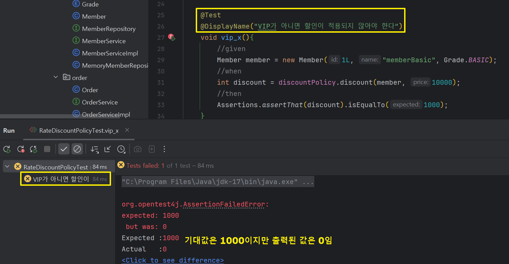

- Assrtions는 static import 하는 것이 좋음
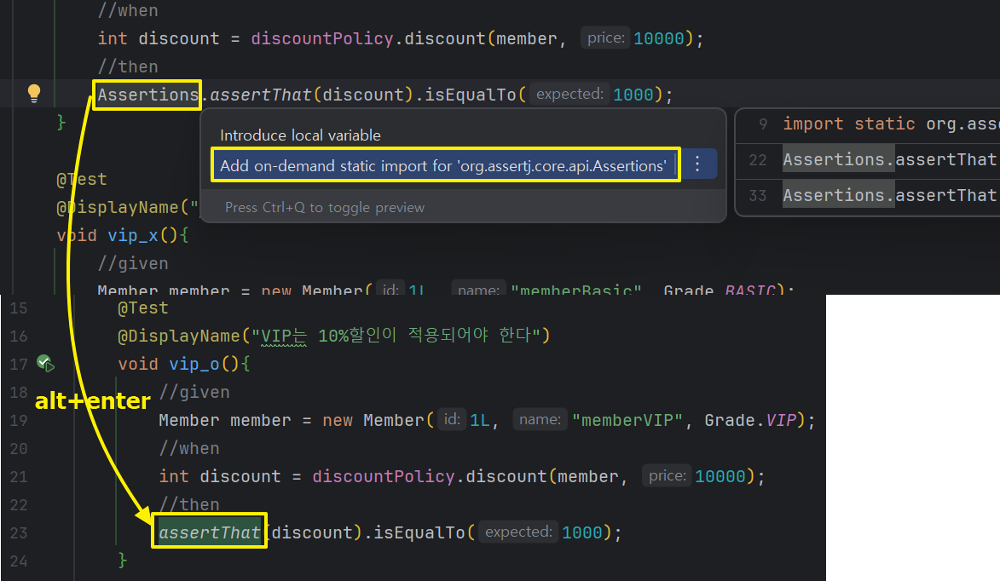

## interface를 만드는 이유를 드디어 이해했다!
### java를 하며 들었던 의문: 변수만 선언된 클래스나 인터페이스를 왜 굳이 만들까?
#### 클래스는 미니 프로젝트를 통해 의문 해결
    DB에서 정보를 가져올 때마다 새로운 변수에 값을 저장할 순 없으니 값을 받는 setter, 저장된 값을 불러오는 getter가 필요했음
#### 강의를 통해 인터페이스 의문 해결
    역할이 정해져있지만(VIP고객은 할인해줌) 구현이 달라질 경우(고정할인 → 비율할인) 메소드 자체를 변경하지 않고 클래스 명만 변경해주면 됨
#### 인터페이스와 2개의 구현 객체
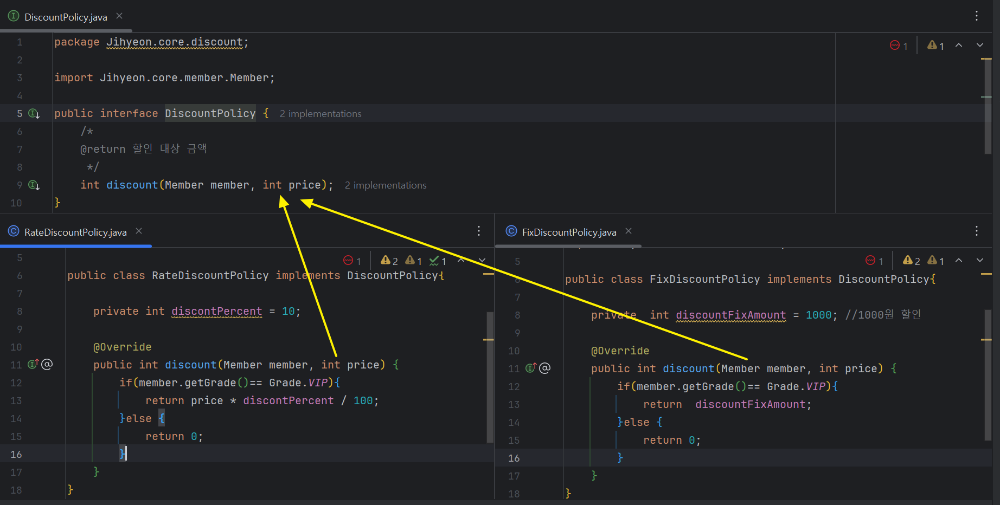
#### 구현이 달라져 클래스만 변동
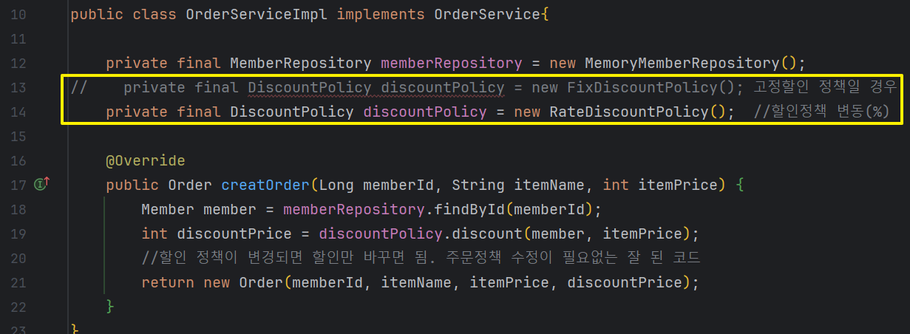

## but 해당 코드는 DIP를 위반함
- DIP: 추상 클래스에만 의존해야함
    - 현재 코드: 주문서비스 클라이언트(orderServiceImpl) ← 추상인터페이스(DiscountPolicy) ← 구체(구현)클래스(FixDiscountPolicy, RateDiscountPolicy) 까지 의존

    ```java
    private final DiscountPolicy discountPolicy = new FixDiscountPolicy(); 고정할인 정책일 경우
    private final DiscountPolicy discountPolicy = new RateDiscountPolicy();  //할인정책 변동(%)
                //추상에도 의존하고                      구체 클래스도 의존해버림 → DIP위반! (추상만 의존해야 함)
    ```

- 개방-폐쇄 원칙(OCP, Open-Closed Principle): 소프트웨어 개체(클래스, 모듈, 함수 등등)는 확장에 대해 열려 있어야 하고, 수정에 대해서는 닫혀 있어야 한다
    - 구체 클래스를 변경할 때 클라이언트(OrderServiceImpl)의 소스 코드도 변경해야하므오 OCP 위반
- private DiscountPolicy discountPolicy;로 인터페이스만 정의하는 경우 <span style="color:red;">NullPointerException</span> 에러 발생!

#### 해결방안
    💡누군가 클라이언트인 OrderServiceImpl에 DiscountPolicy의 구현 객체를 대신 생성하고 주입해야 함

## 관심사 분리
### AppConfig 등장
- 애플리케이션의 전체 동작 방식을 구성(config)하기 위해, <span style="font-weight:bold;">구현 객체</span>를 생성하고, <span style="font-weight:bold;">연결</span>하는 책임을 가지는 별도의 설정 클래스

-  AppConfig는 생성한 객체 인스턴스의 참조(레퍼런스)를 <span style="font-weight:bold;">생성자를 통해서 주입(연결)</span>해줌

### 생성자 주입
- MemberServiceImpl에서 추상 클래스만 사용하고, AppConfig에서 구체 클래스를 담당하도록 변경
    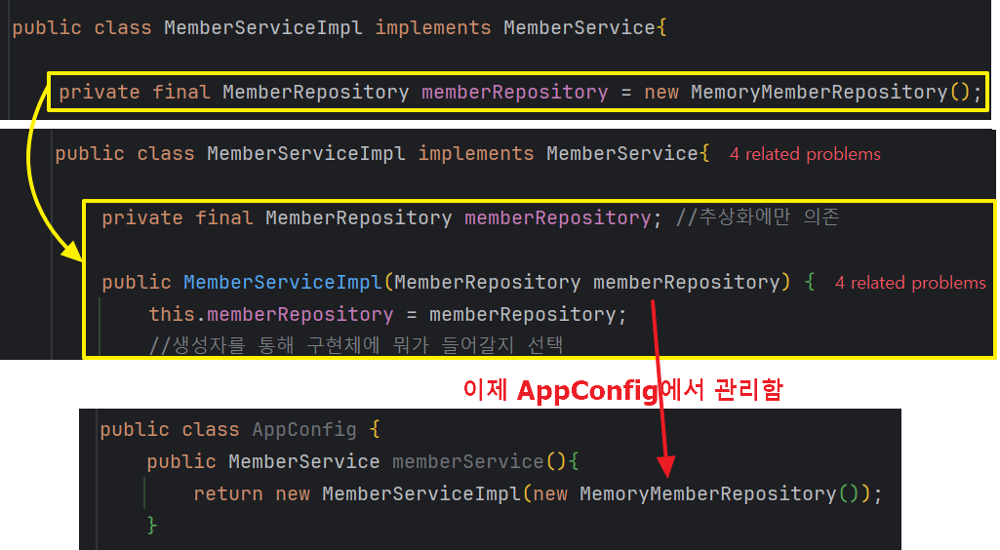

- OrderServiveIml도 2개의 추상 클래스(MemberRepository, DiscountPolicy)만 사용
    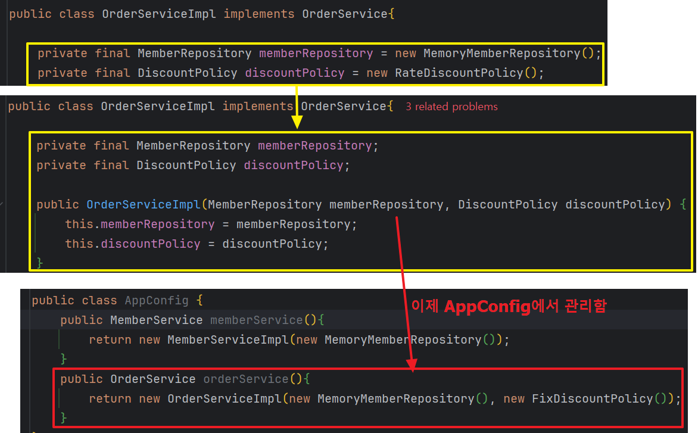

> 설계 변경으로 ImPl이 구현 객체에 의존하지 않게 됨
- 의존관계에 대한 고민은 외부에 맡기고 <span style="font-weight:bold;">실행에만 집중</span>하면 됨!
    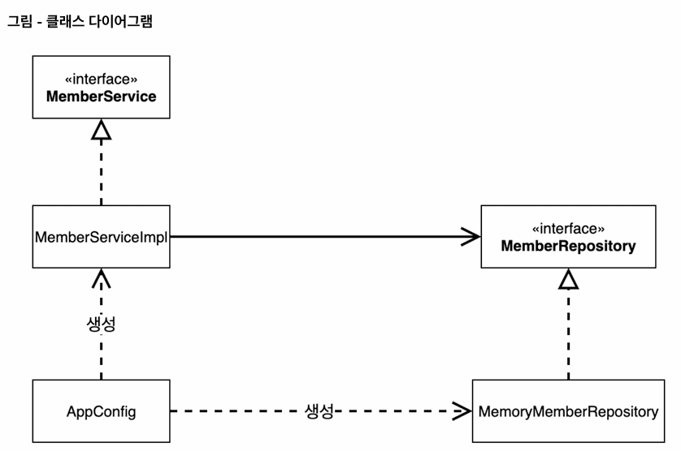
    - DIP 완성! 관심사가 분리됨
    - 클라이언트인 'memberImpl' 입장에서 보면 의존관계를 마치 외부에서 주입해주는 것 같다고 해서 DI(Dependency Injection, 의존관계 주입(의존성 주입))이라고 함

### 실행
- Impl을 불러와 실행하던 기존 코드에서 AppConfig를 불러와 값을 주입받도록 변경
    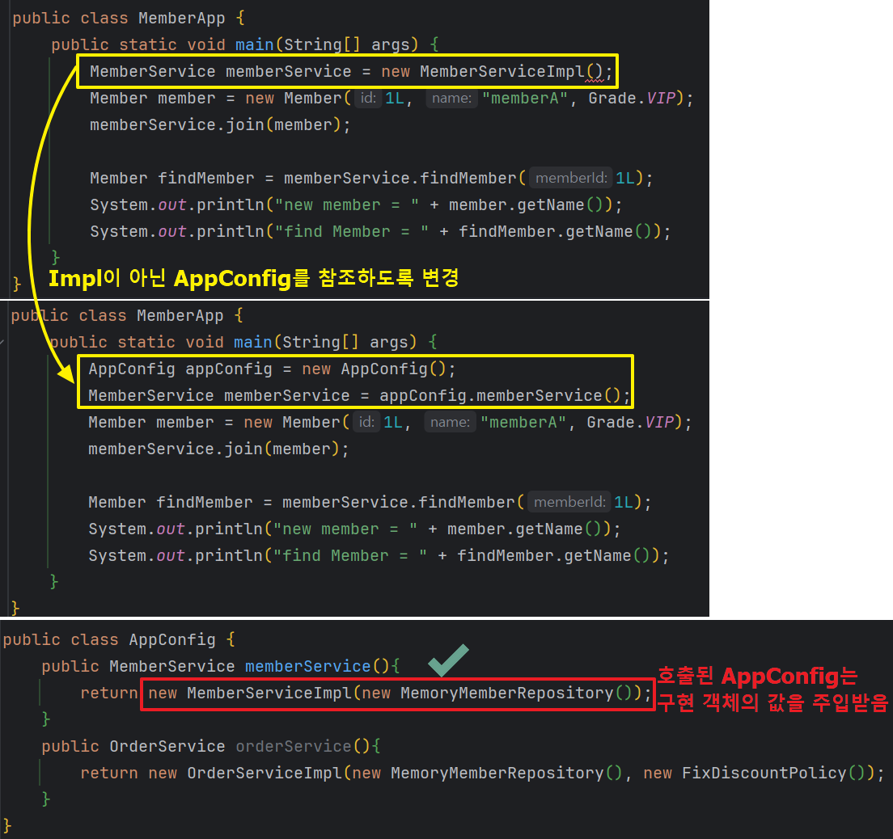
    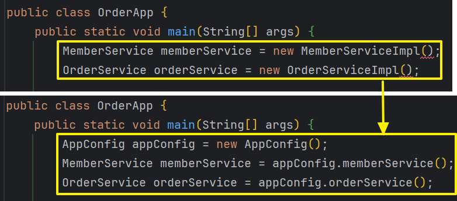

#### Test 변경
- Test도 Impl이 아닌 AppConfig를 참조하도록 변경
- @BeforeEach 사용
    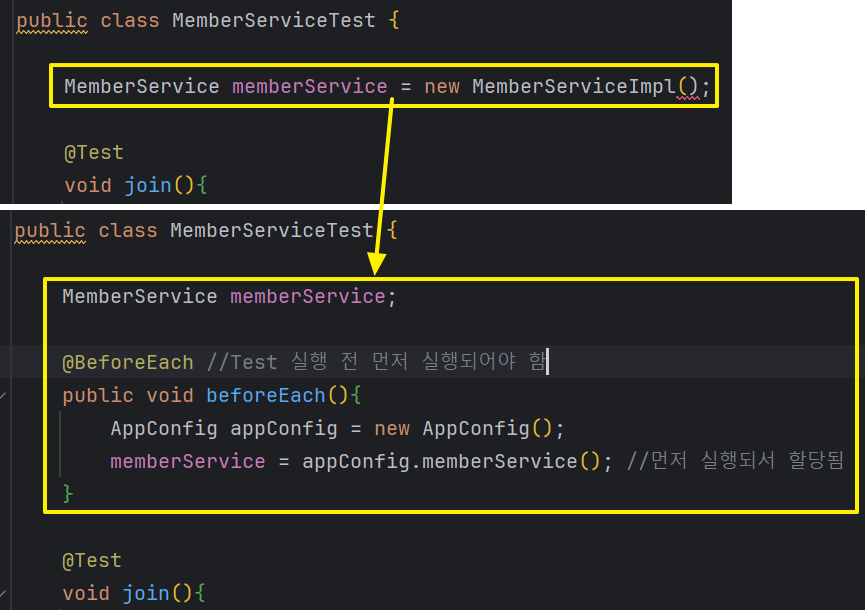
    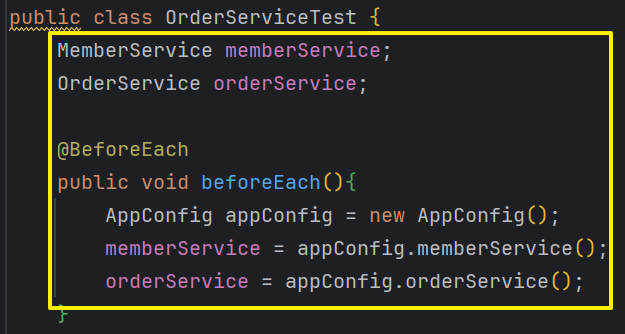

### AppConfig에서 역할에 대한 구현을 명확히 구분할 수 있도록 변경
- 객체로 불러오던 것을 별도의 메소드로 분리해서 콜(단축키: Ctrl+Alt+M)
    - →메소드 명을 보면 역할이 다 들어남!
    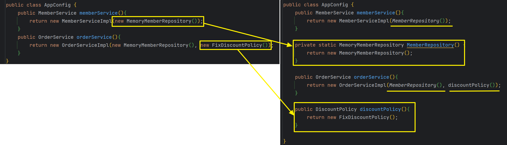

- 4개의 메소드가 있고 각 메소드 명으로 역할을 알 수 있음
    1. MemberService는 MemberServiceImpl를 사용함을 알 수 있음
    2. 만약 MemoryMemberRepository가 자기 자신이 아닌 DB를 사용할 경우 2번의 return 객체만 변경해주면 됨!
    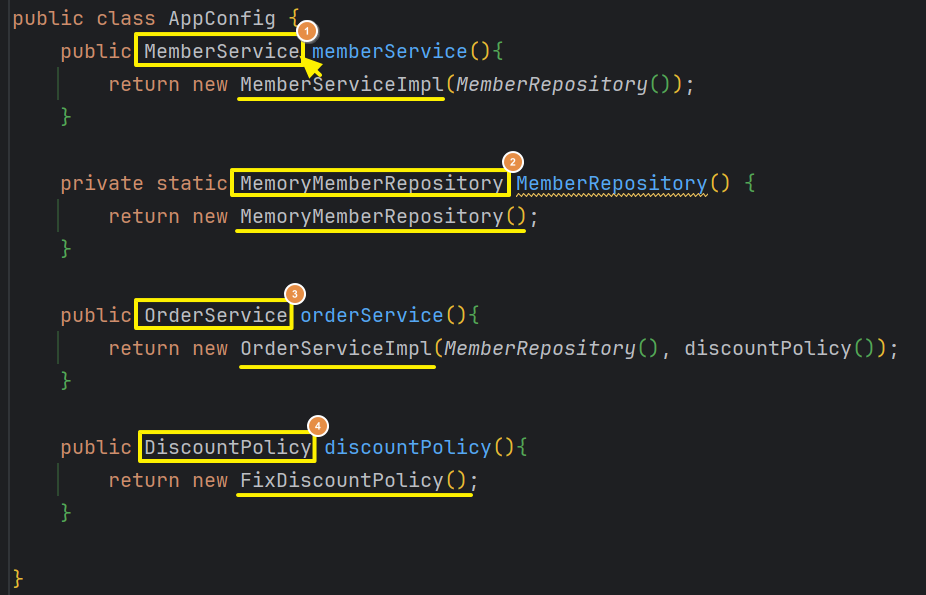

<h3 style="color:yellow; background-color:black;">⭐이제 사용 영역의 코드는 건드리지 않고 구성 영역의 코드(AppConfig)만 고치면 됨!⭐</h3>
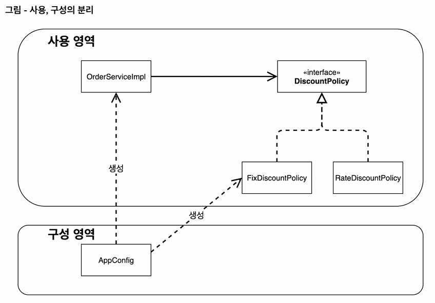
- 할인 정책을 변경할 경우 AppConfig의 DiscountPolicy만 변경해주면 됨
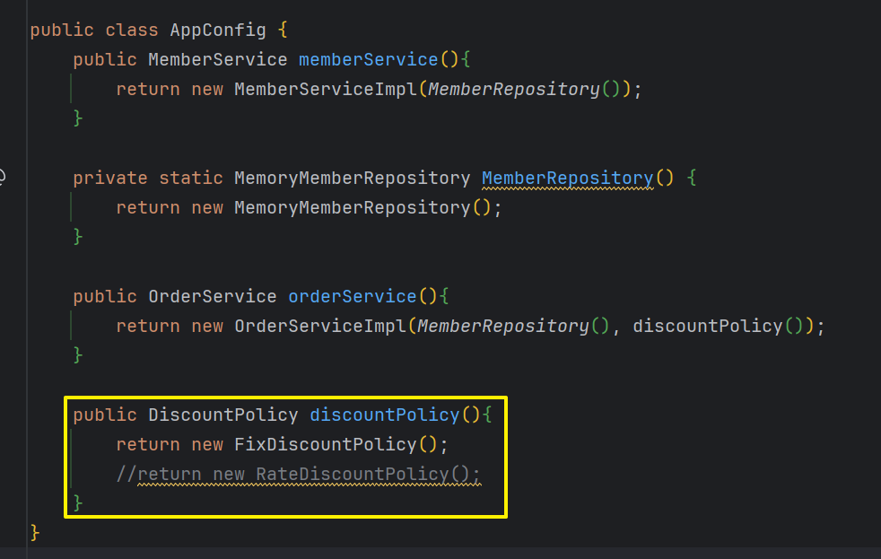

# 제어의 역전 IoC(Inversion of Control)
- 내가 코드를 호출하는 것이 아닌 프레임워크 같은 외부에서 관리하고 호출하는 것

> 프레임워크 vs 라이브러리
    - 프레임워크가 내가 작성한 코드를 제어하고, 대신 실행하면 그것은 프레임워크가 맞다. (JUnit)
    - 반면에 내가 작성한 코드가 직접 제어의 흐름을 담당한다면 그것은 프레임워크가 아니라 라이브러리다.

# 의존관계 주입 DI
- 애플리케이션 <strong>실행 시점(런타임)</strong>에 외부에서 실제 구현 객체를 생성하고 클라이언트에 전달해서 클라이언트와 서버의 실제 의존관계가 연결 되는 것을 <strong>의존관계 주입</strong>이라 한다