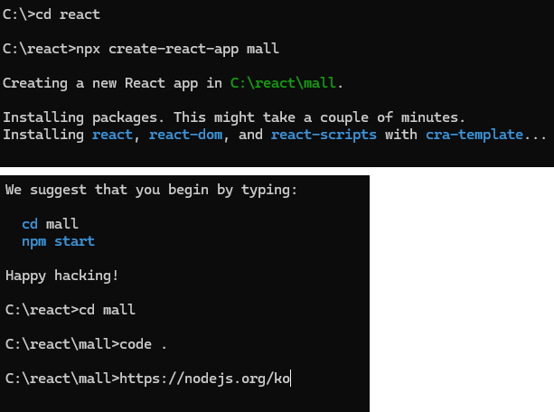
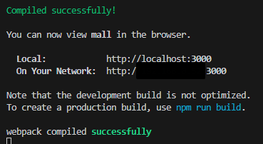
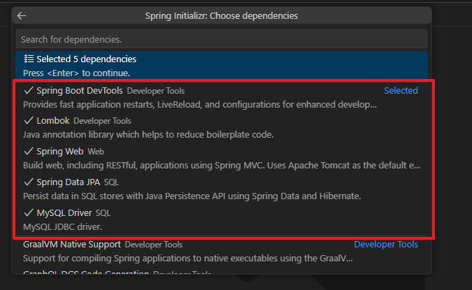

# React 개발환경 설정
## 설치 및 생성
- <a href="https://nodejs.org/ko">node.js</a> LTS버전 설치
- cmd창에서 지정한 폴더에 react폴더 생성

> cmd 명령어: npx create-react-app 생성폴더명
> cd 생성폴더명 으로 이동해서 code . 입력 시 해당 폴더로 vs코드가 열림


- 터미널에서 npm start로 node.js 실행


- 확장프로그램: Simple React Snippets, Tailwind CSS 설치

## Tailwind 설정
- 터미널에서 tailwind 실행
> npm install -D tailwindcss<br>
npx tailwindcss init

### tailwind.config.js 설정
```js
module.exports = {
  content: ["./src/**/*.{html,jsx,js,tsx}"],
  theme: {
    extend: {},
  },
  plugins: [
    require('tailwindcss'),
    require('autoprefixer'),
  ],
}
```

### src > index.css에 tailwind 설정
```css
@tailwind base;
@tailwind components;
@tailwind utilities;
```

## VScode에 Spring Boot 설치
- <a href="https://marketplace.visualstudio.com/items?itemName=vmware.vscode-boot-dev-pack">sts 설치</a>

### 스프링부트 프로젝트 폴더 생성
- commend palette(ctrl+shift+P) 열기
- Spring Initializr: Create a Gradle Project > 버전 설정 > java > 폴더들 저장 경로 이름 설정(com.example) > 폴더 이름 설정(demo가 기본, 나중에 zip파일 명이 됨!) > jar > 17 > 설치할 tools 선택 > 저장 경로 선택


### 스프링부트 프로젝트 성정
- cmd 창에서 생성한 폴더로 이동 > code .로 vscode 실행
- src > resources > application.properties에 DB 설정
```properties
spring.application.name=mallapi

spring.datasource.driver-class-name=com.mysql.cj.jdbc.Driver
spring.datasource.url=jdbc:mysql:/db 주소 
spring.datasource.username=db 이름
spring.datasource.password=비밀번호

spring.jpa.database-platform=org.hibernate.dialect.MySQL8Dialect
spring.jpa.properties.hibernate.format_sql=true
spring.jpa.hibernate.ddl-auto=create
spring.jpa.hibernate.naming.physical-strategy=org.hibernate.boot.model.naming.PhysicalNamingStrategyStandardImpl
spring.jpa.show-sql=true
```

# 2강
## React Router
- <a href="https://reactrouter.com/en/main">React Router 설정</a>
- vscode 콘솔창: npm install react-router-dom

## React 프로젝트 router 설정
- router 설정 파일을 별도로 생성
- src > router 폴더 생성 > root.js 생성
    ```js
    const { createBrowserRouter } = require("react-router-dom");

    const root = createBrowserRouter([

    ])

    export default root
    ```
- App.js에 RouterProvider 설정
    ```js
    import { RouterProvider } from "react-router-dom";
    import root from "./router/root";

    function App() {
    return (
        <RouterProvider router={root}/>
    );
    }

    export default App;
    ```

### lazy 지연로딩
- 리엑트는 기본적으로 single page 이므로 페이지 호출 때만 페이지를 불러오도록 설정
- root.js에 razy 설정
    ```js
    import { Suspense, lazy } from "react";
    const{ createBrowserRouter } = require("react-router-dom");

    const Loading = <div>Loading....</div>
    const Main = lazy(() =>import("../pages/MainPage"))

    const root = createBrowserRouter([
        {
            path: "",
            element: <Suspense fallback={Loading}><Main/></Suspense>
        }
    ])

    export default root;
    ```
- 리엑트 라우터 사용 시 a 태그 사용 불가! Link를 사용해야 함⭐
> Link태그 사용 시 Link로 이동 후 기존 호출했던 페이지 정보가 남아있어서 페이지 이동 시 마다 이전 페이지 삭제 없이 이동이 가능함

#### \<Link>를 통한 이동
- 리액트는 SPA로, 브라우저 주소창을 통해 컴포넌트 출력 가능.
- 주소창 변경은 애플리케이션 전체 로딩과 처리를 의미.
- SPA에서는 새 창 열거나 '새로고침' 주의해야 함.
- React-Router에서 a태그 사용을 피해야 함

## 중첩 라우팅
- todo list의 디렉토리로 하위 경로를 분기할 때, router에서 chidren으로 분기 가능
- \<Outlet/>으로 디렉토리로 나뉘는 컴포넌트 작성
    ```js
    import React from 'react';
    import BasicLayout from "../../layouts/BasicLayout"
    import { Outlet } from 'react-router-dom';

    function IndexPage(propes) {
        
        return (  
            <BasicLayout>
                <div className="w-full flex m-2 p-2 ">
                  <div className="text-xl m-1 p-2 w-20 font-extrabold text-center underline">LIST</div>
                    <div className="text-xl m-1 p-2 w-20 font-extrabold text-center underline">ADD</div>
                </div>
                <div className="flex flex-wrap w-full">
                    <Outlet/>
                </div>
            </BasicLayout>
        );

    }

    export default IndexPage;
    ```

  - \<Outlet/>으로 분기한 콘텐츠 작성 → ListPage.js
  
  ### root에서 중첩 라우팅
  - 작성한 ListPage를 lazy로 불러옴
  - BrowserRouter에서 디렉토리 라우팅
    * todo path에 children으로 불러옴!
    ```js
    {
        path: "todo",
        element: <Suspense fallback={Loading}><TodoIndex/></Suspense>,
        children:[
            {
                path: 'list', 
                element: <Suspense fallback={Loading}><TodoList/></Suspense>
            }
        ]
    }
    ```

    - children이 배열이 되어 복잡하니 todoRouter로 분리
      - [root]
        ```js
          {
              path: "todo",
              element: <Suspense fallback={Loading}><TodoIndex/></Suspense>,
              children: todoRouter()
          }
        ```
      - [todoRouter]
      - todo 페이지 접근 시 바로 list로 넘어갈 수 있도록 Navigate를 걸어줌
        ```js
          import {lazy, Suspense} from "react";
          import { Navigate } from "react-router-dom";

          const Loading = <div className="bg-pink-300">Loading....</div> 
          const TodoList = lazy(()=> import("../pages/todo/ListPage"))

          const todoRouter = () =>{
              return[
                  {
                      path: 'list',
                      element: <Suspense fallback={Loading}><TodoList/></Suspense>
                  },
                  {
                      path: '',
                      element: <Navigate replace={true} to={'list'}/>
                  }
              ]
          }

          export default todoRouter;
        ```