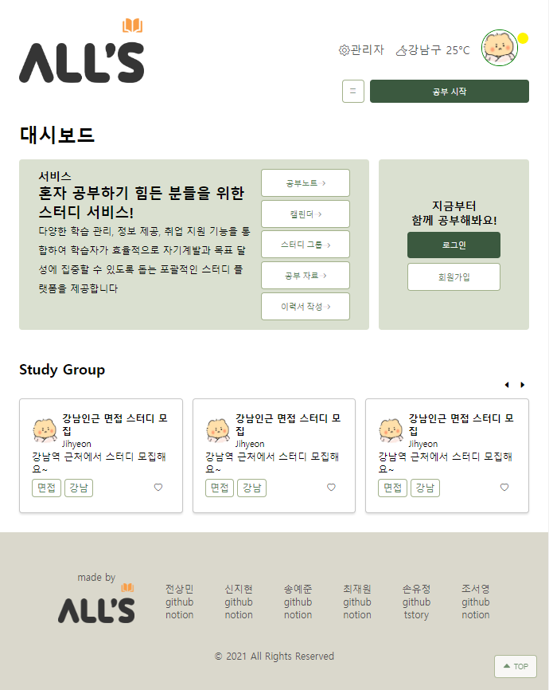

# 데브옵스 중간 프로젝트 "스터디하는 42조"
##   "함께 성장하는 학습 플랫폼 ALL'S"의 웹 개발
### 프로젝트 세부 사항
1. 사용자 정보 저장: 사용자의 ID, 이름, 비밀번호, 이메일, 연락처 등을 저장합니다.
2. 지역 범위 스터디 기능: 사용자들이 자신의 위치를 기반으로 스터디 그룹을 찾고, 참여하고, 관리할 수 있습니다.
3. 권한 설정: 사용자별로 권한을 설정하며, 이를 통해 접근 제어를 할 수 있습니다.
4. 스터디 자료 공유: 스터디 자료를 공유하고, 이에 댓글을 달거나 좋아요를 누를 수 있습니다.
5. 개인 일정 관리: 사용자 개인의 일정을 관리하고 알림을 설정할 수 있습니다.
6. 전체화면 타이머 기능: 공부에 집중할 수 있도록 도와주는 전체화면 타이머 기능도 제공합니다.

# 개발 과정
## 역할
- 내가 담당한 역할: 프론트앤드(총괄), 캘린더, 타이머, 게시판 등

# 프론트 개발
## UI 작성
- 기간: 6/7~6/11
- 범위: 메인, 스터디, 내정보 등을 포함한 33페이지 작성
- 피그마 UI 작성 화면 

## 화면 작성
- HTML, CSS로 기본 화면 작성
- 기간: 6/11~6/13
- 작성 범위: 메인, 로그인, 회원가입
    - 주요 내용: 공통 영역(헤더, 메인메뉴, 푸터) 작성, 레이아웃 잡기, 반응형 웹 구현, 공통 CSS 작성, 공통 영역 JS 작성, CSS/JS 파일 구분 및 통합 등
- 작성 화면
    - 메인
        웹: 
        반응형  
    - 로그인    
        웹: 
        반응형:  
    - 회원가입
        웹: 
        반응형: 
    - 게시판 타입1
        웹: 
        반응형: 

## JSP 화면 작성
- 기간: 6/13~
- 주요 내용: VScode에서 작성한 HTML,CSS,JS 파일을 인텔리제이 스프링 MVC 프로젝트로 변경
###  이슈 사항 
|번호|이슈|날짜|해결|날짜|
|------|---|---|---|---|
|1|CSS,JS 폴더의 경로 문제로 읽히지 않는 이슈|6/13|java파일 하위에 있던 resources 폴더를 webapp하위로 옮겨 viwe와 같은 경로에 위치하도록 변경(파일을 가져오는 root경로가 webapp으로 지정되어 있기 때문으로 보임)|6/13|
|2|security가 구현된 환경에서 CSS,JS파일이 읽히지 않는 이슈|6/13|SecurityConfig.java에서 css, js 폴더에 대한 접근 허용|6/13|
|3|로그인 완료 후(시큐리티 통과 후) CSS, JS 파일이 읽히지 않는 이슈|6/13|시큐리티에 인코딩해줘야 함 .and() .addFilterBefore(new CharacterEncodingFilter("UTF-8", true), CsrfFilter.class);|6/14|
|4|CSS로 제목을 양측정렬(justify-content) 안됨|6/14|- 텍스트가 영역을 넘지 않는 이상(줄바꿈) 안됨 → :after로 줄바꿈 속성(content:'';display:inline-block;width:100%)를 주면 됨 - 영문자는 안됨|6/15|
|5|시큐리티 적용 상황에서 로그인 인증정보 없이 페이지를 이동할 수 없음|6/15|- SecurityConfig에서 .antMatchers(url).permitAll()로 경로를 지정해주어야 함(/studyGroup/**) - controller에서 매개변수 없이 경로만 Mapping해줌|6/15|
|6|이전 버전과 차이가 커서(20p가량 프론트 작성) 합친 버전에서 에러 발생- 원복 후 heap 저장공간 오류 발생 오류코드: maven-resources-production:navercloudspring: java.lang.outofmemoryerror: java heap space|6/17|file > setting 에서 heap공간을 늘림|6/17|
|7|dp.properties파일을 읽지 못하는 오류 발생 오류코드: ERROR org.springframework.web.context.ContextLoader - Context initialization failed org.springframework.beans.factory.BeanDefinitionStoreException: Failed to parse configuration class [bit.naver.config.RootAppContext]; nested exception is java.io.FileNotFoundException: class path resource [db.properties] cannot be opened because it does not exist|6/17|- resource에 올바르게 존재함에도 오류 발생 - 한글 인코딩 문제일 것 같아 Configuration > Maven > Runner > VM Options에 -Dfile.encoding=UTF-8를 입력하였으나 오류 [해결] 프로젝트와 maven을 리프레시하여 오류해결|6/17|
|8|다른 팀원이 작업하여 run확인 후 push한 파일을 내 브랜치(SJH)로 pull하여 버전이 다른 코드 수정 > 일부 파일만 수정되고 기존 작업물이 모두 덮여쓰여 버리는 문제 발생|6/17|근본적 해결은 아니나, 20p가량 작성하고 깃허브에 commit한 기록이 있어(이슈 발생 전 올렸었음) 깃허브의 코드를 보며 다시 수정|6/18|
|9|보안을 위해 시큐리티로 id값을 보내야하나, a링크는 get방식으로 매핑되어 id가 노출되버리는 이슈 발생|6/17|js로 페이지 내에서 function으로 post방식으로 보내거나, form태그로 post mapping해주는 방식 중 form태그로 action 방법 선택|6/17|
|10|form태그의 submit button을 줄 경우 레이아웃이 깨지는 문제 발생|6/17|깃 버전 병합 문제 해결 후 오류 원인 확인 후 버튼에 들어간 CSS 조정|6/18|
|11|로그인 완료 시 페이지를 찾지 못하는 404에러 발생|6/18|메인에서 로그인으로 넘어가는 URL경로에 오타가 있었음. 중간 폴더 /users가 /user로 되어있었으나, 마지막 디렉토리 /loginform은 일치하였기 때문에 로그인 페이지로의 이동은 가능했던 것으로 보임. 경로확인 중요!|6/18|
|12|로그인에서 오류 발생 시 Controller에서 오류 메세지를 받아오지 못하여 모달창이 나타나지 않는 오류 발생(회원가입에서는 됨)|6/18|해결중||