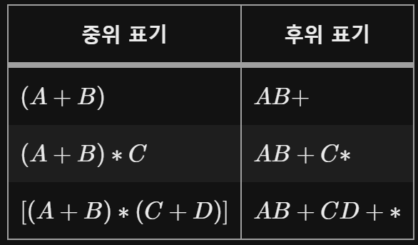
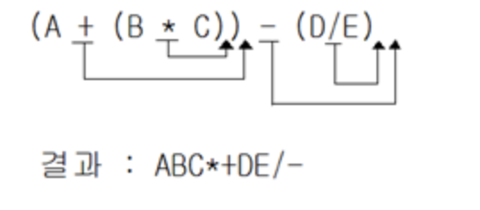
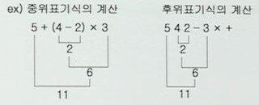
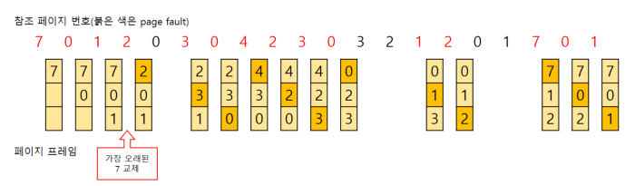
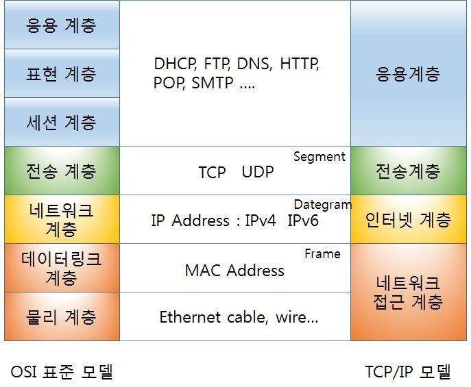

# 정처기 공부

### DB
- 레코드 : 한 행 , 튜플(객체)
- 필드 : 속성 , 컬럼(열)
- 릴레이션: 정보를 구분하여 저장하는 기본 단위(DB테이블)'
- 차수 : 한 릴레이션이 가진 어트리뷰트(속성) 수(행의 수, 0을 가질 수 있음)
- 카디날리티 : 행의 수. 0이 될 수 없음

- DDL(데이터 정의어): create, alter, drop, rename - 구조를 만듬
- DML(데이터 조작어) : select, insert, update, delete - 데이터 입출력
- DCL(데이터 제어어) : grant, revoke

### 이진검색
- 전체 범위의 (첫번째 수 + 마지막 수)/2 반복
- 소수가 나왔을 경우 정수만 취함(해당 정수는 다음 계산에 포함되지 않음)

### C언어
- a && b : a조건과 b조건이 모두 참일 경우 true(1), a와 b가 모두 정수면 1
- a || b : a조건 혹은 b조건이 참일 경우 true(1), a와 b가 모두 정수면 1
- !a : false(0)]
#### 포인터와 배열
- *(arr+1) = arr[1]

### UML
- Unified Modeling Language의 약자
- 통합 모델링 언어
- 클래스 / 객체 / 컴포넌트 / 배치 / 복합체 구조 / 패키지

### solid(객체지향)

### 메소드 오버로딩 vs 오버라이딩

### postfix

### prefix

### gof(gang of four)
1. 생성(Creational) 패턴: 추상 팩토리, 빌더, 팩토리 메서드, 프로토타입, 싱글턴
2. 구조(Structural) 패턴: 어댑터, 브리지, 컴퍼지트, 데커레이터, 퍼사드, 플라이웨이트, 프록시
3. 행위(Behavioral) 패턴: 책임연쇄, 커맨드, 인터프리터, 미디에이터, 메멘토, 옵서버, 테이트, 스트래티지, 템플릿 메서드, 비지터

### 럼바우(Rumbaugh) 
- 객체지향 분석 기법

### 스택(Stack)
- 후입선출(LIFO) 자료구조
- size(): 스택에 들어있는 데이터 수 반환
- isEmpty(): 스택이 비어있는지 판단(빈경우 true, 아니면 false)
- push(): 데이터 추가
- pop(): 스택의 맨 위의 데이터 원소를 제거, 반환
- peek(): 스택의 맨 위의 데이터 원소 반환
#### 수식 후위표기법
- 개괄호일 경우 push, 폐괄호일 경우 개괄호를 만날때까지 스택에 있는 연산자 pop(괄호는 버림)

#### 후위표기된 수식 계산

### FIFO 계산
- 테이블로 계산
- 프레임 수만큼 행 작성
- 페이지 수만큼 열 작성
- 해당 프레임(행)에 차례로 데이터 입력, 행이 다 찼을 경우 해당 데이터 삭제 후 재삽입
- 페이지 변환 횟수는 삭제된 데이터 수+마지막으로 입력된 데이터 수
- 마지막 남은 페이지는 행에 남아있는 데이터 순서

### 큐 스택(자료구조)

### 정규형

### 로킹

### 응집도

### TCP/IP
#### osi7

- OSI 7계층 >> 물-데-네-전-세-표-응
- 데이터 전송 단위 >> 물리-비트, 데이터-프레임, 네트웤-패킷, 
 전송-세그먼트, 그 외-데이터
- 7계층 상세
    - 물리 : 비트 정보를 전기적 신호로 변환 | RC-232C
    - 데이터 : 데이터 전송, 오류/흐름 제어 | HDLD
    - 네트워크 : 노드 간 데이터 전송, 최적 경로 설정(라우팅) | IP
    - 전송 : 데이터 분할/재조립, 혼잡/흐름 제어 | TCP
    - 세션 : 연결 접속 및 동기 제어 | RPC
    - 표현 : 암호화/복호화 | JPEG
    - 응용 : 응용 서비스 연결, 정보 교환 등 | HTTP

### 트리구조
#### 기본 구조
1. 노드(Node): 트리의 기본 요소, 데이터와 다른 데이터에 대한 가지(Branch)를 합친 것
2. 근 노드(Root Node): 트리의 맨 위에 있는 노드, 트리 - 나무, 나무의 뿌리(Root)에서 처음 시작하는 부분의 노드
3. 디그리(Degree, 차수): 각 노드에서 뻗어나온 가지(Branch)의 수, 트리의 디그리는 노드들 중 가장 많은 디그리를 말한다.
4. 단말 노드(Terminal Node) = 잎 노드(Leaf Node): 자식이 하나도 없는 노드, 즉 디그리(차수)가 0인 노드
5. 자식 노드(Son Node): 어떤 노드에 연결된 다음 레벨의 노드들
6. 부모노드(Parent Node): 어떤 노드에 연결된 이전 레벨의 노드들
7. 형제노드(Brother Node, Sibling Node), 동일한 부모를 갖는 노드들
8. 레벨(Level) = 깊이(Depth): 근 노드부터 level 1로 시작해 층 별로 level이 1씩 증가한다.

#### 순회방법
1. 전위 순회(Preorder) = 깊이 우선 순회(DFT; Depth First Traversal)
    - root, left, right
2.  중위 순회(Inorder) = 대칭 순회(Symmetric)
    - left, root, right
3. 후위 순회(Postorder)
    - left, right, root