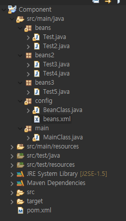

## 자바 Component
- maven 레파지토리에서 검색 : https://mvnrepository.com/artifact/javax.annotation/javax.annotation-api/1.3.2
- Maven코드를 복사하여 pom.xml에 등록

### 프로젝트 생성
- 폴더링 및 파일 구성


- beans.xml에 등록
    ```xml
    <?xml version="1.0" encoding="UTF-8"?>
    <beans xmlns="http://www.springframework.org/schema/beans"
        xmlns:xsi="http://www.w3.org/2001/XMLSchema-instance"
        xmlns:context="http://www.springframework.org/schema/context"
        xsi:schemaLocation="http://www.springframework.org/schema/beans
                            http://www.springframework.org/schema/beans/spring-beans.xsd
                            http://www.springframework.org/schema/context
                            http://www.springframework.org/schema/context/spring-context.xsd">
                            
                            
    </beans>
    ```

### @component 지정
- @Component
    - bean을 따로 등록하지 않아도 자동으로 등록됨. 
    - class위에 적어줘야함
    - @Component("이름") 형식으로 이름 지정 가능

### @ComponentScan
- 어노테이션이 있는 beans2, beans3 패키지 검사(체크)
- 어노테이션이 있는지 확인(@component, @repository, @controller, @service...)

- Test03,4,5 클래스를 컴포넌트로 지정
    ```java
    package beans2;

    import org.springframework.stereotype.Component;

    @Component
    //bean을 따로 등록하지 않아도 자동으로 등록됨. class위에 적어줘야함
    public class Test3 {}
    ///////////////////////////////////////////////////////////
    package beans2;

    import org.springframework.stereotype.Component;

    @Component("component4")
    public class Test4 {}

    ```

- beans.xml 파일로 class와 컴포넌트 가져오기
    - \<context:component-scan base-package="패키지명"/>: 지정된 패키지 안에 있는 Bean 클래스들의 어노테이션을 분석(체크)한다 
	
    ```xml
    <?xml version="1.0" encoding="UTF-8"?>
    <beans xmlns="http://www.springframework.org/schema/beans"
        xmlns:xsi="http://www.w3.org/2001/XMLSchema-instance"
        xmlns:context="http://www.springframework.org/schema/context"
        xsi:schemaLocation="http://www.springframework.org/schema/beans
                            http://www.springframework.org/schema/beans/spring-beans.xsd
                            http://www.springframework.org/schema/context
                            http://www.springframework.org/schema/context/spring-context.xsd">
                            
        <!-- 지정된 패키지 안에 있는 Bean 클래스들의 어노테이션을 분석(체크)한다 -->
        <context:component-scan base-package="beans2"/>
        <context:component-scan base-package="beans3"/>

        <bean class="beans.Test"/>
        <bean class="beans.Test2" id="test2"/>
        <bean class="beans.Test2" id="test22"/>
        
        <bean class="beans2.Test4" id="test4"/>
    </beans>
    ```

- java 파일로 bean을 생성할 경우: component를 가져오기 위한 Scan작업을 해줘야 함
    ```java
    package config;

    import org.springframework.context.annotation.Bean;
    import org.springframework.context.annotation.ComponentScan;
    import org.springframework.context.annotation.Configuration;

    import beans.Test;
    import beans.Test2;
    import beans2.Test3;


    @Configuration
    @ComponentScan(basePackages = "beans2")
    @ComponentScan(basePackages = "beans3")
    //@ComponentScan어노테이션이 있는 beans2, beans3 패키지 검사(체크)한다
    //어노테이션이 있는지 확인(@component, @repository, @controller, @service...)
    public class BeanClass {

        //Test 3,4,5는 위에 @ComponentScan으로 가져와서 bean으로 등록하지 않아도 됨
        
        @Bean
        public Test test1() {
            return new Test();
        }
        
        @Bean
        public Test2 test2() {
            return new Test2();
        }

        @Bean
        public Test3 test3() {
            return new Test3();
        }
    }
    ```

- main에서 출력
    ```java
    package main;

    import org.springframework.context.annotation.AnnotationConfigApplicationContext;
    import org.springframework.context.support.ClassPathXmlApplicationContext;

    import beans.Test;
    import beans.Test2;
    import beans2.Test3;
    import beans2.Test4;

    public class MainClass {
        public static void main(String[] args) {
            ClassPathXmlApplicationContext ctx = new ClassPathXmlApplicationContext("config/beans.xml");
            
            Test t1 = ctx.getBean(Test.class);
            System.out.println(t1);
            
            Test2 t2 = ctx.getBean("test2",Test2.class);
            System.out.println(t2);
            
            Test2 t22 = ctx.getBean("test22",Test2.class);
            System.out.println(t22); //다른 id의 객체라 test2와 주소값이 다름
            
            Test3 t3 = ctx.getBean(Test3.class);
            System.out.println(t3);
            
            Test4 t4 = ctx.getBean("component4",Test4.class); //이름을 성정한 경우 id값이 됨
            System.out.println(t4);
            
            Test4 t44 = ctx.getBean("test4",Test4.class); //컴포넌트로 등록 후 bean으로 따로 설정도 가능
            System.out.println(t44);
            
            //java에 등록한 bean 가져오기
            AnnotationConfigApplicationContext ctx2 = new AnnotationConfigApplicationContext("config/BeanClass");
            
            Test tt1 = ctx2.getBean(Test.class); 
            System.out.println(tt1);
            
            
            ctx.close();
        }
    }
    ```
- 출력결과: 
    

<hr>
<br>
<details>
<summary style="font-size:large; background-color:yellow; font-weight:bold; color:black;">어노테이션 및 의존 객체 자동 주입</summary>
<h2>의존 객체 자동 주입</h2>
- 객체 대상을 명시하지 않아도 스프링 컨테이너가 자동으로 의존 대상 객체를 찾아 해당 객체에 필요한 의존성을 주입하는 것

<h3>@Resource</h3>
<h4>JSR에 있는 자바 기존의 어노테이션</h4>

- 이름을 기준으로 찾는다. 이름이 없으면 타입으로 찾는다. 
-  종속적이지 않아 많이 사용한다.
-	Bean을 생성해주며 싱글톤 패턴이 자동으로 적용된다.
-	Jdk1.8까지만 지원 (아직까지 실무에서는 많이 쓰임)
-	@Resource(name=”빈이름”) : @Autowired + @Qualifier와 같은 효과

<h3>@Autowired</h3>
<h4>스프링에서 등장한 어노테이션(스프링 이외의 프레임워크에서는 사용불가)</h4>

- Type이 일치하는지 찾고 객체를 자동으로 주입한다. 타입이 존재하지 않으면 이름이 일치하는 bean을 컨테이너에서 찾는다. 
- 프레임워크에 종속적이다. 다른 프레임워크로 수정할 경우 다 바꿔줘야함
- Bean을 생성하며 싱글톤 패턴이 자동으로 적용된다.
- @Qualifier(“빈이름”)

<h3>@Qualifier</h3>
<h4>타입이 동일한 bean객체가 여러 개 있으면 Exception이 일어남</h4>
(스프링이 어떤 bean을 주입해야 될지 모르기 때문)
->이럴 때, @Qualifier 사용 


<h3>@Bean</h3> 
<h4>메소드 단위에서 개발자가 외부 라이브러리/ 정의하지 않은 객체를 유연하게 넘기기 위해 사용하는 어노테이션</h4>

-	개발자가 직접 제어가 불가능한 외부 라이브러리 사용할 때
-	메소드를 통해 반환되는 객체를 Bean으로 만든다
-	@Configuration을 선언한 클래스 내부에서 사용한다

<h3>@Component</h3>
<h4>개발자가 직접 정의한 객체 클래스(인터페이스) 자체를 빈 등록할 때</h4>

- 개발자가 직접 정의한 class를 빈으로 등록할 수 있게 만든다
- 개발자가 작성한 class를 빈으로 만든다
- 이름을 부여안하면 타입을 가져와서 등록
- 타입을 통한 빈등록 (타입 같으면 주입)
Component-scan: 
-	빈으로 등록 될 준비를 마친 클래스들을 스캔하여, 빈으로 등록해주는 것이다.
-	 @Controller, @Service, @Component, @Repository 어노테이션을 붙인 클래스들이 빈으로 등록 될 준비를 한 것이다.

</details>
<br>
<hr>

## component 객체 생성 및 값 주입
### component의 bean 생성
- class에 @component 어노테이션 지정
- bean에서 @configuration, @componentScan(basePackages = "패키지명")
    - Test 클래스 생성
    ``` java
    @Component 
    public class Data {
    @Configuration
    @ComponentScan(basePackages = "beans")
    public class BeanClass {
    }
    ```
    - BeanClass에서 빈 가져오기
    ```java
    @Configuration
    @ComponentScan(basePackages = "beans")
    public class BeanClass {
    }
    ```

### Test클래스에서 Data 클래스를 받아 bean생성
- @component("이름")이 지정된 경우 별도의 객체 생성 안해도 됨
- @Qualifier("컴포넌트명"): 이름이 지정되지 않은 bean 생성 시 bean 클래스에서 해당 컴포넌트의 bean을 생성해줘야 함
    - Test 클래스 생성
    ``` java
    @Component
    public class Test {
        @Autowired
        private Data d1;
        
        @Autowired
        @Qualifier("component2")
        private Data2 d2;
        
        @Resource(name="component3")
        private Data3 d3;
        
        @Resource(name="component4") //Data3에 해당 이름이 없으므로 BeanClass에서 등록해줘야 함
        private Data3 d4;
        
        @Resource(name="component5")
        private Data3 d5;

        // get, set
    }
    ```
    - BeanClass 생성
    ```java
	@Bean
	public Data3 component4() { //Test에는 있었지만 Data에 없어서 bean등록을 다시 해줘야함
		return new Data3();
	}
	
	@Bean
	public Data3 component5() {
		return new Data3();
	}
    ```

### 생성자의 매개변수로 값 주입하는 경우
- Data 객체를 가져오는 Test2 클래스 생성
    ```java
    @Component
    public class Test2 {

        private int d1;
        private String d2;
        private Data4 d3;
        private Data5 d4;
        
        public Test2(@Value("1") int d1, @Value("spring") String d2, Data4 d3, Data5 d4){
            this.d1=d1;
            this.d2=d2;
            this.d3=d3;
            this.d4=d4;
        }

        ///get set
    }
    ```
- 매개변수에 값이 들어가있지만 바꾸는 경우
    - BeanClass
    ```java
    @Configuration
    @ComponentScan(basePackages = "beans")
    public class BeanClass {
        @Bean
        public Test3 t3() {
            return new Test3(100,"java",new Data4(), new Data5()); //생성자로 값이 들어있는 상테에서 또 넣을 경우
        }
    }
    ```

#### 출력결과
    ````java
    public class MainClass {
        public static void main(String[] args) {
            AnnotationConfigApplicationContext ctx = new AnnotationConfigApplicationContext(BeanClass.class);
            
            Test t1 = ctx.getBean(Test.class);
            System.out.println(t1.getD1());
            System.out.println(t1.getD2());
            System.out.println(t1.getD3());
            System.out.println(t1.getD4());
            System.out.println(t1.getD5());
        
            System.out.println("--------생성자로 데이터를 넣은 경우-----------------");
            Test2 t2 = ctx.getBean(Test2.class);
            System.out.println(t2.getD1());
            System.out.println(t2.getD2());
            System.out.println(t2.getD3());
            System.out.println(t2.getD4());
            
            System.out.println("---Bean에서 데이터를 다시 넣은 경우 새로 넣어진 값 출력----");
            Test3 t3 = ctx.getBean("t3",Test3.class);
            System.out.println(t3.getD1());
            System.out.println(t3.getD2());
            System.out.println(t3.getD3());
            System.out.println(t3.getD4());
            
            ctx.close();
        }
    }
    ```
- 결과화면


!! component3 참고