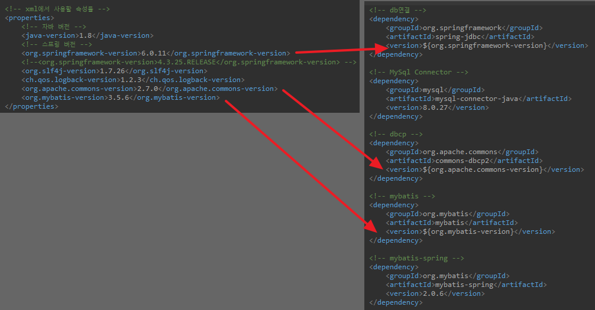

## DB와 Spring 연결

### 1. Maven Repository
#### \<properties>에 버전 정보를 등록하여 가져올 수 있음(유지보수 용이)
- <a href="https://mvnrepository.com/artifact/org.springframework/spring-jdbc/6.0.11">Spring JDBC</a>를 Spring 버전과 동일하게 가져오기
- <a href="https://mvnrepository.com/artifact/mysql/mysql-connector-java/8.0.27">MySql Connector Java</a> 등록
- <a href="https://mvnrepository.com/artifact/org.apache.commons/commons-dbcp2/2.7.0">Apache Commons DBCP</a> 등록
- <a href="https://mvnrepository.com/artifact/org.mybatis/mybatis/3.5.6">MyBatis</a> 등록: sql에 쉽게 접근할 수 있도록 해줌
- <a href="https://mvnrepository.com/artifact/org.mybatis/mybatis-spring/2.0.6">MyBatis Spring</a> 등록



### 2. SQL 테이블 생성
    ```sql
    create table spring_table(
    num1 int,
    str1 varchar(10));
    ```

### 3. SQL 테이블에 맞는 Bean 생성
    ```java
    @Component
    @Scope("prototype") //메소드 호출 시마다 새로운 객체 생성
    public class JBean {
        private int num1;
        private String str1;
        
        public int getNum1() {
            return num1;
        }
        public void setNum1(int num1) {
            this.num1 = num1;
        }
        public String getStr1() {
            return str1;
        }
        public void setStr1(String str1) {
            this.str1 = str1;
        }
    }
    ```
### DB 연결
    ```java
    @Configuration
    @ComponentScan(basePackages = "kr.bit.beans")
    public class Beans {
        @Bean
        public BasicDataSource dataSource() {
            BasicDataSource source = new BasicDataSource();
            source.setDriverClassName("com.mysql.cj.jdbc.Driver");
            source.setUrl("jdbc:mysql://localhost:3306/hyeon");
            source.setUsername("root");
            source.setPassword("1234");
            
            return source;
        }
        @Bean
        public SqlSessionFactory factory(BasicDataSource source) throws Exception{
            SqlSessionFactoryBean fac = new SqlSessionFactoryBean();
            fac.setDataSource(source);
            SqlSessionFactory fac2 = fac.getObject();
            return fac2;
        }
        
        @Bean
        public MapperFactoryBean<MapperInterface> test(SqlSessionFactory fac) throws Exception{
            MapperFactoryBean<MapperInterface> mapper = new MapperFactoryBean<MapperInterface>(MapperInterface.class);
            mapper.setSqlSessionFactory(fac);
            return mapper;
        }
    }
    ```

### sql 실행문 작성(인터페이스)
    ```java
    public interface MapperInterface {

        @Select("select num1, str1 from spring_table") //괄호안에 쿼리문을 넣으면 됨
        List<JBean> read();
        
        @Insert("insert into spring_table(num1,str1) values (#{num1}, #{str1}") //JDBC는 변수 ? / MyBatis는 #
        void in(JBean bean);
        
        @Update("update spring_table set str1=#{str1} where num1=#{num1}")
        void up(JBean bean);
        
        @Delete("delete from spring_table where num1=#{num1}")
        void del(int num1);

    }
    ```

## DB설정 시
### JDBC Template 사용 시
- BasicDataSource
- JdbcTemplate

JDBC 사용
```java
public void in_sert(JBean bean) {
    String sql="insert into spring_table(num1,str1) values(?,?)";
    db.update(sql,bean.getNum1(),bean.getStr1());
}
```
### mybatis이용 시
- BasicDataSource
- SqlSessionFactory
- MapperFactoryBean → mybatis
편리한점: 어노테이션으로 작업 가능

mybatis 사용
```java
@Insert("insert into spring_table(num1,str1) values (#{num1}, #{str1}")
void in(JBean bean)
```

> 코드 간략화 가능!``