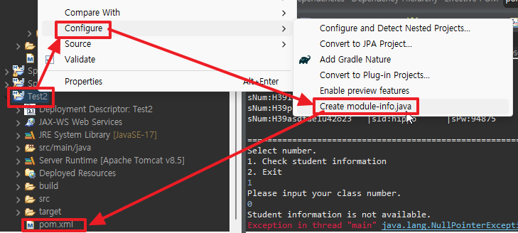
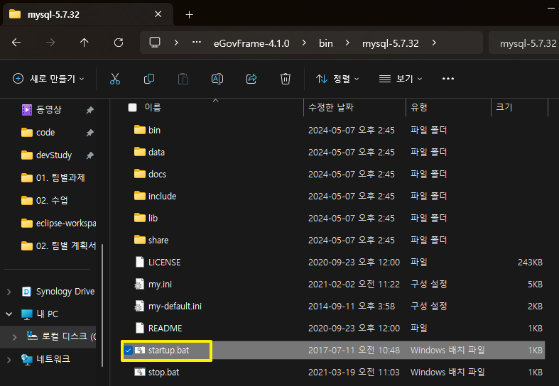
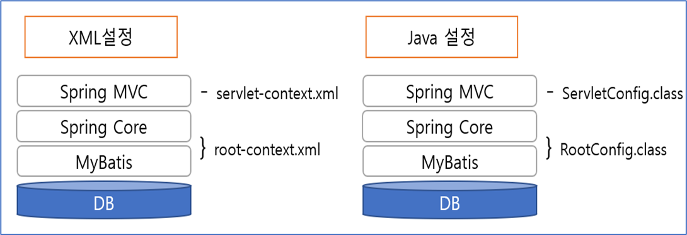

# MVC 환경 구축
## 프로젝트 일정
스프링 mvc(레거시) = 이클립스
스프링부트 = 인텔리제이

## dynamic > convert to maven
- jsp
- maven

- 프로젝트 생성 후 create module-info.java 설정 시 pom.xml이 생김
- maven으로 안만들어도 이렇게 환경 구축 생성 가능


## sts 설치 > 스프링 부트
- 이클립스 마켓플레이스에서 설치
- 스프링 부트도 사용 가능

## 전자정부 프레임워크
- boot를 안쓰는 경우 사용
- <a href="https://www.egovframe.go.kr/home/sub.do?menuNo=65">전자정부 프레임워크 홈페이지</a>에서 설치
- exe파일 다운받기(파일 위치는 반드시 C:/)
- mySQL 연결

- servers 폴더 뺴고 다 삭제
- Dynamic project > tomcat포함 플젝생성 > create module-info.java 설정

# 스프링의 주요 특징
## 1) POJO 기반의 구성
 POJO(Plain Old Java Object) 만으로 가능하도록 제작됨
 일반적인 자바 코드를 사용해서 객체를 구성하는 방식을 그대로 스프링에서 사용가능

## 2) 의존성 주입(DI)을 통한 객체 간의 관계 구성
- 의존성: 하나의 객체가 다른 객체 상태에 따라 영향을 받는 것(A객체가 B객체 없이 실행이 안될경우)
- 주입: 말 그대로 ‘외부에서 밀어 넣는 것’ (수동적)
    - 어떤 객체가 필요한 객체를 외부에서 밀어 넣는다
    - 스프링을 이용하면 객체와 객체를 분리해서 생성하고, 이러한 객체들을 엮는(wiring) 작업을 하는 형태로 개발 가능
    - 스프링에서 관리하는 객체들을 Bean이라는 용어로 부름

## 3) AOP 지원
=> 개발자가 비즈니스 로직에만 집중할 수 있게 하기 위해 대부분의 시스템이 공통으로 가지고 있는 보안, 트랜잭션과 같은 비즈니스 로직은 아니지만 반드시 처리가 필요한 부분 => ‘횡단관심사’ 로 분리해서 제작 가능

# 스프링 흐름
- 스프링이 사용하는 메모리 영역(컨텍스트 Context) 생성됨 
- 스프링은 자신이 객체를 생성하고 관리해야 하는 객체들에 대한 설정이 필요 → root-context.xml 에서 함

## MVC(Model-View-Controller) 3-tier
- 대부분의 서블릿 기반 프레임워크들이 사용하는 방식 
- 데이터와 처리, 화면을 분리하는 방식 
- 웹에서는 Model 2 방식으로 표현

## 스프링 MVC 구조

* XML이나 Java설정 이용시에 설정 분리 

# 전자정부 프레임워크 이클립스에서 셋팅
## xml로 셋팅(ApplicationContext)
### 1. pom.xml 설정
<details>
<summary>pom.xml 셋팅 코드</summary>
    
    <project xmlns="http://maven.apache.org/POM/4.0.0"
        xmlns:xsi="http://www.w3.org/2001/XMLSchema-instance"
        xsi:schemaLocation="http://maven.apache.org/POM/4.0.0 
                            http://maven.apache.org/xsd/maven-4.0.0.xsd">
        <modelVersion>4.0.0</modelVersion>
        <groupId>MVC_Basic_01</groupId>
        <artifactId>MVC_Basic_01</artifactId>
        <version>0.0.1-SNAPSHOT</version>
        <packaging>war</packaging>
        <build>
            <sourceDirectory>src</sourceDirectory>
            <plugins>
                <plugin>
                    <artifactId>maven-compiler-plugin</artifactId>
                    <version>3.8.0</version>
                    <configuration>
                        <source>1.8</source>
                        <target>1.8</target>
                    </configuration>
                </plugin>
                <plugin>
                    <artifactId>maven-war-plugin</artifactId>
                    <version>3.2.1</version>
                    <configuration>
                        <warSourceDirectory>WebContent</warSourceDirectory>
                    </configuration>
                </plugin>
            </plugins>
        </build>
        <!-- 라이브러리 버전관리 -->
        <properties>
            <javax.servlet-version>4.0.1</javax.servlet-version>
            <javax.servlet.jsp-version>2.3.3</javax.servlet.jsp-version>
            <javax.servlet.jsp.jstl-version>1.2</javax.servlet.jsp.jstl-version>
            <org.springframework-version>5.2.2.RELEASE</org.springframework-version>
            <!-- <org.springframework-version>4.3.25.RELEASE</org.springframework-version> -->
        </properties>
        <!-- 라이브러리 셋팅 -->
        <dependencies>
            <!-- https://mvnrepository.com/artifact/javax.servlet/javax.servlet-api -->
            <dependency>
                <groupId>javax.servlet</groupId>
                <artifactId>javax.servlet-api</artifactId>
                <version>${javax.servlet-version}</version>
                <scope>provided</scope>
            </dependency>
            <!-- https://mvnrepository.com/artifact/javax.servlet.jsp/javax.servlet.jsp-api -->
            <dependency>
                <groupId>javax.servlet.jsp</groupId>
                <artifactId>javax.servlet.jsp-api</artifactId>
                <version>${javax.servlet.jsp-version}</version>
                <scope>provided</scope>
            </dependency>
            <!-- https://mvnrepository.com/artifact/javax.servlet.jsp.jstl/jstl -->
            <dependency>
                <groupId>javax.servlet</groupId>
                <artifactId>jstl</artifactId>
                <version>${javax.servlet.jsp.jstl-version}</version>
            </dependency>
            <!-- https://mvnrepository.com/artifact/org.springframework/spring-webmvc -->
            <dependency>
                <groupId>org.springframework</groupId>
                <artifactId>spring-webmvc</artifactId>
                <version>${org.springframework-version}</version>
            </dependency>


        </dependencies>
    </project>
    
</details>

### 2. WEB-INF에 폴더, 파일 생성
- 폴더: config, views
- web.xml
<details>
<summary>web.xml 셋팅 코드</summary>
    
        <?xml version="1.0" encoding="UTF-8"?>
        <web-app version="4.0"
            xmlns="http://xmlns.jcp.org/xml/ns/javaee"
            xmlns:xsi="http://www.w3.org/2001/XMLSchema-instance"
            xsi:schemaLocation="http://xmlns.jcp.org/xml/ns/javaee                       
                                http://xmlns.jcp.org/xml/ns/javaee/web-app_4_0.xsd">

            <!-- 현재 웹 애플리케이션에서 받아들이는 모든 요청에 대해 appServlet이라는 이름으로 정의되어 있는 서블릿을 사용하겠다. -->
            <servlet-mapping>
                <servlet-name>appServlet</servlet-name>
                <url-pattern>/</url-pattern>
            </servlet-mapping>
            <!-- 요청 정보를 분석해서 컨트롤러를 선택하는 서블릿을 지정한다. -->
            <servlet>
                <servlet-name>appServlet</servlet-name>
                <!-- Spring MVC에서 제공하고 있는 기본 서블릿을 지정한다. -->
                <servlet-class>org.springframework.web.servlet.DispatcherServlet</servlet-class>
                <!-- Spring MVC 설정을 위한 xml 파일을 지정한다. -->
                <init-param>
                    <param-name>contextConfigLocation</param-name>
                    <param-value>/WEB-INF/config/servlet-context.xml</param-value>
                </init-param>
                <load-on-startup>1</load-on-startup>
            </servlet>
            
            <!-- Bean을 정의할 xml 파일을 지정한다. -->
            <context-param>
                <param-name>contextConfigLocation</param-name>
                <param-value>/WEB-INF/config/root-context.xml</param-value>
            </context-param>
            
            <!-- 리스너설정 -->
            <listener>
                <listener-class>org.springframework.web.context.ContextLoaderListener</listener-class>
            </listener>
            
            <!-- 파라미터 인코딩 필터 설정 -->
            <filter>
                <filter-name>encodingFilter</filter-name>
                <filter-class>org.springframework.web.filter.CharacterEncodingFilter</filter-class>
                <init-param>
                    <param-name>encoding</param-name>
                    <param-value>UTF-8</param-value>
                </init-param>
                <init-param>
                    <param-name>forceEncoding</param-name>
                    <param-value>true</param-value>
                </init-param>
            </filter>
            
            <filter-mapping>
                <filter-name>encodingFilter</filter-name>
                <url-pattern>/*</url-pattern>
            </filter-mapping>
        </web-app>
    
</details>

### 3. config폴더에 web.xml에 있는 파일 생성
- servlet-context.xml 파일 생성
<details>
    <summary>servlet-context.xml 셋팅 코드</summary>

        <?xml version="1.0" encoding="UTF-8"?>
        <beans:beans xmlns="http://www.springframework.org/schema/mvc"
                    xmlns:xsi="http://www.w3.org/2001/XMLSchema-instance"
                    xmlns:beans="http://www.springframework.org/schema/beans"
                    xmlns:context="http://www.springframework.org/schema/context"
                    xsi:schemaLocation="http://www.springframework.org/schema/mvc
                                        http://www.springframework.org/schema/mvc/spring-mvc.xsd
                                        http://www.springframework.org/schema/beans
                                        http://www.springframework.org/schema/beans/spring-beans.xsd
                                        http://www.springframework.org/schema/context
                                        http://www.springframework.org/schema/context/spring-context.xsd">
        </beans:beans>
 
</details>

- root-context.xml 생성: bean 관리
<details>
    <summary>servlet-context.xml 셋팅 코드</summary>
    ```xml
        <?xml version="1.0" encoding="UTF-8"?>
        <beans xmlns="http://www.springframework.org/schema/beans"
            xmlns:xsi="http://www.w3.org/2001/XMLSchema-instance"
            xsi:schemaLocation="http://www.springframework.org/schema/beans
                                http://www.springframework.org/schema/beans/spring-beans.xsd">
                                
        </beans>
    ```
</details>

### 4. bean 생성
- servlet-context.xml bean 생성
<details>
<summary>servlet-context.xml에 bean 생성</summary>

    <!-- 스캔한 패키지 내부의 클래스 중 controller로 로딩하도록 함 -->
    <annotation-driven/>
    <!-- 스캔할 Bean들이 모여있는 패키지를 지정함 -->
    <context:component-scan base-package="kr.bit.controller"/>
    <!-- controller메소드에서 변환하는 문자열 앞 뒤에 붙일 경로 설정 -->
    <beans:bean class="org.springframework.web.servlet.view.InternalResourceViewResolver">
        <beans:property name="prefix" value="/WEB-INF/views/"/> <!-- 경로를 이거로 고정하겠다(접두사) -->
        <beans:property name="suffix" value=".jsp"/> <!-- 접미사 -->
    </beans:bean>
    
    <!-- 정적 파일 세팅 -->
    <resources location="/resources/" mapping="/**"></resources>

</details>

### 5. src/main/java class 생성
- 패키지 생성: kr.bit.controller > HomeController class 생성
<details>
    <summary>HomeController 생성</summary>

        package kr.bit.controller;

        import org.springframework.stereotype.Controller;
        import org.springframework.web.bind.annotation.RequestMapping;
        import org.springframework.web.bind.annotation.RequestMethod;

        @Controller
        public class HomeController {
        @RequestMapping(value="/", method=RequestMethod.GET)
        public String home() {
            System.out.println("home");
            return "index";
        }
        }

</details>

### 6.실행화면(index) 생성
- views에 index.jsp 생성
- MVC_Basic_01 프로젝트 run


