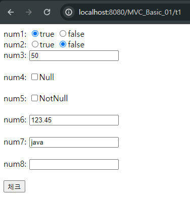
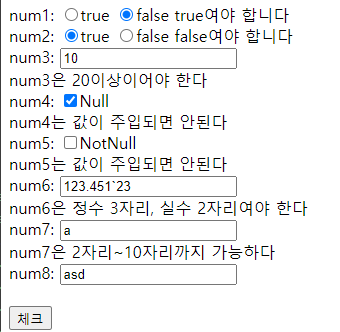
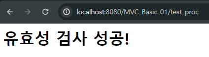
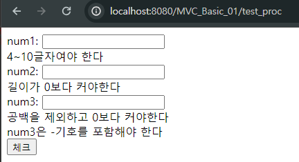
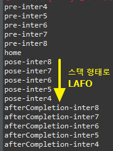
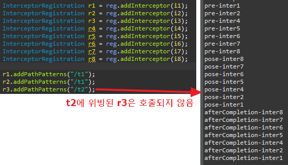

# 10. 어노테이션 종류들
## 유효성 검사의 어노테이션

<details>
<summary style="font-size: x-large; font-weight: bold;">회원가입 등에서 사용하는 유효성 검사 사용예</summary>
!! MVC_Basic_21 참고

### 1. Data.java
- @AssertTrue 또는 False: True(Fasle)가 아닌 값이 들어오면 오류
- @Max(n)또는 @Min(n) : n보다 큰(또는 작은) 값
- @Null 또는 @NotNull: 값이 들어오면(들어오지 않으면) 오류
- @Digits(integer=3, fraction=2) : integer: 정수 자리수 / Fraction: 실수 자리수
- @Size(min=2, max=10): 지정된 글자수보다 짧거나 길면 오류
- @Pattern(regexp="[a-zA-Z]*"): 정규 표현식(주어진 정규식에 위배되면 오류), 소문자 영문자+대문자 영문자+숫자

### 2. 입력한 Data를 받고 유효성 검사를 하는 jsp 페이지 생성
- <%@ taglib prefix="form" uri="http://www.springframework.org/tags/form" %>로 jsp의 form을 가져다 씀
- <form:form>에서 유효성 값을 적은 Data 객체 가져와야 함
    - modelAttribute="클래스(앞글자소문자)"로 연결하여 데이터 주입. 클래스 이름이 같으면 필드에 값을 자동 주입한다
- Data의 값을 주입받기 때문에 기본 값이 입력되어 나타남
- form태그에서 에러 메세지 출력을 위해 <form:errors> 사용 → path로 연결된 변수명에 맞는 properties의 에러 메세지 출력

<details>
<summary>입력폼 페이지 코드</summary>
- 입력 화면

    ```jsp
    <form:form modelAttribute="data" method="post" action="test_proc"> <!-- modelAttribute="클래스(앞글자소문자)"로 연결하여 데이터 주입 -->
        num1: <form:radiobutton path="num1" value="true"/>true <!-- Data에서 기본값으로 true를 초기화해서 선택됨 -->
            <form:radiobutton path="num1" value="false"/>false <!-- @AssertTrue에 위배되서 false선택 시 에러, 메세지를 띄우기 위해 bindingResurlt 연결해야 함 -->
            <form:errors path="num1"/><br>
            
        num2: <form:radiobutton path="num2" value="true"/>true 
            <form:radiobutton path="num2" value="false"/>false
            <form:errors path="num2"/><br>
        
        num3: <form:input path="num3" type="text"/><br>
            <form:errors path="num3"/><br>

        num4: <form:checkbox path="num4" value="check1"/>Null<br>
            <form:errors path="num4"/><br>
        
        num5: <form:checkbox path="num5" value="check2"/>NotNull<br>
            <form:errors path="num5"/><br>
            
        num6: <form:input path="num6" type="text"/><br>
            <form:errors path="num6"/><br>
            
        num7: <form:input path="num7" type="text"/><br>
            <form:errors path="num7"/><br>
            
        num8: <form:input path="num8" type="text"/><br>
            <form:errors path="num8"/><br>
        
        <form:button type="submit">체크</form:button>
    </form:form>
    ```

</details>

- 화면 출력 결과
    

### 3. 변하지 않는 값(유효성 검사 확인, DB 정보 등)은 properties에 저장
- Data에 저장되고 form에서 입력받는 값들에 대한 유효성 검사 및 에러 메세지 입력

<details>
<summary>유효성 확인 properties 코드</summary>
- 유효성 에러가 날 경우 에러메세지 등록
    ```properties
    AsserTure.data.num1=num1은 true여야 한다
    AsserTure.data.num2=num2은 false여야 한다
    Max.data.num3=num3은 200이하여야 한다
    Min.data.num3=num3은 20이상이어야 한다
    Null.data.num4=num4는 값이 주입되면 안된다
    NotNull.data.num5=num5는 값이 주입되면 안된다
    Digits.data.num6=num6은 정수 3자리, 실수 2자리여야 한다
    Size.data.num7=num7은 2자리~10자리까지 가능하다
    Pattern.data.num8=정규식에 위배된다
    ```

</details>

### 4. 메세지 등록을 위해 ServletAppContext에 등록
- properties 파일을 jsp(브라우저)에서 출력하기 위해서는 빈을 등록해야 함
    ```java
    @Bean(name = "messageSource")
        //왠지 모르겠지만 bean 이름을 설정해줘야 에러가 안난다.
        public ReloadableResourceBundleMessageSource source() {
            ReloadableResourceBundleMessageSource res = new ReloadableResourceBundleMessageSource();
            res.setBasename("/WEB-INF/properties/error");
            
            return res;
        }
    ```

### 5. SpringController에 유효성 검사 객체 연결
- Post로 받은 값과 url을 맵핑
- @Valid를 통해 유효성 값이 있는 Data 객체 연결
- BindingResult를 통해 검사 결과를 받는 객체 생성
    - hasErrors 메소드로 유효성 검사 (에러 발생 시 원래 페이지로 돌아감)
    ```java
        @PostMapping("/test_proc") //입력한 값 유효성 검사 > 유효성 검사에 대한 결과값
        public String test_proc(@Valid Data data, BindingResult result) {
            if(result.hasErrors()){
                return "test1";
            }else {
                return "test2";
            }
            
        }
    ```

- 유효성이 맞지 않는 경우


- 유효성 검사에 성공하는 경우


## 공백, 숫자 양식 등 유효성 검사 사용예
!! MVC_Basic_22 참고

### Data.java 어노테이션 종류
- @NotEmpty: 값의 길이가 0이면 오류발생(공백도 글자로 인식)
- @NotBlank: 공백을 제거한 문자의 길이가 0이면 오류 발생
- @Positive: 양수가 아니면 오류
- @PositiveOrZero: 0 또는 양수가 아니면 오류
- @Negative: 음수가 아니면 오류
- @Email: 이메일 형식으로, @기호가 있어야 함

</details>

<br><br>

# 11. 유효성(Validator Customize)
## Validator 커스터마이징
- jsr에 대한 유효성 검사를 할 때 303, 380로 유효성 검사를 하기에는 정해져 있음(위에서 한 작업)
- 이 외의 유효성 검사를 하기 위해 따로 유효성 검사를 작성할 수 있음 "Validator 클래스 생성"


<details>
<summary style="font-size: x-large; font-weight: bold;">1. Validator 인터페이스 구현</summary>
!! MVC_Basic_23 참고

## 1. Validator 인터페이스 구현
- Data에서 값을 받는 객체 생성 후 src/main/java에 Validator 패키지+클래스 생성
- org.springframework의 Validator을 상속받아 인터페이스 구현
    - override: supports, validate
    - supports: 유효성 검사할 데이터를 가지고 있는 객체가 유효성 검사가 가능한지 확인
    - validate: 유효성 검사하는 메소드
        - 유효성 검사가 지정되지 않는 변수에 대해서 유효성 검사 형식과 에러 이름 지정 가능
        - 어노테이션으로 지정하기 힘든 유효성 검사에 대한 정의 가능
    ```java
    package kr.bit.vaildator;

    import org.springframework.validation.Errors;
    import org.springframework.validation.ValidationUtils;
    import org.springframework.validation.Validator;

    import kr.bit.beans.Data;

    public class DataValidator implements Validator{
        @Override
        public boolean supports(Class<?> clazz) {
            // 유효성 검사할 데이터를 가지고 있는 객체가 유효성 검사가 가능한지 확인
            return Data.class.isAssignableFrom(clazz);
            //Data라는 클래스에 지정된 값 형식에 맞는 지 확인
        }
        @Override
        public void validate(Object target, Errors errors) {
            // 유효성 검사하는 메소드
            //Data에서 값 형식이 지정된건 num1뿐. 2,3은 여기서 유효성 검사 작성
            ValidationUtils.rejectIfEmpty(errors, "num2", "error2"); //num2가 empty면 에러 이름 error2
            ValidationUtils.rejectIfEmptyOrWhitespace(errors, "num3", "error3"); //num3가 empty이거나 whitespace면 에러 이름 error3
            
            Data d = (Data)target;
            
            String str1=d.getNum2();
            String str2=d.getNum3();
            
            if(str1.length()>5) { //num2 길이가 5 초과 시 error4라는 이름으로 에러 정의
                errors.rejectValue("num2", "error4"); //num2에 대한 유료성 검사 추가
            }
            
            if(str2.contains("-")==false) {
                errors.rejectValue("num3", "error5");
            }
            
        }

    }
    ```
    
### 데이터 받는 화면 구성
- jsp 페이지 작성
    ```jsp
        <form:form modelAttribute="data" method="post" action="test_proc"> 
            
            num1: <form:input path="num1" type="text"/><br>
                <form:errors path="num1"/><br>
            
            num2: <form:input path="num2" type="text"/><br>
                <form:errors path="num2"/><br>
            
            num3: <form:input path="num3" type="text"/><br>
                <form:errors path="num3"/><br>

            <form:button type="submit">체크</form:button>
        </form:form>
    ```

### 에러 메세지 등록 properties
- 어노테이션명.클래스.객체명 또는 에러명.클래스.객체명
    ```properties
    Size.data.num1=4~10글자여야 한다
    error2.data.num2=길이가 0보다 커야한다
    error4.data.num2=5글자를 넘으면 안된다
    error3.data.num3=공백을 제외하고 0보타 커야한다
    error5.data.num3=num3은 -기호를 포함해야 한다
    ```

## 2. 컨트롤에 인터페이스 등록
- Controller에서 InitBinder로 작성한 Validator 등록
    ```java
        @InitBinder
        public void initBinder(WebDataBinder binder) {
            DataValidator validator = new DataValidator();
            
            binder.addValidators(validator); //유효성검사가 1개면 setValidator 사용 가능
        }
    ```

- 오류가 날 경우


</details>
<br><br>

# 12. 인터셉터
!! MVC_Basic_24 참고

- 요청 발생 시 호출되는 메서드 코드가 중복되는 부분이 있을 때 인터셉터를 통해 처리한다
- 예: 로그인 여부 확인, 등급별 서비스 권한, 관리자/회원 작업처리

<details>
<summary style="font-size: x-large; font-weight: bold;">인터셉터 사용예</summary>
### HandlerInterceptor를 상속받는 Inter1 클래스 작성
- 3개의 메소드 오버라이드 가능
    1. preHandle: controller 메서드가 호출되기 전에 호출됨(맵핑 전)
    2. postHandle: controller 메서드가 호출된 이후에 호출됨(view처리 수행 전에 호출됨) (맵핑 후)
    3. afterCompletion: view처리 끝나고 응답결과가 브라우저로 전달되지 전에 호출됨
    ```java
    package kr.bit.interceptor;

    import javax.servlet.http.HttpServletRequest;
    import javax.servlet.http.HttpServletResponse;

    import org.springframework.web.servlet.HandlerInterceptor;
    import org.springframework.web.servlet.ModelAndView;

    public class Inter1 implements HandlerInterceptor{
        //요청 발생 시 호출되는 메서드 코드가 중복되는 부분이 있을 때 인터셉터를 통해 처리한다
        //로그인 여부 확인, 등급별 서비스 권한, 관리자/회원 작업처리에서 많이 사용

        //controller 메서드가 호출되기 전에 호출됨(맵핑 전)
        @Override
        public boolean preHandle(HttpServletRequest request, HttpServletResponse response, Object handler)
                throws Exception {
            System.out.println("pre-inter1");
            return true;
        }

        //controller 메서드가 호출된 이후에 호출됨(view처리 수행 전에 호출됨) (맵핑 후)
        @Override
        public void postHandle(HttpServletRequest request, HttpServletResponse response, Object handler,
                ModelAndView modelAndView) throws Exception {
            System.out.println("pose-inter1");
        }
        
        //view처리 끝나고 응답결과가 브라우저로 전달되지 전에 호출됨
        @Override
        public void afterCompletion(HttpServletRequest request, HttpServletResponse response, Object handler, Exception ex)
                throws Exception {
            System.out.println("afterCompletion-inter1");
        }
    }
    ```

### ServletAppContext에 인터셉터 등록
- 경로와 인터셉터를 설정하기 위해 ServletAppContext에 등록
- 위빙(Weaving): 원본 로직에 부가 기능 로직이 추가되는 것
    ```java
	public void addInterceptors(InterceptorRegistry reg) {
		WebMvcConfigurer.super.addInterceptors(reg);
		
		Inter1 i1 = new Inter1();
		Inter2 i2 = new Inter2();
		Inter3 i3 = new Inter3();
		Inter4 i4 = new Inter4();
		Inter5 i5 = new Inter5();
		Inter6 i6 = new Inter6();
		Inter7 i7 = new Inter7();
		Inter8 i8 = new Inter8();
		
		InterceptorRegistration r1 = reg.addInterceptor(i1);
		InterceptorRegistration r2 = reg.addInterceptor(i2);
		InterceptorRegistration r3 = reg.addInterceptor(i3);
		InterceptorRegistration r4 = reg.addInterceptor(i4);
		InterceptorRegistration r5 = reg.addInterceptor(i5);
		InterceptorRegistration r6 = reg.addInterceptor(i6);
		InterceptorRegistration r7 = reg.addInterceptor(i7);
		InterceptorRegistration r8 = reg.addInterceptor(i8);
		
		r1.addPathPatterns("/t1"); //interceptor가 가로채 갈 주소를 등록
		r2.addPathPatterns("/t1");
		r3.addPathPatterns("/t2");
	}
    ```
- index 실행 결과
    
- test1 페이지 이동 결과
    

- interceptor가 가로채 갈 주소 등록 방법
    - r1.addPathPatterns("/t1"); 경로 등록
    - r4.addPathPatterns("/t1","/t2"); 경로 2개 등록
    - r6.addPathPatterns("/*"); 모든 경로 등록 (/t1, /t2)
    - r7.addPathPatterns("/s1/*"); s1으로 시작하는 하나의 경로
    - r8.addPathPatterns("/**"); 상세경로 등록 (/s1/t3, /s1/t4)
    - r8.excludePathPatterns("/*"); interceptor가 가로채가지 않을 주소를 등록

</details>
<br><br>

# 13. DB 자바 설정
!! MVC_Basic_25 참고

<details>
<summary style="font-size: x-large; font-weight: bold;">DB연결 방법</summary>
## mySQL 연결
### 1. DB에 table 생성
    ```sql
    use hyeon;

    create table mvc_table(
    num1 varchar(100) not null,
    num2 varchar(100) not null,
    num3 varchar(100) not null
    );

    desc mvc_table;
    ```

### 2. lib에 mysql-connector-j-8.2.0.jar 넣기
### 3. 프로젝트와 DB 연결
- 3-1. pom.xml에 mybatis 설정
    ```xml
		<dependency>
			<groupId>org.mybatis</groupId>
			<artifactId>mybatis-spring</artifactId>
			<version>2.0.3</version>
		</dependency>
    ```
- 3-2. properties에 db정보 입력
    ```properties
    db.classname=com.mysql.cj.jdbc.Driver
    db.url=jdbc:mysql://localhost:3306/db명
    db.username=이름
    db.password=비밀번호
    ```
- 3-3. ServletAppContext에 sql 정보 등록
    ```java
    @PropertySource("/WEB-INF/properties/db.properties") //Properties 파일 사용 명시
    public class ServletAppContext implements WebMvcConfigurer{
        
        @Value("${db.classname}")
        private String db_classname;

        @Value("${db.url}")
        private String db_url;
        
        @Value("${db.username}")
        private String db_username;
        
        @Value("${db.password}")
        private String db_password;
	
    // ....

    	@Bean //Bean으로 정보 등록
        public BasicDataSource dataSource() {
            BasicDataSource source = new BasicDataSource();
            source.setDriverClassName(db_classname);
            source.setUrl(db_url);
            source.setUsername(db_username);
            source.setPassword(db_password);
            
            return source;
        }
        
        @Bean
        public SqlSessionFactory factory(BasicDataSource source) throws Exception{
            SqlSessionFactoryBean fac = new SqlSessionFactoryBean();
            fac.setDataSource(source);
            SqlSessionFactory factory = fac.getObject();
            return factory;
        }

        @Bean
            public MapperFactoryBean<MapperInterface> text_mapper(SqlSessionFactory factory) throws Exception{
            MapperFactoryBean<MapperInterface> fac = new MapperFactoryBean<MapperInterface> (MapperInterface.class);
            fac.setSqlSessionFactory(factory);
            return fac;
	    }
    }
    ```
- 3-4. DB에 값을 넣는 작업 만들기
    - form 서식 만들기
        ```jsp
            <%@ page language="java" contentType="text/html; charset=UTF-8"
                pageEncoding="UTF-8"%>
            <!DOCTYPE html>
            <html>
            <head>
            <meta charset="UTF-8">
            <title>Insert title here</title>
            </head>
            <body>
                <form action="input_proc" method="post">
                    num1 : <input type="text" name="num1"><br> <!-- num1,2,3에 입력한 값을 Data 클래스 필드에 넣기 -->
                    num2 : <input type="text" name="num2"><br>
                    num3 : <input type="text" name="num3"><br>
                    
                    <button type="submit">확인</button>
                </form>
            </body>
            </html>
        ```
    - SQL에 insert해주는 인터페이스 작성
        ```java
        public interface MapperInterface {

            @Insert("Insert into mvc_table(num1,num2,num3) values(#{num1},#{num2},#{num3})") 
            void insert_data(Data data);

        }
        ```
    - 컨트롤러에서 인터페이스 받아와서 처리
        ```java
        @Controller
        public class SpringController {
            
            @Autowired
            MapperInterface mapper;
            
            @GetMapping("/input_test")
            public String input_test() {
                return "input_test";
            }
            
            @PostMapping("/input_proc")
            public String input_proc(Data data) {
                mapper.insert_data(data); //db에 저장
                return "input_proc";
            }
        }
        ```

- 3-5. DB에서 값을 꺼내는 작업
    - 인터페이스에서 db select 메소드 작성
        ```java
        @Select("select num1, num2, num3 from mvc_table")
        List<Data> select_data();
        ```

    - Controller에서 인터페이스 메소드 활용 데이터 저장
        ```java
        @GetMapping("/read_test")
        public String read_test(Model model) {
            List<Data> li = mapper.select_data();
            model.addAttribute("li",li);
            return "read_test";
        }
        ```

    - 화면에 데이터 출력
        ```jsp
            <%@ taglib prefix="c" uri="http://java.sun.com/jsp/jstl/core" %>
            <!DOCTYPE html>
            <html>
            <head>
            <meta charset="UTF-8">
            <title>Insert title here</title>
            </head>
            <body>
                <c:forEach var="obj" item="${li }">
                    ${obj.num1 }<br>
                    ${obj.num2 }<br>
                    ${obj.num3 }<br>
                </c:forEach>
            </body>
            </html>
        ```

</details>