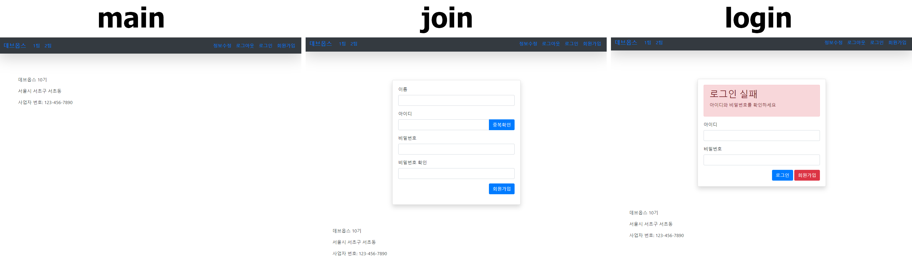
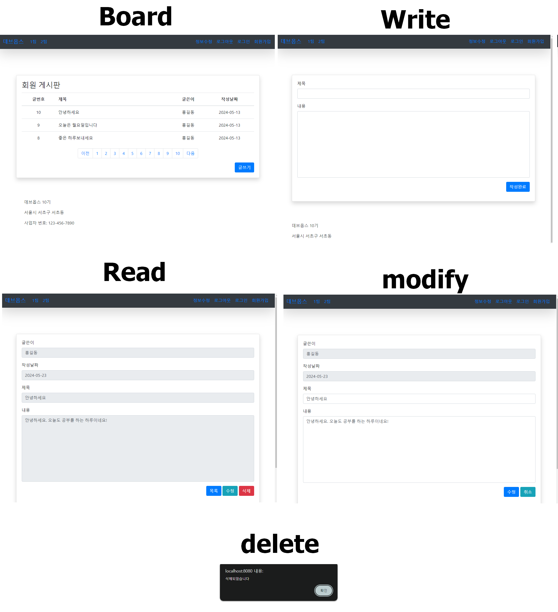
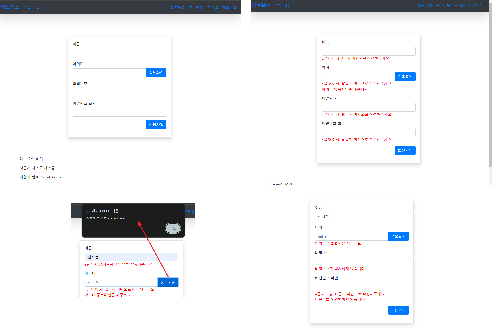
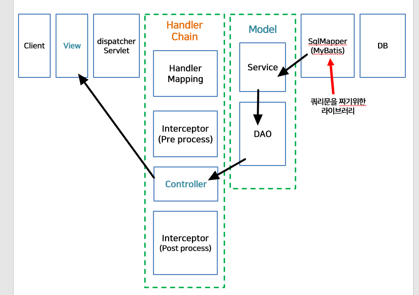
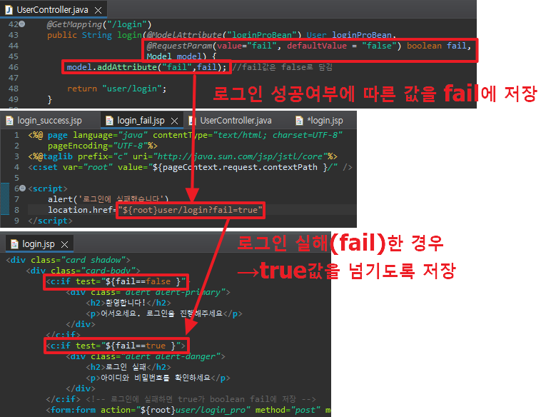

## Dynamic 프로젝트 생성
### 1. 프로젝트 생성 : Tomcat 있는지 확인!


### 2. 생성한 프로젝트 maven으로 변경

- 오류가 있는 경우 maven update
    

<br>
<br>

## 서버 연결 및 기본 설정
### 3. 서버 연결(config) 및 첫 화면 지정(HomeController)

- ServletAppContext에 Controller 사용 정보 등록
    ```java
    @ComponentScan("kr.bit.controller")
    ```

### 4. main 페이지 만들기
- 절대 경로 지정: c:url
    ```jsp
    <%@ taglib prefix="c" uri="http://java.sun.com/jsp/jstl/core" %>
    <c:url value='/' var="root"/>
    ```
    - /절대경로 를 포함하기 위해서 사용 : 페이지마다 상대경로로 할 순 없으니 절대경로를 지정하여 페이지 위치 지정
    - var로 이름 지정(root) = root/하위경로
    
- 부트스트랩 사용
    - <a href="https://getbootstrap.com/docs/4.1/getting-started/introduction/">부트스트랩</a>에서 css와 js 사용
    ```jsp
    <link rel="stylesheet" href="https://maxcdn.bootstrapcdn.com/bootstrap/4.1.0/css/bootstrap.min.css">
    <script src="https://ajax.googleapis.com/ajax/libs/jquery-3.3.1/jquery.min.js"></script>
    <script src="https://cdnjs.cloudflare.com/ajax/libs/popper.js/1.14.0/umd/popper.min.js"></script>
    <script src="https://maxcdn.bootstrapcdn.com/bootstrap/4.1.0/js/bootstrap.min.js"></script>
    ```

### 5. main에 import되는 nav, footer 작성
- main.jsp의 main
    ```jsp
	<c:import url="/WEB-INF/views/include/nav.jsp"/>
	<c:import url="/WEB-INF/views/include/footer.jsp"/>
    ```

- nav.jsp
    ```jsp
    <%@ page language="java" contentType="text/html; charset=UTF-8"
        pageEncoding="UTF-8"%>
    <%@ taglib prefix="c" uri="http://java.sun.com/jsp/jstl/core" %>
    <c:url value='/' var="root"/>
    <!-- 상단 -->
    <nav class="navbar navbar-expand-md bg-dark text-white fixed-up shadow-lg">
        <a class="navbar-brand" href="${root }main">데브옵스</a>
        <button class="navbar-toggler" type="button" data-bs-toggle="collapse" data-bs-target="#navbarNav" aria-controls="navbarNav">
        <span class="navbar-toggler-icon"></span>
        </button>
        <div class="collapse navbar-collapse" id="navbarNav">
        <ul class="navbar-nav"></ul>
        <ul class="navbar-nav ml-auto">
            <li class="nav-item">
            <a class="nav-link" href="${root }user/modify">정보수정</a>
            </li>
            
            <li class="nav-item">
            <a class="nav-link" href="${root }user/logout">로그아웃</a>
            </li>
            
            <li class="nav-item">
            <a class="nav-link" href="${root }user/login">로그인</a>
            </li>
            
            <li class="nav-item">
            <a class="nav-link" href="${root }user/join">회원가입</a>
            </li>
        </ul>
        </div>
    </nav>
    ```
- footer.jsp
    ```jsp
    <%@ page language="java" contentType="text/html; charset=UTF-8"
        pageEncoding="UTF-8"%>
    <c:url value='/' var="root"/>
    <div class="container-fluid bg-white text-dark" style="margin-top:50px;padding-top:30px;padding-bottom:30px;">
        <div class="container">
            <p>데브옵스 10기</p>
            <p>서울시 서초구 서초동</p>
            <p>사업자 번호: 123-456-7890</p>
        </div>
    </div>
    ```
> 절대경로로 넣으면 새로운 요청이 발생했을 때 localhost:808 주소만 남음<br>
> 하위 경로가 어떻게 되어있던 상관없이 원하는 페이지를 직접 요청할 수 있음

## 서브 페이지 - 유저
### 유저 서브 페이지로 이동할 수 있도록 경로 맵핑
- UserController 파일을 생성하여 /user 경로에 있는 페이지 맵핑
- 공통된 경로(/user)는 @RequestMapping으로 묶어줄 수 있음
    ```java
    @Controller
    @RequestMapping("/user") //공통된 경로 맵핑
    public class UserController {

            @GetMapping("/modify")
            public String modify() {
                return "user/modify";
            }
            
            @GetMapping("/logout")
            public String logout() {
                return "user/logout";
            }
            
            @GetMapping("/login")
            public String login() {
                return "user/login";
            }
            
            @GetMapping("/join")
            public String join() {
                return "user/join";
            }
    }
    ```
### 유저 서브 페이지 작성
- 회원가입(join.jsp) 작성
    - 회원가입 버튼 선택 → \<form action="${root}user/login" method="post">
    - UserController에서 get으로 로그인을 넘겼기 때문에 문제 발생. 일단 post방식으로 변경
- 로그인(login.jsp) 작성
    - 로그인 선택 → \<form action="${root}main" method="get">
	- 회원가입 선택 → \<a href="${root }user/join" class="btn btn-danger">회원가입</a>

#### 유저 서브 페이지 화면


## 서브 페이지 - 게시판
### 게시판 서브 페이지로 이동할 수 있도록 경로 맵핑
- BoardController 파일을 생성하여 /board 경로에 있는 페이지 맵핑
    ```java
    @Controller
    @RequestMapping("/board")
    public class BoardController {
        @GetMapping("/main")
        public String main() {
            return "board/main";
        }
        @GetMapping("/read")
        public String read() {
            return "board/read";
        }
        @GetMapping("/write")
        public String write() {
            return "board/write";
        }
        @GetMapping("/modify")
        public String modify() {
            return "board/modify";
        }
        @GetMapping("/delete")
        public String delete() {
            return "board/delete";
        }

    }
    ```

### 게시판 서브 페이지 작성
- 게시판 목록(board/main) 작성
    - 부트스트랩에서 페이지 네이션 추가
    - 글쓰기 이동 버튼 \<a href="${root }board/write" class="btn btn-primary">글쓰기</a>
- 게시글 쓰기(board/write) 작성
    - 작성 완료 → \<form action="${root}board/read" method="get">
- 게시글 수정(board/read) 작성
    - 목록 페이지 이동 → \<a href="${root }board/main" class="btn btn-primary">목록</a>
	- 수정 페이지 이동 → \<a href="${root }board/modify" class="btn btn-info">수정</a>
    - 삭제 페이지 이동 → \<a href="${root }board/delete" class="btn btn-danger">삭제</a>
- 게시글 수정(board/modify) 작성
    - 수정 완료 → \<form action="${root}board/read" method="get">
    - 작성 취소 → \<a href="${root }board/read" class="btn btn-info">취소</a>
- 게시글 삭제(board/delete) 작성
    - 게시글 삭제 후 alert, main으로 이동

#### 게시판 서브 페이지 화면


## 전체 패키지 정리


## DB 작성
### sql에 테이블 작성
- 게시물 번호: board_info_table
- 게시물 상세: content_table
- 유저 정보: user_table
    ```sql
    use hyeon;

    create table board_info_table(
    board_info_idx int auto_increment primary key,
    board_info_name varchar(500) not null);

    insert into board_info_table values(1,'1팀');
    insert into board_info_table values(2,'2팀');

    create table user_table(
    user_idx int auto_increment primary key,
    user_name varchar(50) not null,
    user_id varchar(100) not null,
    user_pw varchar(100) not null);

    create table content_table(
    content_idx int auto_increment primary key,
    content_subject varchar(500) not null,
    content_text text not null,
    content_writer_idx int not null,
    content_board_idx int not null,
    content_date date not null,
    foreign key(content_writer_idx) references user_table(user_idx),
    foreign key(content_board_idx) references board_info_table(board_info_idx));

    desc content_table;
    desc user_table;
    desc board_info_table;
    ```

### 프로젝트에서 beans 생성
- 각 테이블에 맞는 변수 설정 및 get, set
    
- sql 연결을 위해 WEB-INF의 lib에 mysql connenct 넣기

### 프로젝트와 DB 연결
- 1. pom.xml에 mybatis 설정
    ```xml
		<dependency>
			<groupId>org.mybatis</groupId>
			<artifactId>mybatis-spring</artifactId>
			<version>2.0.3</version>
		</dependency>
    ```
- 2. properties에 db정보 입력
    ```properties
    db.classname=com.mysql.cj.jdbc.Driver
    db.url=jdbc:mysql://localhost:3306/db명
    db.username=이름
    db.password=비밀번호
    ```
- 3. ServletAppContext에 sql 정보 등록
    ```java
    @PropertySource("/WEB-INF/properties/db.properties") //Properties 파일 사용 명시
    public class ServletAppContext implements WebMvcConfigurer{
        
        @Value("${db.classname}")
        private String db_classname;

        @Value("${db.url}")
        private String db_url;
        
        @Value("${db.username}")
        private String db_username;
        
        @Value("${db.password}")
        private String db_password;
	
    // ....

    	@Bean //Bean으로 정보 등록
        public BasicDataSource dataSource() {
            BasicDataSource source = new BasicDataSource();
            source.setDriverClassName(db_classname);
            source.setUrl(db_url);
            source.setUsername(db_username);
            source.setPassword(db_password);
            
            return source;
        }
        
        @Bean
        public SqlSessionFactory factory(BasicDataSource source) throws Exception{
            SqlSessionFactoryBean fac = new SqlSessionFactoryBean();
            fac.setDataSource(source);
            SqlSessionFactory factory = fac.getObject();
            return factory;
        }

        @Bean
            public MapperFactoryBean<MapperInterface> text_mapper(SqlSessionFactory factory) throws Exception{
            MapperFactoryBean<MapperInterface> fac = new MapperFactoryBean<MapperInterface> (MapperInterface.class);
            fac.setSqlSessionFactory(factory);
            return fac;
	    }
    }
    ```
# 순서 : Mapper > Dao > Service

## Mapper 작성 (Handler Chain - Handler Mapping 작업중)
- TopMenu 생성에 관한 작업만 표시
### mapper 패키지 생성
- src/main/java에 mapper를 생성할 패키지 작성
- TopMenuMapper, BoardMapper, UserMapper 생성
    - TopMenuMapper 인터페이스
        ```java
        public interface TopMenuMapper {
            @Select("select board_info_idx, board_info_name from board_info_table order by board_info_idx")
            List<BoardInfo> getTopMenuList();
            //함수호출 시 위 커리문 실행 → 쿼리문 결과값들이 List에 저장됨
            //인터페이스라 여기서 메서드 작성 불가능!
        }
        ```
    - BoardMapper 인터페이스
    - UserMapper 인터페이스

### ServletController에 mapper Bean 등록
- 3개의 mapper를 생성하였으므로 3개 모두 Bean으로 등록
    ```java
    @Bean
    public MapperFactoryBean<BoardMapper> board_mapper(SqlSessionFactory factory) throws Exception{
        MapperFactoryBean<BoardMapper> fac = new MapperFactoryBean<BoardMapper> (BoardMapper.class);
        fac.setSqlSessionFactory(factory);
        return fac;
    }
    
    @Bean
    public MapperFactoryBean<TopMenuMapper> top_mapper(SqlSessionFactory factory) throws Exception{
        MapperFactoryBean<TopMenuMapper> fac = new MapperFactoryBean<TopMenuMapper> (TopMenuMapper.class);
        fac.setSqlSessionFactory(factory);
        return fac;
    }
    
    @Bean
    public MapperFactoryBean<UserMapper> user_mapper(SqlSessionFactory factory) throws Exception{
        MapperFactoryBean<UserMapper> fac = new MapperFactoryBean<UserMapper> (UserMapper.class);
        fac.setSqlSessionFactory(factory);
        return fac;
    }
    ```

## Mapper에 맞는 DAO 생성
### dao 패키지 생성
- 생성된 dao 를 servletAppContext에 등록
    ```java
    @ComponentScan("kr.bit.dao")
    ```
#### mapper를 자동주입 받음
- TopMenuMapper를 가져오는 TopMenuDao생성
    ```java
    @Repository //DB테이블에 접근하는 메서드들을 사용하기 위한 어노테이션
    public class TopMenuDao {

        @Autowired
        private TopMenuMapper topMenuMapper;
        
        List<BoardInfo> getMenuTopList(){
            List<BoardInfo> topMenuList = topMenuMapper.getTopMenuList();
            return topMenuList; //1, 2, 1팀, 2팀
        }
        
    }
    ```

## DAO에 맞는 Service 생성
### service 패키지 생성
- 3개의 dao에 맞는 service 생성
- 각 service에 @Service를 명시, servletAppContext에 @Bean으로 등록
    ```java
    @ComponentScan("kr.bit.service")
    ```
#### DAO를 자동주입 받음
- TopMenuDao를 가져오는 TopMenuService생성
    ```java
    @Service
    public class TopMenuService {

        @Autowired
        private TopMenuDao topMenuDao;
        
        public List<BoardInfo> getTopMenuList(){
            List<BoardInfo> topMenuList = topMenuDao.getTopMenuList();
            return topMenuList;
        }
    }
    ```
→ 상단메뉴에 팀명을 띄우고 싶음(상단 메뉴는 어떤 주소를 눌러도 다 동작해야 하기 때문) 
<p style="color:red">→ 인터셉터를 거쳐 어떤 요청이 있던 간에 topmenu를 통과하여 처리할 수 있도록 구현</p>

## interceptor 작성
- service에 맞는 interceptor 생성
- servletAppContext에 @Bean으로 등록
    ```java
    @Autowired
    private TopMenuService topMenuService; //@service

    //인터셉터 등록
    public void addInterceptors(InterceptorRegistry re) {
    	 WebMvcConfigurer.super.addInterceptors(re);
    	 
    	 TopInterceptor top = new TopInterceptor(topMenuService);
    	 InterceptorRegistration re1 = re.addInterceptor(top); //topMenuInterceptor 등록
    	 re1.addPathPatterns("/**"); //모든 경로로 매핑해도 끌 수 있도록 컨트롤러 전에 preHamdle
    }
    ```

### HandlerInterceptor를 상속받는 interceptor 클래스 생성
- TopMenuService에 관련된 TopInterceptor 생성
    ```java
    public class TopInterceptor implements HandlerInterceptor{
        private TopMenuService topMenuService;

        
        public TopInterceptor(TopMenuService topMenuService) { //초기화
            this.topMenuService = topMenuService;
        }
        
        @Override
        public boolean preHandle(HttpServletRequest request, HttpServletResponse response, Object handler)
                throws Exception {
            
            List<BoardInfo> team = topMenuService.getTopMenuList(); //select 1,2,1팀,2팀
            request.setAttribute("team", team);
            
            return true;
        }
    }
    ```

## 화면에 출력
### 메뉴바(nav)에 team의 이름 띄우기
- nav.jsp에 db에서 받은 정보를 가져오는 team 이름을 띄우기
- a링크로 만들어 팀에 맞는 idx값을 넘기며 board(게시판 목록)로 이동하도록 추가
    ```jsp
      <ul class="navbar-nav">
      	<c:forEach var='obj' items="${team }">
      		<li class="nav-item">
      			<a href="${root }board/main?board_info_idx=${obj.board_info_idx}" class="nav-link">${obj.board_info_name }</a>
      		</li>
      	</c:forEach>
      </ul>
    ```

## 회원가입 유효성 검사 추가
### join.jsp의 form 값들을 form:form으로 변경
1. taglib 사용: \<%@ taglib prefix="form" uri="http://www.springframework.org/tags/form" %>
    ```jsp
    <form:form action="${root}user/join_pro" method="post" modelAttribute="joinBean">
        <form:hidden path="existId"/>
        <div class="form-group">
            <form:label path="user_name">이름</form:label> 
            <form:input type="text" path="user_name" class="form-control"/>
            <form:errors path="user_name" style='color:red'/>
        </div>

        <div class="form-group">
            <form:label path="user_id">아이디</form:label>
            <div class="input-group">
                <form:input class="form-control" path="user_id" onkeypress="resetUser()"/>
                <div class="input-group-append">
                    <button type="button" class="btn btn-primary" onclick="chexistId()">중복확인</button>
                </div>
            </div>
            <form:errors path="user_id" style='color:red'/>
        </div>
        <!-- .... -->
    ```
### 유효성 검사
2. User Bean에 유효성 값 등록
    ```java
	@Size(min=2, max=4)
	@Pattern(regexp = "[가-힣]*")
	private String user_name;
	
	@Size(min=4, max=10)
	@Pattern(regexp = "[a-zA-Z0-9]*")
	private String user_id;
	
	@Size(min=4, max=10)
	@Pattern(regexp = "[a-zA-Z0-9]*")
	private String user_pw;
	
	@Size(min=4, max=10)
	@Pattern(regexp = "[a-zA-Z0-9]*")
	private String user_pw2;
	
	private boolean existId;
    ```
3. Bean으로 등록할 수 없는 유효성 검사를 위한 Validator 생성
    - src/main/java에 Validator 패키지 및 java파일 생성
    ```java
    public class UserValidator implements Validator{
        public boolean supports(Class<?> clazz) {
            return User.class.isAssignableFrom(clazz);
        }
        public void validate(Object target, Errors errors) {
            User user = (User)target;
            String beanName = errors.getObjectName();
            
            //join.jsp의 폼에 데이터 입력
            // modelAttribute로 User 클래스의 필드에 데이터 값이 저장되어 있는 상태(값 주입된 상태)
            
            if(beanName.equals("joinBean")) {
                if(user.getUser_pw().equals(user.getUser_pw2())==false) {
                    errors.rejectValue("user_pw", "NotEqual");
                    errors.rejectValue("user_pw2", "NotEqual");
                }
            }
            //비밀번호와 비밀번호 확인이 같아야 됨. 유효성 검사하는 어노테이션이 따로 없음 → 개발자가 정의(커스터 마이징)
        }
    }
    ```

4. 에러 메세지를 띄울 error properties 생성
    ```properties
    Size.joinBean.user_name=2글자 이상, 4글자 미만으로 작성해주세요
    Pattern.joinBean.user_name=한글로만 작성해주세요

    Size.joinBean.user_id=4글자 이상, 10글자 미만으로 작성해주세요
    Pattern.joinBean.user_id=영문으로만 작성해주세요

    Size.joinBean.user_pw=4글자 이상, 10글자 미만으로 작성해주세요
    Pattern.joinBean.user_pw=영문으로만 작성해주세요

    Size.joinBean.user_pw2=4글자 이상, 10글자 미만으로 작성해주세요
    Pattern.joinBean.user_pw2=영문으로만 작성해주세요

    NotEqual.joinBean.user_pw=비밀번호가 일치하지 않습니다
    NotEqual.joinBean.user_pw2=비밀번호가 일치하지 않습니다
    ```

5. UserController에 form action 연결값 mapping 및 validator 등록
    ```java
	@GetMapping("/join")
	public String join(@ModelAttribute("joinBean") User joinBean) {
		return "user/join";
	}
	
	@PostMapping("/join_pro") //join
	public String join_pro(@Valid @ModelAttribute("joinBean") User joinBean, BindingResult result) {
		if(result.hasErrors()) {
			return "user/join";
		}
		//UserService.addUser(joinBean);
		return "user/join_success";
	}
	
	@InitBinder
	public void initBinder(WebDataBinder binder) {
		UserValidator v1 = new UserValidator();
		binder.addValidators(v1);
	}
    ```
### 아이디 중복확인을 위한 onclick="chexistId()" 작성
6. UserMapper에서 DB의 userid 찾기
    ```java
    public interface UserMapper {
        @Select("select user_name from user_table where user_id=#{user_id}")
        String exisId(String user_id);
    }
    ```
7. UserDao에서 함수 호출
    ```java
    @Repository
    public class UserDao {
        @Autowired
        private UserMapper userMapper;
        
        public String exisId(String user_id) {
            return userMapper.exisId(user_id);
        }
    }
    ```
8. UserService에서 Dao 자동주입 받음
    ```java
    @Service
    public class UserService {
        @Autowired
        private UserDao userDao;
        
        public boolean existId(String user_id) {
            String user_name=userDao.existId(user_id);
            if(user_name==null) {
                return true;
            }
            return false;
        }
    }
    ```
9. RestTestController 생성하여 주소값 보내기
    ```java
    //restAPI는 보통 주소로 보냄
    @RestController
    public class RestTestController {
        @Autowired
        private UserService userService;
        
        @GetMapping("/user/chexistId/{user_id}")
        public String existId(@PathVariable String user_id) {
            boolean chk = userService.existId(user_id);
            return chk+"";
        }
    }
    ```
10. 값 넘기기 및 함수 작성
- 값 넘기기(form안에 작성) : \<form:hidden path="existId"/>
- 중복체크를 위한 스크립트 함수 작성
    ```jsp
	<script>
		function chexistId() { //아이디를 입력하지 않은 경우
			let user_id = $('#user_id').val();
			if(user_id.length == 0) {
				alert('아이디를 입력해주세요.')
				return;
			}
			
			$.ajax({ //아이디 중복 검사
				url:'${root}user/chexistId/' + user_id,
				type:'get',
				dataType:'text',
				success:function(result) {
					if(result.trim() == 'true') {
						alert('사용할 수 있는 아이디입니다.')
						$('#existId').val('true')
					} else {
						alert('사용할 수 없는 아이디입니다.')	
						$('#existId').val('false')
					}
				}
			})
			
		}
	</script>
    ```

11. 중복검사를 안한 경우 처리
- User Bean에서 existId값 false로 초기화
    ```java
	public User() {
		this.existId=false; //중복검사를 안할걸로 초기화 → '중복검사를 해주세요'라고 띄우기 위해
	}
    ```
- UserValidator에 유효성 검사 커스터마이징
    ```java
		if(beanName.equals("joinBean")) {
			if(user.isExistId()==false) {
				errors.rejectValue("user_id", "NotCheck");
			}
		}
    ```
- properties에 에러 메세지 등록
    ```properties
    NotCheck.joinBean.user_id=아이디 중복확인을 해주세요
    ```

12. 아이디를 바로 중복검사 해주는 onkeypress="resetUser()" 함수 작성
- 

### 회원가입 유효성 검사 작성 화면


## 회원가입 시 SQL에 데이터 삽입
- SQL 구문 짜기(mapper) > dao > service > controller > view 순으로 이동 중
    
### insert 구문 작성
1. UserMapper에서 db에 insert하도록 sql 구문 작성
    ```java
	//db에 삽입
	@Insert("insert into user_table(user_name, user_id, user_pw) values(#{user_name}, #{user_id}, #{user_pw})")
	void addUser(User joinBean);
    ```
2. UserDao에서 함수 호출
    ```java
	public void addUser(User joinBean){
		userMapper.addUser(joinBean);
	}
    ```
3. UserService에서 호출
    ```java
	public void addUser(User joinBean){
		userDao.addUser(joinBean);
	}
    ```
4. UserController에서 주입받기
    ```java
	@Autowired
	private UserService userService; //컨트롤러 전후단계에서 작동하는 비즈니스 로직.

    @PostMapping("/join_pro") //join
	public String join_pro(@Valid @ModelAttribute("joinBean") User joinBean, BindingResult result) {
		if(result.hasErrors()) {
			return "user/join";
		}
		userService.addUser(joinBean); //addUser 추가.DB에 삽입(insert)
		return "user/join_success";
	}
    ```
5. 회원가입 성공 시 이동하는 join_success 파일 작성
    ```java
    <%@ page language="java" contentType="text/html; charset=UTF-8"
        pageEncoding="UTF-8"%>
    <%@taglib prefix="c" uri="http://java.sun.com/jsp/jstl/core"%>
    <%@taglib prefix="form" uri="http://www.springframework.org/tags/form" %>
    <c:set var="root" value="${pageContext.request.contextPath }/" />

    <script>
        alert('가입이 완료되었습니다')
        location.href="${root}user/login"
    </script>
    ```

## 로그인 여부에 따라 nav 메뉴 변경
1. User Bean에 변수 설정 및 초기화
    ```java
    private boolean userLogin; 	

    public User() {
		this.existId=false;
		this.userLogin=false; //유저로그인 변수 추가
	}
    ```
2. RootAppContext에 loginBean 등록
    ```java
    @Configuration
    @ComponentScan("kr.bit.beans")
    public class RootAppContext {  //root-context.xml
        @Bean("loginBean")
        @SessionScope
        public User loginBean() {
            return new User();
        }
    }
    ```
3. 로그인 form을 form:form으로 변경
    ```jsp
    <form:form action="${root}user/login_pro" method="post" modelAttribute="loginProBean">
        <div class="form-group">
            <form:label path="user_id">아이디</form:label> 
            <form:input type="text" class="form-control" path="user_id" />
            <form:errors path="user_id" style='color:red'/>
        </div>
        <div class="form-group">
            <form:label path="user_pw">비밀번호</form:label> 
            <form:input type="password" class="form-control" path="user_pw" />
            <form:errors path="user_pw" style='color:red'/>
        </div>
        <div class="text-right">
                <form:button class="btn btn-primary">로그인</form:button>
                <a href="${root }user/join" class="btn btn-danger">회원가입</a>
        </div>
    </form:form>
    ```
4. userService에 mapping
    ```java
	@GetMapping("/login")
	public String login(@ModelAttribute("loginProBean") User loginProBean) {
		return "user/login";
	}
	
	@PostMapping("/login_pro")
	public String login_pro(@Valid @ModelAttribute("loginProBean") User joinBean, BindingResult result) {
		if(result.hasErrors()) {
			return "user/login";
		}
		return "/main";
	}
    ```
5. UserMapper에서 ID, PW 검사하여 user_idx, user_name 추출
    ```java
	@Select("select user_idx, user_name from user_table where user_id=#{user_id} and user_pw=#{user_pw}")
    User loginUser(User loginProBean);
    ```
6. UserDao에서 함수 호출
    ```java
	public User getLoginUser(User loginProBean) {
		return userMapper.loginUser(loginProBean);
	}
    ```
7. UserService에서 세션영역에 들어갈 로그인 정보 셋팅
    ```java
	@Resource(name="loginBean") //RootAppContext의 세션영역세 설정한 빈 이름(loginBean)이 같기 때문에 주소값 자동 주입
	private User loginBean;

    public void getLoginUser(User loginProBean) {
        User loginProBean2 = userDao.getLoginUser(loginProBean);
        if(loginProBean2!=null) {
            //비번, 아이디가 일치하면(로그인 된 상태라면)
            //세션영역에 저장한 loginBean 객체로부터 idx,name, 로그인 여부확인을 설정할 거임
            loginBean.setUser_idx(loginProBean2.getUser_idx()); //로그인 되어있는 사람의 idx값을 가져와서 User 클래스의 필드(user_idx)에 세팅
            loginBean.setUser_name(loginProBean2.getUser_name());
            loginBean.setUserLogin(true); //로그인 되어있는 상태이므로 true
        }
	}
    ```
8. UserController에 값 주입받기
    ```java
	@Resource(name="loginBean")
	private User loginBean; //로그인 여부확인을 위해 세션영역에 담아놓은 값 자동 주입 받음

	@PostMapping("/login_pro")
	public String login_pro(@Valid @ModelAttribute("loginProBean") User loginProBean, BindingResult result) {
		if(result.hasErrors()) {
			return "user/login";
		}
		userService.getLoginUser(loginProBean); //로그인 성공하면 user_idx, user_name 추출
		
		if(loginBean.isUserLogin()==true) {
			return "user/login_success";
		}else {
			return "user/login_fail";
		}
	}
    ```
9. 로그인 여부에 따라 처리
- 로그인 성공 시 login_success로 이동
    ```jsp
    <%@ page language="java" contentType="text/html; charset=UTF-8"
        pageEncoding="UTF-8"%>
    <%@taglib prefix="c" uri="http://java.sun.com/jsp/jstl/core"%>
    <c:set var="root" value="${pageContext.request.contextPath }/" />

    <script>
        alert('로그인 되었습니다')
        location.href="${root}main"
    </script>
    ```
- 로그인 실패 시 login_fail로 이동
    ```jsp
    <%@ page language="java" contentType="text/html; charset=UTF-8"
        pageEncoding="UTF-8"%>
    <%@taglib prefix="c" uri="http://java.sun.com/jsp/jstl/core"%>
    <c:set var="root" value="${pageContext.request.contextPath }/" />

    <script>
        alert('로그인에 실패했습니다')
        location.href="${root}user/login?fail=true"
    </script>
    ```
10. 로그인 실패 시 "로그인 실패"라는 화면이 나오게 작성
- UserController 에서 로그인 실패 여부(fail) 값 설정
    ```java
	@GetMapping("/login")
	public String login(@ModelAttribute("loginProBean") User loginProBean, 
						@RequestParam(value="fail", defaultValue = "false") boolean fail, 
						Model model) {
		model.addAttribute("fail",fail); //fail값은 false로 담김
		
		return "user/login";
	}
    ```
- login.jsp에서 로그인 실패 메세지에 대한 작업
    ```jsp
    <c:if test="${fail==false }">
        <div class="alert alert-primary">
            <h2>환영합니다!</h2>
            <p>어서오세요. 로그인을 진행해주세요</p>
        </div>
    </c:if> 
    <c:if test="${fail==true }">
        <div class="alert alert-danger">
            <h2>로그인 실패</h2>
            <p>아이디와 비밀번호를 확인하세요</p>
        </div>
    </c:if> <!-- 로그인에 실패하면 true가 boolean fail에 저장 -->
    ```
#### 로그인 정보에 따른 jsp 화면 구성 변경 로직
