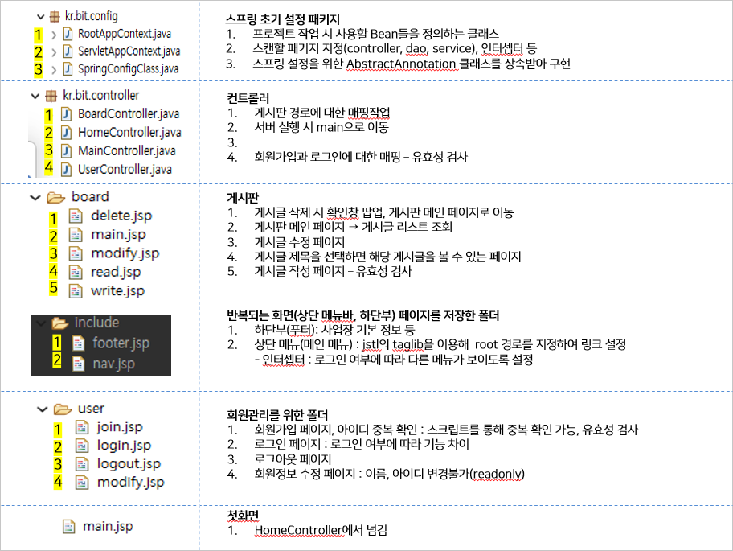

## Dynamic 프로젝트 생성
### 1. 프로젝트 생성 : Tomcat 있는지 확인!
    

### 2. 생성한 프로젝트 maven으로 변경
    
    - 오류가 있는 경우 maven update
        

<br>
<br>

## 서버 연결 및 기본 설정
### 3. 서버 연결(config) 및 첫 화면 지정(HomeController)
    

### 4. main 페이지 만들기
- 절대 경로 지정: c:url
    ```jsp
    <%@ taglib prefix="c" uri="http://java.sun.com/jsp/jstl/core" %>
    <c:url value='/' var="root"/>
    ```
    - /절대경로 를 포함하기 위해서 사용 : 페이지마다 상대경로로 할 순 없으니 절대경로를 지정하여 페이지 위치 지정
    - var로 이름 지정(root) = root/하위경로
    
- 부트스트랩 사용
    - <a href="https://getbootstrap.com/docs/4.1/getting-started/introduction/">부트스트랩</a>에서 css와 js 사용
    ```jsp
    <link rel="stylesheet" href="https://maxcdn.bootstrapcdn.com/bootstrap/4.1.0/css/bootstrap.min.css">
    <script src="https://ajax.googleapis.com/ajax/libs/jquery-3.3.1/jquery.min.js"></script>
    <script src="https://cdnjs.cloudflare.com/ajax/libs/popper.js/1.14.0/umd/popper.min.js"></script>
    <script src="https://maxcdn.bootstrapcdn.com/bootstrap/4.1.0/js/bootstrap.min.js"></script>
    ```

### 5. main에 import되는 nav, footer 작성
- main.jsp의 main
    ```jsp
	<c:import url="/WEB-INF/views/include/nav.jsp"/>
	<c:import url="/WEB-INF/views/include/footer.jsp"/>
    ```

- nav.jsp
    ```jsp
    <%@ page language="java" contentType="text/html; charset=UTF-8"
        pageEncoding="UTF-8"%>
    <%@ taglib prefix="c" uri="http://java.sun.com/jsp/jstl/core" %>
    <c:url value='/' var="root"/>
    <!-- 상단 -->
    <nav class="navbar navbar-expand-md bg-dark text-white fixed-up shadow-lg">
        <a class="navbar-brand" href="${root }main">데브옵스</a>
        <button class="navbar-toggler" type="button" data-bs-toggle="collapse" data-bs-target="#navbarNav" aria-controls="navbarNav">
        <span class="navbar-toggler-icon"></span>
        </button>
        <div class="collapse navbar-collapse" id="navbarNav">
        <ul class="navbar-nav"></ul>
        <ul class="navbar-nav ml-auto">
            <li class="nav-item">
            <a class="nav-link" href="${root }user/modify">정보수정</a>
            </li>
            
            <li class="nav-item">
            <a class="nav-link" href="${root }user/logout">로그아웃</a>
            </li>
            
            <li class="nav-item">
            <a class="nav-link" href="${root }user/login">로그인</a>
            </li>
            
            <li class="nav-item">
            <a class="nav-link" href="${root }user/join">회원가입</a>
            </li>
        </ul>
        </div>
    </nav>
    ```
- footer.jsp
    ```jsp
    <%@ page language="java" contentType="text/html; charset=UTF-8"
        pageEncoding="UTF-8"%>
    <c:url value='/' var="root"/>
    <div class="container-fluid bg-white text-dark" style="margin-top:50px;padding-top:30px;padding-bottom:30px;">
        <div class="container">
            <p>데브옵스 10기</p>
            <p>서울시 서초구 서초동</p>
            <p>사업자 번호: 123-456-7890</p>
        </div>
    </div>
    ```
> 절대경로로 넣으면 새로운 요청이 발생했을 때 localhost:808 주소만 남음
> 하위 경로가 어떻게 되어있던 상관없이 원하는 페이지를 직접 요청할 수 있음

## 서브 페이지 - 유저
### 유저 서브 페이지로 이동할 수 있도록 경로 맵핑
- UserController 파일을 생성하여 /user 경로에 있는 페이지 맵핑
- 공통된 경로(/user)는 @RequestMapping으로 묶어줄 수 있음
    ```java
    @Controller
    @RequestMapping("/user") //공통된 경로 맵핑
    public class UserController {

            @GetMapping("/modify")
            public String modify() {
                return "user/modify";
            }
            
            @GetMapping("/logout")
            public String logout() {
                return "user/logout";
            }
            
            @GetMapping("/login")
            public String login() {
                return "user/login";
            }
            
            @GetMapping("/join")
            public String join() {
                return "user/join";
            }
    }
    ```
### 유저 서브 페이지 작성
- 회원가입(join.jsp) 작성
    - 회원가입 버튼 선택 → \<form action="${root}user/login" method="post">
    - UserController에서 get으로 로그인을 넘겼기 때문에 문제 발생. 일단 post방식으로 변경
- 로그인(login.jsp) 작성
    - 로그인 선택 → \<form action="${root}main" method="get">
	- 회원가입 선택 → \<a href="${root }user/join" class="btn btn-danger">회원가입</a>

## 서브 페이지 - 게시판
### 게시판 서브 페이지로 이동할 수 있도록 경로 맵핑
- BoardController 파일을 생성하여 /board 경로에 있는 페이지 맵핑
    ```java
    @Controller
    @RequestMapping("/board")
    public class BoardController {
        @GetMapping("/main")
        public String main() {
            return "board/main";
        }
        @GetMapping("/read")
        public String read() {
            return "board/read";
        }
        @GetMapping("/write")
        public String write() {
            return "board/write";
        }
        @GetMapping("/modify")
        public String modify() {
            return "board/modify";
        }
        @GetMapping("/delete")
        public String delete() {
            return "board/delete";
        }

    }
    ```

### 게시판 서브 페이지 작성
- 게시판 목록(board/main) 작성
    - 부트스트랩에서 페이지 네이션 추가
    - 글쓰기 이동 버튼 \<a href="${root }board/write" class="btn btn-primary">글쓰기</a>
- 게시글 쓰기(board/write) 작성
    - 작성 완료 → \<form action="${root}board/read" method="get">
- 게시글 수정(board/read) 작성
    - 목록 페이지 이동 → \<a href="${root }board/main" class="btn btn-primary">목록</a>
	- 수정 페이지 이동 → \<a href="${root }board/modify" class="btn btn-info">수정</a>
    - 삭제 페이지 이동 →<a href="${root }board/delete" class="btn btn-danger">삭제</a>
- 게시글 수정(board/modify) 작성
    - 수정 완료 → \<form action="${root}board/read" method="get">
    - 작성 취소 → \<a href="${root }board/read" class="btn btn-info">취소</a>
- 게시글 삭제(board/delete) 작성
    - 게시글 삭제 후 alert, main으로 이동

## 전체 패키지 정리



## DB 작성
### sql에 테이블 작성
- 게시물 번호: board_info_table
- 게시물 상세: content_table
- 유저 정보: user_table
    ```sql
    use hyeon;

    create table board_info_table(
    board_info_idx int auto_increment primary key,
    board_info_name varchar(500) not null);

    insert into board_info_table values(1,'1팀');
    insert into board_info_table values(2,'2팀');

    create table user_table(
    user_idx int auto_increment primary key,
    user_name varchar(50) not null,
    user_id varchar(100) not null,
    user_pw varchar(100) not null);

    create table content_table(
    content_idx int auto_increment primary key,
    content_subject varchar(500) not null,
    content_text text not null,
    content_writer_idx int not null,
    content_board_idx int not null,
    content_date date not null,
    foreign key(content_writer_idx) references user_table(user_idx),
    foreign key(content_board_idx) references board_info_table(board_info_idx));

    desc content_table;
    desc user_table;
    desc board_info_table;
    ```

### 프로젝트에서 beans 생성
- 각 테이블에 맞는 변수 설정 및 get, set
    
- sql 연결을 위해 WEB-INF의 lib에 mysql connenct 넣기

### 프로젝트와 DB 연결
- 1. pom.xml에 mybatis 설정
    ```xml
		<dependency>
			<groupId>org.mybatis</groupId>
			<artifactId>mybatis-spring</artifactId>
			<version>2.0.3</version>
		</dependency>
    ```
- 2. properties에 db정보 입력
    ```properties
    db.classname=com.mysql.cj.jdbc.Driver
    db.url=jdbc:mysql://localhost:3306/db명
    db.username=이름
    db.password=비밀번호
    ```
- 3. ServletAppContext에 sql 정보 등록
    ```java
    @PropertySource("/WEB-INF/properties/db.properties") //Properties 파일 사용 명시
    public class ServletAppContext implements WebMvcConfigurer{
        
        @Value("${db.classname}")
        private String db_classname;

        @Value("${db.url}")
        private String db_url;
        
        @Value("${db.username}")
        private String db_username;
        
        @Value("${db.password}")
        private String db_password;
	
    // ....

    	@Bean //Bean으로 정보 등록
        public BasicDataSource dataSource() {
            BasicDataSource source = new BasicDataSource();
            source.setDriverClassName(db_classname);
            source.setUrl(db_url);
            source.setUsername(db_username);
            source.setPassword(db_password);
            
            return source;
        }
        
        @Bean
        public SqlSessionFactory factory(BasicDataSource source) throws Exception{
            SqlSessionFactoryBean fac = new SqlSessionFactoryBean();
            fac.setDataSource(source);
            SqlSessionFactory factory = fac.getObject();
            return factory;
        }

        @Bean
            public MapperFactoryBean<MapperInterface> text_mapper(SqlSessionFactory factory) throws Exception{
            MapperFactoryBean<MapperInterface> fac = new MapperFactoryBean<MapperInterface> (MapperInterface.class);
            fac.setSqlSessionFactory(factory);
            return fac;
	    }
    }
    ```