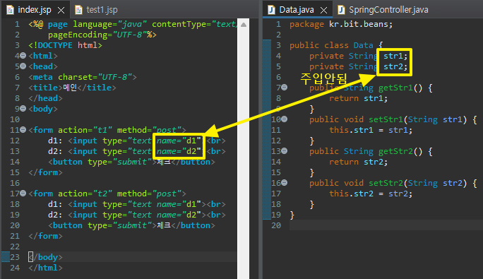
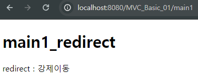
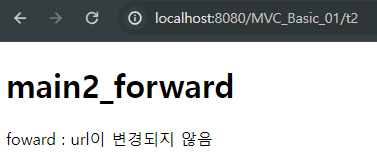

# 1. 추출/주입받기
<details>
<summary style="font-size:x-large; font-weight: bold;">사용자가 값을 전달할 때 컨트롤러에서 받을 경우</summary>

> MVC_Basic_05 프로젝트 참고
<details>
    <summary>index page</summary>
    
```html

<a href="t1?data1=10&data2=20&data3=30&data3=40">test1</a><br>
<form action="t2" method="post">
    d1: <input type="text" name="d1"><br>
    d2: <input type="text" name="d2"><br>
    d3: <input type="checkbox" name="d3" value="10">data3 10
        <input type="checkbox" name="d3" value="20">data3 20<br>
        <button type="submit">test2</button>
</form>

<br><br>

<a href="t3?data1=10&data2=20&data3=30&data3=40">test3</a><br>

<a href="t4/10/20/30">test4</a><br>

<a href="t5?data1=10&data2=20&data3=30&data3=40">test5</a><br>
<a href="t6?data1=10&data2=20&data3=30&data3=40">test6</a><br>

<a href="t7?data1=10">test7</a><br>

```

</details>

### HttpServletRequest 사용(request.getParameter())
- URL에 쿼리스트링으로 들어온 데이터 처리
    ```java
        @GetMapping("/t1")
        public String t1(HttpServletRequest request) {
            String d1 = request.getParameter("data1"); //10
            String d2 = request.getParameter("data2"); //20
            String d3[] = request.getParameterValues("data3"); 
            
            System.out.println(d1);
            System.out.println(d2);
            for(String str:d3) {
                System.out.println(str);
            }
            return "final";
        }
    ```

### WebRequest 사용
- 
    ```java
        @GetMapping("/t3")
        public String t3(WebRequest request) {
            String d1 = request.getParameter("d1"); //10
            String d2 = request.getParameter("d2"); //20
            String d3[] = request.getParameterValues("d3"); 
            
            System.out.println(d1);
            System.out.println(d2);
            for(String str:d3) {
                System.out.println(str);
            }
            return "final";
        }
    ```

### 경로로 주입받기(@PathVariable 사용)
- 주소/값1/값2...의 형태
- 데이터 요청주소에 값이 있을 경우 값을 주입받을 수 있음
    ```java
        @GetMapping("t4/{data1}/{data2}/{data3}") //{}안에는 임의의 이름
        public String t4(@PathVariable int data1, @PathVariable int data2, @PathVariable int data3) {
            //@PathVariable: 데이터 요청주소에 값이 있을 경우 값을 주입받을 수 있음
            System.out.println(data1);
            System.out.println(data2);
            System.out.println(data3);
            
            return "final";
        }
    ```
### @RequestParam
- 값을 직접 주입받을 수 있음
- 이름이 같아야함! (변수이름 = 파라미터 이름)
    ```java
        @GetMapping("/t5")
        public String t5(@RequestParam int data1, @RequestParam int data2, @RequestParam int[] data3) {
            System.out.println(data1);
            System.out.println(data2);
            for(int str:data3) {
                System.out.println(str);
            }
            return "final";
        }
    ```
- 변수의 이름을 바꾸고 싶을 경우 value 속성을 사용하여 파라미터 이름을 지정할 수 있음
    ```java
        @GetMapping("/t6")
        public String t6(@RequestParam(value="data1") int n1, @RequestParam(value="data2") int n2, @RequestParam(value="data3") int[] n3) {
            System.out.println(n1);
            System.out.println(n2);
            for(int str:n3) {
                System.out.println(str);
            }
            return "final";
        }
    ```

- 값이 없을 때 확인(required), 기본값 지정(defaultValue) 방법
    ```java
        @GetMapping("/t7")									//null값 들어감                            //기본값을 0으로 넣겠다
        public String t7(@RequestParam int data1, @RequestParam(required=false) String data2, @RequestParam(defaultValue="0") int data3) {
            System.out.println(data1); //10
            System.out.println(data2); //null
            System.out.println(data3); //0
            
            return "final";
        }	
    ```
</details>

<details>
<summary style="font-size:x-large; font-weight: bold;">객체로 주입받는 방법</summary>

> MVC_Basic_06 프로젝트 참고
<details>
    <summary>index page</summary>
    
```html

<a href="t1?data1=10&data2=20&data3=30&data3=40">test1</a><br>
<a href="t2?data1=10&data2=20&data3=30&data3=40">test2</a><br>

```

</details>

### Map, List를 통해 데이터 받기
- Map, List import 
    ```java
        @GetMapping("/t1")	//t1?data1=10&data2=20&data3=30&data3=40 1과 2는 Map으로 받고 3은 List로 받음
        public String t1(@RequestParam Map<String, String> map, @RequestParam List<String> data3) {
            String data1=map.get("data1"); 
            String data2=map.get("data2"); 
            //String data33=map.get("data3"); 
            
            System.out.println(data1); //10
            System.out.println(data2); //20
            //System.out.println(data33); //30
            
            for(String str:data3) {
                System.out.println(str); //30 40
            }
            
            return "final";
        }
    ```

### @ModelAttribute
- 파라미터를 객체로 주입받을 수 있음
- 컨트롤러에서 메서드의 파라미터는 기본자료형을 제외한 객체형 타입은 다시 화면으로 전달
- @ModelAttribute는 명시적으로 화면에 전달되도록 지정(생략가능, but 적어주는게 좋음)
- ex) (@ModelAttribute Data bean1, @ModelAttribute Data2 bean2) = (Data bean1, Data2 bean2)
    ```java
        @GetMapping("/t2") //index.jsp에서 값을 /t2로 넘길 때 → Data객체 필드에 주입됨(넘긴 값)
        public String t2(@ModelAttribute Data bean1, @ModelAttribute Data2 bean2) {
            System.out.println(bean1.getData1()); //10
            System.out.println(bean1.getData2()); //20
            
            for(int n:bean1.getData3()) {
                System.out.println(n); //30 40
            }
            
            System.out.println(bean2.getData1()); //10
            System.out.println(bean2.getData2()); //20
            
            return "final";
        }
    ```
#### 별도 class에 값을 저장할 경우
> MVC_Basic_08 참고
- form > input의 name 값과 데이터를 get, set하는 변수명이 같아야 주입됨!!
    
- 객체로 저장된 필드 값 가져올때 클래스명 맨 앞글자는 소문자로 작성해야 함
    - ${requestScope.data.str1 }
- class명이 아닌 이름 지정 가능
    - (@ModelAttribute("test") Data bean)

</details>

<br>

# 2. viewResolver
<details>
<summary style="font-size:x-large; font-weight: bold;">값을 주입받아 브라우저에 출력</summary>
> MVC_Basic_07 프로젝트 참고
<details>
    <summary>index page</summary>
    
```html
<a href="t1?data1=10&data2=20">test1</a><br>
<a href="t2">test2</a><br>
<a href="t3">test3</a><br>
<a href="t4">test4</a><br>
```

</details>

### 쿼리스트링의 값을 받아 브라우저에 출력
- jsp 방식과 비슷함
    ```java
        //SpringController
        @GetMapping("/t1")
        public String t1() {
            return "test1";
        }
    ```
    ```jsp
    <!-- test1 -->
    <body>
        <%
            String d1 = request.getParameter("data1");
            String d2 = request.getParameter("data2");
        %>
        <%=d1 %>
        <%=d2 %><br>
        
        <!-- EL언어 -->
        ${param.data1 }
        ${param.data2 }
    </body>
    ```

### 값을 담는 setAttribute 사용하여 브라우저에 전달
- pageContext, request, session, Application
    ```java
        //SpringController
        @GetMapping("/t2")
        public String t2(HttpServletRequest request) {
            request.setAttribute("data1", 10);
            request.setAttribute("data2", 20);
            
            return "test2";
        }
    ```
    ```jsp
    <!-- test2 -->
    <body>
        ${data1 } <!-- requestScope.data1 이지만 생략 가능 -->
        ${data2 }
    </body>
    ```

### Model에 데이터를 담을 경우
- Model인 경우(Model, ModelAndView)  request
    ```java
        //SpringController
        import org.springframework.ui.Model;

        @GetMapping("/t2")
        public String t2(HttpServletRequest request) {
            request.setAttribute("data1", 10);
            request.setAttribute("data2", 20);
            
            return "test2";
        }
    ```
    ```jsp
    <!-- test3 -->
    <body>
        ${requestScope.data1 }
        ${data2 }
    </body>
    ```

### ModelAndView에 데이터를 담을 경우
- Model을 더 자주씀
    ```java
        //SpringController
        @GetMapping("/t4")
        public ModelAndView t4(ModelAndView mv) { //실무에선 보통 model로 씀
            mv.addObject("data1",50); //값 세팅
            mv.addObject("data2",60);
            
            mv.setViewName("test4"); //test4로 뷰페이지 설정 → 페이지 이동
            
            return mv;
        }
    ```
    ```jsp
    <!-- test4 -->
    <body>
        ${data1 }
        ${data2 }
    </body>
    ```


</details>

<br>

# 3. form요소들
### \<form:form>
- radio, checkbox 등 많이 사용
<details>
<summary style="font-size:x-large; font-weight: bold;">form에 입력된 값을 받는 장법</summary>
> MVC_Basic_09 프로젝트 참고
<details>
    <summary>index page</summary>
    
```html
<%@ page language="java" contentType="text/html; charset=UTF-8"
    pageEncoding="UTF-8"%>
<body>
<a href="t1">test1</a><br>
<a href="t2">test2</a><br>
<a href="t3">test3</a><br>
<a href="t4">test4</a>
</body>
</html>
```
</details>

### class 객체에 저장한 값 불러오기
- el언어를 이용하여 값 불러오기
    ```java
    // SpringController
    <body>
        <form action="final" method="post">
            이름: <input type="text" name="name" value="${requestScope.data.name}" }><br>
            아이디: <input type="text" name="id" value="${data.id}" }><br>
            비밀번호: <input type="text" name="pw" value="${data.pw}" }><br>
            주소1: <input type="text" name="adr1" value="${data.adr1}" }><br>
            주소2: <input type="text" name="adr2" value="${data.adr2}" }>
            
            <button type="submit">로그인</button>
        </form>
    </body>
    ```
    ```html
    <body>
        <form action="final" method="post">
            이름: <input type="text" name="name" value="${requestScope.data.name}" }><br>
            아이디: <input type="text" name="id" value="${data.id}" }><br>
            비밀번호: <input type="text" name="pw" value="${data.pw}" }><br>
            주소1: <input type="text" name="adr1" value="${data.adr1}" }><br>
            주소2: <input type="text" name="adr2" value="${data.adr2}" }>
            
            <button type="submit">로그인</button>
        </form>
    </body>
    ```

### form 기능을 활용하여 값을 불러오기
- <form:form>을 사용하여 값 불러오기
- modelAttribute에 class이름 넣을 경우 경로 안적어도 됨
    ```java
        // SpringController
        @GetMapping("/t2")
        public String t2(Data bean) {
            bean.setName("수정");
            bean.setId("kim");
            bean.setPw("1234");
            bean.setAdr1("Seoul");
            bean.setAdr2("gangnam");
            
            return "test1";
        }
    ```
    ```html
    <!-- test2 -->
    <%@ page language="java" contentType="text/html; charset=UTF-8"
        pageEncoding="UTF-8"%>
    <%@ taglib prefix="form" uri="http://www.springframework.org/tags/form" %>
    <!DOCTYPE html>
    <html>
    <head>
    <meta charset="UTF-8">
    <title>메인</title>
    </head>
    <body>
        <form:form action="final" modelAttribute="data">
            이름: <form:input path="name"><br> <!-- path이름과 설정한 필드명이 같아야함 -->
            아이디: <form:input path="id"><br>
            비밀번호: <form:input path="pw"><br>
            주소1: <form:input path="adr1"><br>
            주소2: <form:input path="adr2">
        
        </form:form>
    </body>
    </html>
    ```

### 이름을 지정하여 가져오기
- @ModelAttribute로 이름 지정
    ```java
	@GetMapping("/t3")
	public String t3(@ModelAttribute("modelBean") Data bean) {
		bean.setName("화연");
		bean.setId("hong");
		bean.setPw("1234");
		bean.setAdr1("Seoul");
		bean.setAdr2("gangnam");
		
		return "test3";
	}
    ```
    ```html
    <!-- test3 -->
    <form:form action="final" modelAttribute="modelBean">
        이름 : <form:input path="name" /><br>
        아이디 : <form:input path="id" /><br>
        비번 : <form:password path="pw" showPassword="true"/><br>
        주소1 : <form:input path="adr1" /><br>
        주소2 : <form:input path="adr2" /><br>
        <button type="submit">체크</button>
    </form:form>
    ```

### Model로 값 주입
- Model을 이용한 값주입
    ```java
	@GetMapping("/t4")
	public String t4(Model model) {
		Data bean = new Data();
		bean.setName("비트");
		bean.setId("hong");
		bean.setPw("1234");
		bean.setAdr1("Seoul");
		bean.setAdr2("gangnam");
		
		model.addAttribute("modelBean",bean);
		
		return "test4";
	}
    ```
    ```html
    test3과 동일
    ```

</details>

# 4. redirect, forward
<details>
<summary style="font-size:x-large; font-weight: bold;">redirect, forward 작동 예시</summary>
> MVC_Basic_11 프로젝트 참고
<details>
    <summary>index page</summary>
    
```html
<body>
<a href="t1">Redirect</a><br>
<a href="t2">Forword</a>
</body>
```
</details>

### redirect
- url이 변경되는 강제 이동
    ```java
        @GetMapping("/t1")
        public String t1() {
            return "redirect:/main1";
        }
        @GetMapping("/main1")
        public String main1() {
            return "main1";
        }
    ```   
    ```html
    <body>
        <h1>main1_redirect</h1>
        redirect : 강제이동
    </body>
    ```
    

### forward
- url이 변경되지 않음
    ```java
        @GetMapping("/t2")
        public String t2() {
            return "forward:/main2";
        }
        @GetMapping("/main2")
        public String main2() {
            return "main2";
        }
    ```   
    ```html
    <body>
        <h1>main2_forward</h1>
        foward : url이 변경되지 않음
    </body>
    ```
    

</details>
<details>
<summary style="font-size:x-large; font-weight: bold;">forward, Model 사용 예시</summary>
> MVC_Basic_12 프로젝트 참고
<details>
    <summary>index page</summary>

```html
<body>
<a href="t1">Test1</a><br>
</body>
```
</details>

### 1. beans 생성
- Data클래스 4개 생성


### 2. RootAppContext
- @Configuration로 bean설정 파일임을 명시
    ```java
    package kr.bit.config;

    import org.springframework.context.annotation.Bean;
    import org.springframework.context.annotation.Configuration;

    import kr.bit.beans.Data;
    import kr.bit.beans.Data2;

    @Configuration	//bean설정 파일임을 명시
    public class RootAppContext {	//root-context.xml과 동일
        @Bean
        public Data data() {
            return new Data();
        }
        @Bean("request2")
        public Data2 data2() {
            return new Data2();
        }
        
    }
    ```
### 3. ServletAppContext
- @ComponentScan("kr.bit.beans") → @Component 선언 시 추가해줘야 함

### 4. SpringController
- @Autowired로 자동주입
    ``` java
    @Controller
    public class SpringController {
        @Autowired
        Data data1; //IoC컨테이너(RootAppContext.java)에 빈으로 등록(@Bean)한 Data 객체의 주소값이 data1 필드에 자동 주입됨
        @Resource(name="request2")
        Data2 data2;//IoC컨테이너에 빈으로 등록하며 이름을 지정한(request2) Data 객체의 주소값이 data2 필드에 자동 주입됨
        @Autowired
        Data3 data3;
        @Resource(name="request4")
        Data4 data4;
        
        @GetMapping("/t1")
        public String t1() {
            data1.setStr1("스프링1");
            data1.setStr2("스프링2");
            
            data2.setStr3("스프링3");
            data2.setStr4("스프링4");
            
            data3.setStr5("스프링5");
            data3.setStr6("스프링6");
            
            data4.setStr7("스프링7");
            data4.setStr8("스프링8");
            
            return "forward:/final1"; //forward는 request객체 유지됨 (redirect는 안됨)
        }
        @GetMapping("/final1")
        public String final1(Model model) { //request 범위와 같음
            //model 객체에 위에서 set한 값 담기
            model.addAttribute("data1",data1);
            model.addAttribute("data2",data2);
            model.addAttribute("data3",data3);
            model.addAttribute("data4",data4);
            
            return "final";
        }
    }
    ```
### 5. final.jap 출력
- data객체에 담긴 데이터 출력
    ```jsp
    <body>
    ${requestScope.data1.str1 }
    ${requestScope.data1.str2 } <br>

    ${requestScope.data2.str3 }
    ${requestScope.data2.str4 } <br>

    ${requestScope.data3.str5 }
    ${requestScope.data3.str6 } <br>

    ${requestScope.data4.str7 }
    ${requestScope.data4.str8 } <br>
    </body>
    ```

### 만약 redirect라면
- 위의 코드일 경우 Model에 객체가 저장되기 때문에 출력됨
- Bean에 @RequestScope 설정 시 redirect로 값이 저장되지 않음
- @RequestScope: 요청이 발생할 때마다 Bean객체가 생성되며 자동으로 주입됨

</details>
<br><br>

# 5. request, session 빈 주입