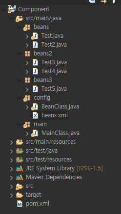
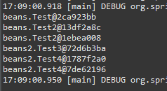

## 자바 Component
- maven 레파지토리에서 검색 : https://mvnrepository.com/artifact/javax.annotation/javax.annotation-api/1.3.2
- Maven코드를 복사하여 pom.xml에 등록

### 프로젝트 생성
- 폴더링 및 파일 구성


- beans.xml에 등록
    ```xml
    <?xml version="1.0" encoding="UTF-8"?>
    <beans xmlns="http://www.springframework.org/schema/beans"
        xmlns:xsi="http://www.w3.org/2001/XMLSchema-instance"
        xmlns:context="http://www.springframework.org/schema/context"
        xsi:schemaLocation="http://www.springframework.org/schema/beans
                            http://www.springframework.org/schema/beans/spring-beans.xsd
                            http://www.springframework.org/schema/context
                            http://www.springframework.org/schema/context/spring-context.xsd">
                            
                            
    </beans>
    ```

### @component 지정
- @Component
    - bean을 따로 등록하지 않아도 자동으로 등록됨. 
    - class위에 적어줘야함
    - @Component("이름") 형식으로 이름 지정 가능

- Test03,4,5 클래스를 컴포넌트로 지정
    ```java
    package beans2;

    import org.springframework.stereotype.Component;

    @Component
    //bean을 따로 등록하지 않아도 자동으로 등록됨. class위에 적어줘야함
    public class Test3 {}
    ///////////////////////////////////////////////////////////
    package beans2;

    import org.springframework.stereotype.Component;

    @Component("component4")
    public class Test4 {}

    ```

- beans.xml 파일로 class와 컴포넌트 가져오기
    - \<context:component-scan base-package="패키지명"/>: 지정된 패키지 안에 있는 Bean 클래스들의 어노테이션을 분석(체크)한다 
	
    ```xml
    <?xml version="1.0" encoding="UTF-8"?>
    <beans xmlns="http://www.springframework.org/schema/beans"
        xmlns:xsi="http://www.w3.org/2001/XMLSchema-instance"
        xmlns:context="http://www.springframework.org/schema/context"
        xsi:schemaLocation="http://www.springframework.org/schema/beans
                            http://www.springframework.org/schema/beans/spring-beans.xsd
                            http://www.springframework.org/schema/context
                            http://www.springframework.org/schema/context/spring-context.xsd">
                            
        <!-- 지정된 패키지 안에 있는 Bean 클래스들의 어노테이션을 분석(체크)한다 -->
        <context:component-scan base-package="beans2"/>
        <context:component-scan base-package="beans3"/>

        <bean class="beans.Test"/>
        <bean class="beans.Test2" id="test2"/>
        <bean class="beans.Test2" id="test22"/>
        
        <bean class="beans2.Test4" id="test4"/>
    </beans>
    ```

- java 파일로 bean을 생성할 경우
    ```java
    package config;

    import org.springframework.context.annotation.Bean;
    import org.springframework.context.annotation.ComponentScan;
    import org.springframework.context.annotation.Configuration;

    import beans.Test;
    import beans.Test2;
    import beans2.Test3;


    @Configuration
    @ComponentScan(basePackages = "beans2")
    @ComponentScan(basePackages = "beans3")
    //@ComponentScan어노테이션이 있는 beans2, beans3 패키지 검사(체크)한다
    //어노테이션이 있는지 확인(@component, @repository, @controller, @service...)
    public class BeanClass {

        //Test 3,4,5는 위에 @ComponentScan으로 가져와서 bean으로 등록하지 않아도 됨
        
        @Bean
        public Test test1() {
            return new Test();
        }
        
        @Bean
        public Test2 test2() {
            return new Test2();
        }

        @Bean
        public Test3 test3() {
            return new Test3();
        }
    }
    ```

- main에서 출력
    ```java
    package main;

    import org.springframework.context.annotation.AnnotationConfigApplicationContext;
    import org.springframework.context.support.ClassPathXmlApplicationContext;

    import beans.Test;
    import beans.Test2;
    import beans2.Test3;
    import beans2.Test4;

    public class MainClass {
        public static void main(String[] args) {
            ClassPathXmlApplicationContext ctx = new ClassPathXmlApplicationContext("config/beans.xml");
            
            Test t1 = ctx.getBean(Test.class);
            System.out.println(t1);
            
            Test2 t2 = ctx.getBean("test2",Test2.class);
            System.out.println(t2);
            
            Test2 t22 = ctx.getBean("test22",Test2.class);
            System.out.println(t22); //다른 id의 객체라 test2와 주소값이 다름
            
            Test3 t3 = ctx.getBean(Test3.class);
            System.out.println(t3);
            
            Test4 t4 = ctx.getBean("component4",Test4.class); //이름을 성정한 경우 id값이 됨
            System.out.println(t4);
            
            Test4 t44 = ctx.getBean("test4",Test4.class); //컴포넌트로 등록 후 bean으로 따로 설정도 가능
            System.out.println(t44);
            
            //java에 등록한 bean 가져오기
            AnnotationConfigApplicationContext ctx2 = new AnnotationConfigApplicationContext("config/BeanClass");
            
            Test tt1 = ctx2.getBean(Test.class); 
            System.out.println(tt1);
            
            
            ctx.close();
        }
    }
    ```
- 출력결과: 
    