# 환경설정
## Node.js 설치
- Node.js: 자바스크립트의 실행환경이자 웹 브라우저 밖에서도 쓸 수 있음

1. <a href="https://nodejs.org/en/download/package-manager">Node.js</a> 다운로드
    - 20버전의 짝수버전 다운로드
    - 체크박스 모두 체크 후 next
2. cmd 설정
    - node 버전 확인 : node -v

3. C 드라이브 > react > Test01 폴더 생성
    - vs코드에서 cmd 터미널 열기 > npm init 입력
    - 모두 enter로 폴더 만들기 > package.json이 생성됨
4. vscode
    - Test01에 index.js 생성
    - 터미널에서 node index.js 라고 치면 콘솔 실행됨!
        * node가 실행어
        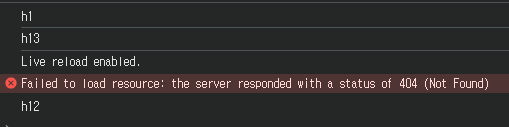
    - 만약 Test01이 아닌 src폴더를 생성해서 하위로 옮기면 실행 안됨
        * 폴더명을 입력해줘야 함
        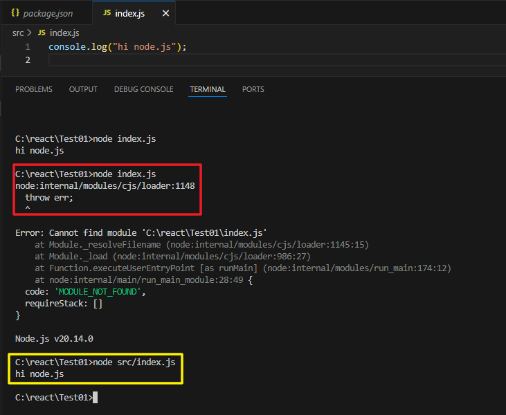
    - package.json에서 start값 설정 시 명령어 "npm run start"로 실행 가능
        - package 설정
        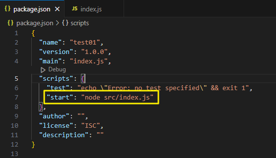
        - 명령어 실행
        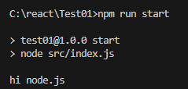

### module 시스템
#### package.json
- Node.js 프로젝트에서 사용되는 파일로, 일반적으로 이 안에는 프로젝트의 이름, 버전, 설명, 작성자, 라이센스, 프로젝트 실행에 필요한 의존성 목록이 포함된다.
#### 모듈 시스템
- 모듈을 생성하고 불러오고 사용하는 모듈을 다루는 다양한 기능을 제공하는 시스템
Ex) common.js, es module
- es module을 많이 씀
1. calculator.js로 함수 작성
    - 방법1. 함수 작성 후 export를 따로 해주기
        - 함수 작성
        - 함수 내보내기 : export
    ```js
    function add(a, b){
        return a+b;
    }

    function multi(a,b){
        return a*b;
    }

    export{add,multi};
    ```

    - 방법2. 각각의 함수 export
    ```js
    export function add(a, b){
        return a+b;
    }

    export function multi(a,b){
        return a*b;
    }
    ```
2. es module사용을 위해 packe.json 설정 변경
    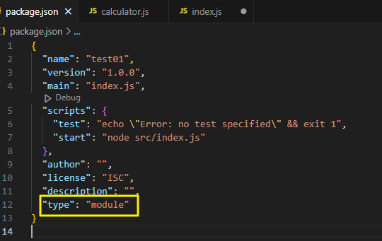
3. indext.js에서 calculator 파일을 import해서 사용해보기

    ```js
    import {add,multi} from "./calculator.js";

    console.log(add(2,2));
    console.log(multi(4,5));
    ```
    - 터미널에서 실행 결과
    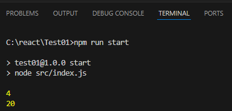

4. export하는 함수에 default 작성 시
    - import할 때 중괄호가 필요없게됨
    ```js
    import sub,{add,multi} from "./calculator.js"
    //두줄로 적는걸 한줄로 적을 수 있음
    //import sub from "./calculator.js"
    //import {add,multi} from "./calculator.js"

    console.log(add(2,2));
    console.log(multi(4,5));
    console.log(sub(3,2));
    ```

### node.js 라이브러리
<a href="https://www.npmjs.com/">npmjs 홈페이지</a>에서 검색 후 터미널에 입력하여 설치
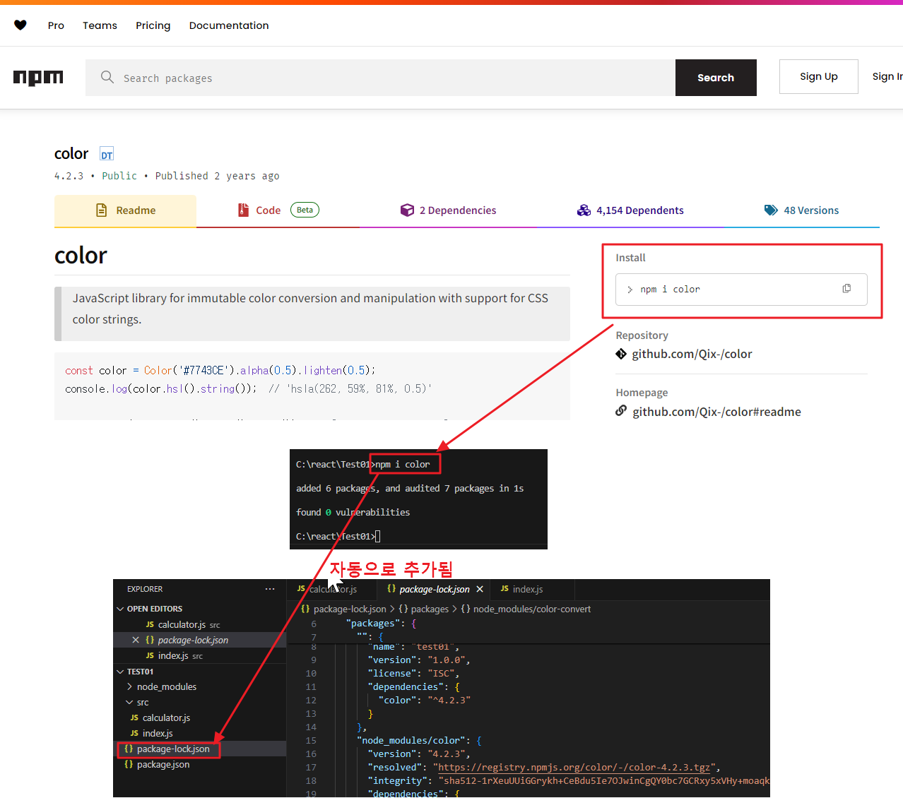
- 설치한 라이브러리 사용
    ```js
    import Color from "color";


    const color = Color();
    console.log(color);
    ```
- 터미널에서 실행
    ```bash
    C:\react\Test01>npm run start

    > test01@1.0.0 start
    > node src/index.js

    { model: 'rgb', color: [ 0, 0, 0 ], valpha: 1 }
    4
    20
    1
    ```

## Vite
- 차세대 프론트엔드 개발 툴
- 기본 설정이 적용된 React App 생성이 가능하다

- 리액트는 안에 서버 내장되어있음

### React 폴더 열기
- 터미널에 npm create vite@latest 입력
- 환경 설정
    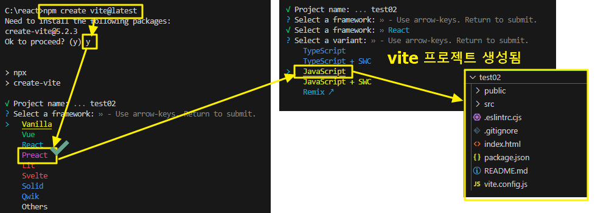

### test02 폴더 열기
- 현재 경로로 터미널 열기 : ctrl+j
- npm i 입력(i는 install 줄임말) → *package-lock.json 생성
    * 기본적으로 제공하는 라이브러리

### 로컬환경(페이지) 설정
- 터미널에 npm run dev 입력 → url이 뜸
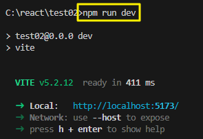
- 터미널에서 약어로 여러 설정 가능
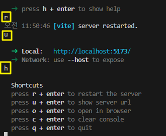

### 컴포넌트 구조 확인
- App 컴포넌트 렌더링하고 있음
    - index > main.jsx > App.jsx 순으로 참조
    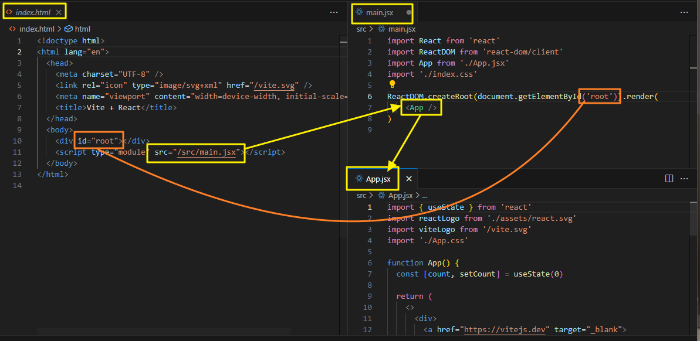
- App.jsx에서 return으로 html태그를 받음 > 리액트에서는 함수가 html태그를 리턴하고 있으면 컴포넌트라 부름
    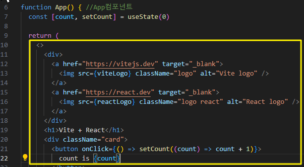
    - App은 import App from './App';을 의미
        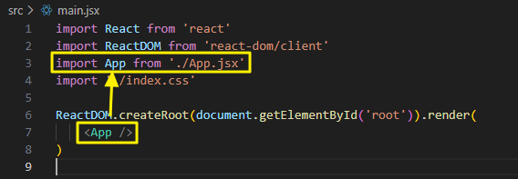
    - App 안의 return값 변경 시 import된 main 화면 변경
        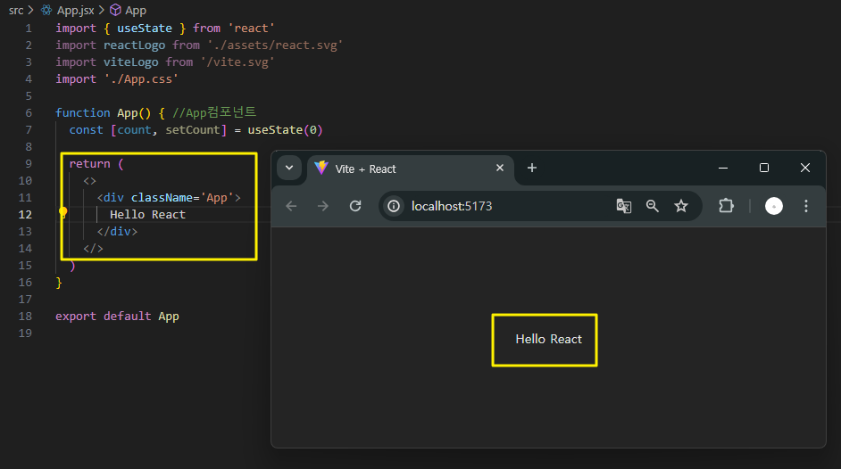

# 기본 개념
## React
- 리액트로 업데이트 구현: 목적만 명시/ 코드 간결 ↔ Js로 업데이트 구현: 모든 과정을 다 설명/ 코드 길어짐

-리액트에서는 각각의 페이지를 컴포넌트 단위로 나눠서 개발하게 되는데, 이때 각각의 컴포넌트들에는 state라는 상태를 저장하는 변수를 둘 수 있음
- State변수 값에 따라 UI 결과가 달라진다(화면 업데이트 시, State변수 값만 바꾸면됨)
### 브라우저 렌더링
- HTML에서 DOM은 DOM이 수정되면 업데이트가 일어나게 됨
    - Render Tree(웹페이지 청사진) → Layout(요소배치) → Painting(실제로 화면에 그려냄)
- CSS → CSSDOM
    - 동시에 발생한 업데이트를 모아놨다가 한꺼번에 DOM수정해야함
    - → 한번한번 다 DOM수정하면 성능안좋아짐
    - *복잡한 대규모에선 불가능 (리액트는 이 과정을 자동으로 처리해줌)
#### Virtual DOM
- DOM을 자바스크립트 객체로 흉내낸 복제판
- 리액트의 특징: 업데이트가 발생하면 실제 DOM을 수정하기 전에 가상의 복제판 DOM에 먼저 반영해봄
- 실제 돔이 아닌 복제판에 반영한 후 → 실제 돔에 반영(일종의 버퍼역할)
> 업데이트 처리 빨라짐!<br>
> 데이터 업데이트 → 전체 ui를 virtual dom 에 리렌더링 → 이전 virtual dom과 비교 → 바뀐 부분만 실제 dom에 적용

## jsx
- 함수에서 반환하는 내용이 마치 html 을 작성한 것과 같이 보임
- 특징
    1. 리액트 컴포넌트에서 요소 여러 개를 하나의 요소처럼 감싸줘야 함. → <> </> 
        <br>반드시 DOM 트리 구조로 되어 있어야 virtual dom 에서 컴포넌트 변화를 감지한다.
    2. 자바스크립트 표현식 작성하려면 JSX내부에서 코드를 { }로 감싸야 한다.
    3. 태그를 꼭 닫아야 한다.
    4. class 대신 className

## vscode 환경설정
- extension에서 eslint 다운
- 오류가 날만한 코드가 있으면 알려줌
- eslintrc.cjs 설정
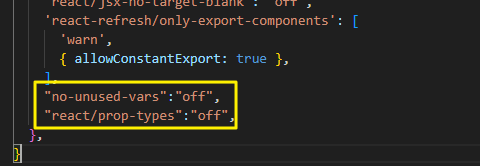

# REACT
## 사용자 정의 태그
- 함수를 정의하여 사용자 정의 태그 사용 가능
- 리액트에서 사용자 정의 태그는 반드시 대문자로 시작
    ```jsx
    import logo from './logo.svg'
    import './App.css'
    function Header(){
        return(
            <header> //App()에 있는 코드 넣기
                <h1><a href="">WEB</a></h1>
            </header>
        )
    }
    function App(){
        return{
            <div>
                <header> //이부분
                    <h1><a href="">WEB</a></h1>
                </header>
            </div>
        }
    }
    ```
    - Header로 컴포넌트 지정 시 헤더 컴포넌트만 불러오면 됨
        ```jsx
            function App(){
                return{
                <Header></Header> //헤더 컴포넌트 불러오기
                }
            }
        ```
- eslint 에러 발생 시 <div>태그로 감싸면 됨

### 사용자 정의태그 실습
- App.jsx에서 Header 컴포넌트 생성 및 App 컴포넌트에서 불러오기
    ```jsx
    //헤더 컴포넌트
    /*functionj= Header(){
    return(
        <header>
        <h1>header</h1>
        </header>
    )
    }*/

    const Header = () =>{ //Header 컴포넌트(자식)
    return(
        <header>
        <h1>header</h1>
        </header>
    )
    }

    function App() { //App 컴포넌트(부모 컴포넌트)
    return (
        <>
        <Header/> //자식 컴포넌트
        </>
    )
    }

    export default App
    ```
    - 출력화면 : 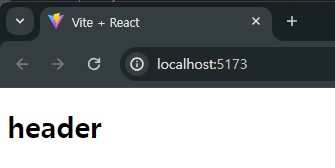
### 컴포넌트 모아두기
- src에 components 폴더 생성
- Header.jsx 파일 생성 > 위에서 작성한 헤더 컴포넌트 가져오기
- export 내보내기
    ```jsx
    //Header.jsx
    const Header = () =>{ //Header 컴포넌트
        return(
        <header>
            <h1>header</h1>
        </header>
        )
    }
    
    export default Header;
    ```
    ```jsx
    //App.jsx
    import Header from "./copmonents/Haeder"

    function App() { //App 컴포넌트
    return (
        <>
        <Header/> 
        <h1>안녕하세요</h1>
        </>
    )
    }

    export default App
    ```