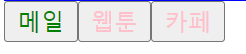
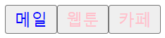
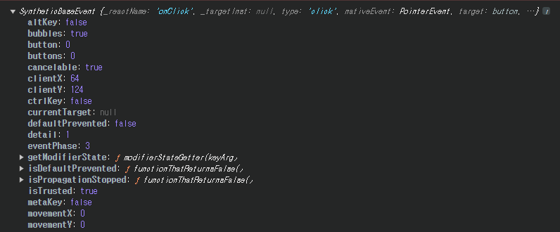
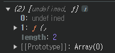
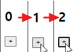
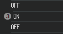
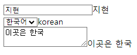
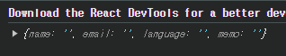
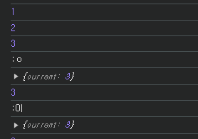
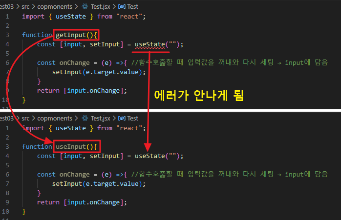

## js 배열
### 배열, 객체 구조 할당
- 배열이나 객체의 속성을 해체하여 그 값을 개별 변수에 담을 수 있게 하는 JavaScript 표현식
- 배열 구조 할당
    ```js
    let arr=[1,2,3];
    let [one, two, three] = arr;
    ```
- 객체 구조 분해 할당
    ```js
    let student={
        name:"홍길동",
        age:20,
        hobby:"컴퓨터",
    }

    let {name, age, hobby}=student;
    console.log(name,age,hobby);
    ```

### ... 연산자
- stread 연산자 
- 객체나 배열에 저장된 여러 개의 값을 개별로 흩뿌려줌
    ```js
    let arr1 = [1,2,3];
    let arr2 = [4,5,arr1[0],arr1[1],arr1[2]];
    let arr3 = [4,5,...arr1,6]; //arr에 있는 값들이 다 들어감

    console.log(arr2); //4,5,1,2,3
    console.log(arr3); //4,5,1,2,3,6

    let obj1={
        a:1,
        b:2,
    }

    let obj2={
        a:obj1.a,
        b:obj1.b,
        c:3,
        d:4,
        e:5,
    }

    let obj3={
        ...obj1,
        c:3,
        d:4,
        e:5,
    }

    console.log(obj2);
    console.log(obj3); //obj2와 같은 결과

    function fun(p1,p2,p3){
        console.log(p1,p2,p3);
    }

    fun(...arr1);
    ```
<br>

## Reacet 표현식
- if문 사용 시
    ```jsx
    const Main = () =>{
    const student = {
        name:"hyeon",
        isLogin: true,
    };

    if(student.isLogin){
        return <div className="logout">로그아웃</div>;
    }else{
        return <div>로그인</div>
    }
    }
    
    export default Main;
    ```
### 삼항조건 표현식
- return에서 삼항조건식 추가
    ```jsx
    const Main = () =>{ 
    const num=10;
    const obj={a:1};

    return(
        <main>
        <h2>{num%2===0?"짝수":"홀수"}</h2>
        {num}
        {obj.a}
        </main>
    )
    }
    
    export default Main;
    ```
- 삼항조건 표현식을 활용하여 화면에 나타내기
    ```jsx
    const Main = () =>{ //Header 컴포넌트
        const student = {
            name:"hyeon",
            isLogin: true,
        };

        return(
            <>
            {student.isLogin ? (
                <div style={{backgroundColor:"yellow", borderBottom:"3px solid blue"}}>
                로그아웃
                </div>
            ):( //false이면
                <div>로그인</div>
            )}
            </>
        )
    }
    
    export default Main;
    ```

- css를 따로 빼낼 경우(component폴더에 Main.css 작성)
    - Main.jsx
        ```jsx
        import "./Main.css";

        const Main = () =>{ 
        const student = {
            name:"hyeon",
            isLogin: true,
        };

        return(
            <>
            {student.isLogin ? (
                <div className="logout">
                로그아웃
                </div>
            ):( //false이면
                <div>로그인</div>
            )}
            </>
        )
        }
        
        export default Main;
        ```
    - Main.css
        ```css
        .logout{
            background-color: yellow;
            border-bottom: 3px solid blue;
        }
        ```

## Props(properties)
- 컴포넌트 속성을 설정할 때 사용하는 요소 
- Props의 값은 해당 컴포넌트를 불러와 사용하는 부모 컴포넌트에서 설정할 수 있음
    - Props는 부모 컴포넌트가 설정하는 값 → props를 바꾸려면 부모 컴포넌트에서 바꾸어 주어야함

- defaultProps : Props 기본값 설정
- childeren : 컴포넌트 태그 사이의 내용을 보여주는 props

### 함수형 컴포넌트
- Button 콤포넌트 만들기
    - Button.jsx
        ```jsx
        const Button = () =>{ //함수형 컴포넌트
            return <button>클릭하세요</button>
        };

        export default Button;
        ```
### props를 활용한 텍스트 넣기
- 출력화면 App.jsx에서 Button의 값 설정
    ```jsx
    import Button from "./copmonents/Button"
    function App() { //App 컴포넌트
    return (
        <>
        <Button text={"메일"} color={"green"}/><br/>
        <Button text={"웹툰"}/><br/>
        <Button text={"카페"}/><br/>
        <Footer/> 
        </>
    )
    }

    export default App
    ```
- Button 컴포넌트에 설정한 값을 불러오도록 변경
    - return문 안에서 props의 값을 출력하려면 {props.text}와 같이 중괄호로 감싸줘야 함
    ```jsx
    const Button = (props) =>{ //함수형 컴포넌트
        console.log(props); //props값이 객체 형태로 담겨서 출력됨
        return <button style={{color:props.color}}>{props.text}</button>
    };

    export default Button;
    ```

### 기본값 지정
- defaultProps 지정
    ```jsx
    const Button = (props) =>{ //함수형 컴포넌트
        console.log(props); //props값이 객체 형태로 담겨서 출력됨
        return <button style={{color:props.color}}>{props.text}</button>
    };

    Button.defaultProps = { //defaultProps : 매개변수로 넘어오는 props가 없어도 적용됨.
        color: "pink", 
    };

    export default Button;
    ```
    

### 매개변수 props이 아닌 이름으로 받아오기
- props대신 지정한 이름으로 받아오기
    ```jsx
    const Button = ({text,color}) =>{ //함수형 컴포넌트
        return <button style={{color:color}}>{text}</button>
    };

    Button.defaultProps = {
        color: "pink",
    };

    export default Button;
    ```
<br>

- ...연산자 활용
    ```jsx
    function App() { //App 컴포넌트
    const buttons={
        text:"메일",
        color:"blue",
        name:"리엑트",
        a:1,
    };

    return (
        <>
        <Button {...buttons}/>
        <Button text={"웹툰"}/>
        <Button text={"카페"}/>
        </>
    )
    }
    ```
    - 화면: 
- 컴포넌트 태그 사이의 자식값 보여주기 : children
    - App.jsx
        ```jsx
      <Button>
        <div>자식</div>
      </Button>
        ```
    - BUtton.jsx
        ```jsx
        const Button = ({text,color, children}) =>{ 
            return 
            <button style={{color:color}}>
                {text}
                {children}
            </button>
        };

        export default Button;
        ```
## 이벤트처리
- Button태그 안에서 이벤트 입력
    ```jsx
    const Button = ({text,color, children}) =>{ //함수형 컴포넌트
        return (
            <button onClick={()=>{
                console.log(text);
            }} style={{color:color}}>
                {text}
                {children}
            </button>
        );
    };
    ```
- 이벤트 정의 후 불러오기
    ```jsx
    const Button = ({text,color, children}) =>{ //함수형 컴포넌트
        const onClickButton=()=>{
            console.log(text);
        }
        return(
            <button onClick={onClickButton}
            onMouseOver={onClickButton}
            style={{color:color}}> 
                {text}
                {children}
            </button>
        )
    };
    ```
- "e" : 브라우저에 적용되는 모든 이벤트 객체
    - 합성이벤트: 브라우저마다 이벤트 객체가 달라질 수 있어 리엑트에서는 여러 브라우저를 참고하여 통합 규격을 만들어 놓음
    
    ```jsx
    const Button = ({text,color, children}) =>{ 
        const onClickButton=(e)=>{ 
            console.log(e);
            console.log(text);
        }
        return(
            <button onClick={onClickButton}
            style={{color:color}}> 
                {text}
                {children}
            </button>
        )
    };
    ```

# state
- prop와 함께 컴포넌트 함수를 다시 실행해서 새로운 리턴 값을 만들어주는 데이터
- prop: 컴포넌트를 사용하는 외부자를 위한 데이터<br>
↔ state: 컴포넌트를 만드는 내부자를 위한 데이터(내부에서 바뀔 수 있는 값)

- state 구조
    ```jsx
    function App() { 
    const state=useState(); //배열 반환
    console.log(state); //두개 요소가 들어있는 배열 형태
    return (
        <></>
    )
    }
    ```
    
> 배열형태: [undefined, f()] = [새롭게 생성된 state값, state값 변경하는 함수]

- 배열 비구조화 할당<br>
    const array=[1,2]<br>
    const [one,two]=array;

- 사본을 업데이트할 때 → spread 연산자라 불리는 ...을 사용하여 처리 

## state값을 활용하여 콘텐츠 작성
- 브라우저에 띄울때 변수를 주고 다르게 띄우고 싶으면 state사용
- useState의 인자는 그 state의 초기값
- 초기값 = undefined로 0임
    ```jsx
    function App() { 
    const [state, setState]=useState(0);
    console.log(state); //0출력

    return (
        <>
        <h2>{state}</h2>
        <button onClick={()=>{
            setState(state+1);
        }}>
            +
        </button>
        </>
    )
    }
    ```
    - 버튼 클릭할 때 마다 값 변경 "리렌더링"
    
- reRendering: 컴포넌트의 <span style="font-weight:bold; color:red">state값이 바뀌면서</span> 컴포넌트가 return을 다시 함
    - 화면을 다시 그림 → 이 때, 변경된 state값도 화면에 바로 반영됨
- state값 설정
    ```jsx
    function App() { 
    const [state, setState]=useState(0);
    const [computer,setComputer] =useState("OFF");

    return (
        <>
        <h2>{computer}</h2>
        <button onClick={()=>{
            setComputer(state==="ON" ? "OFF" : "ON")
        }}>
            {computer ==="ON" ? "끄기":"켜기"}
        </button>
        </>
    )
    }
    ```
- state값에 따라 태그 선정
    ```jsx
    import {Fragment} from "react"
    import { useState } from "react"

    const Computer = ({power}) => {
    return(
        <div>
        {power==="ON"? <h1>ON</h1> : <h1>OFF</h1>}
        </div>
    )
    }

    function App() { 
    const [state, setState]=useState(0);
    const [power,setPower] =useState("OFF");

    return (
        <>
        <Computer power={power}/> {/*부모컴포넌트에서 prop값 설정할 수 있음*/}
        </>
    )
    }

    export default App
    ```
<br>

## 기능별 분리(reRendering을 막기위해)
- 버튼 클릭 시 값 변경
    ```jsx
    import {Fragment} from "react"
    import { useState } from "react"

    const Computer = ({power}) => {
    console.log(power);
    return(
        <div>
        {power==="ON"? <h1>ON</h1> : <h1>OFF</h1>}
        </div>
    ) 
    }

    function App() { 
    const [state, setState]=useState(0);
    const [power,setPower] =useState("OFF");

    return (
        <>
        <div>
            <Computer power={power}/> 
            <button onClick={()=>{
            setPower(power==="ON"?"OFF":"ON");
            }}>
            {power==="ON"?"끈다":"켠다"}
            </button>
        </div>
        <div>
            <h1>{state}</h1> 
            <button onClick={()=>{
            setState(state+1);
            }}>
            +
            </button>
        </div>  
        </>
    )
    }

    export default App
    ```
    - → 하나의 상태가 변경될 때 마다 다른 기능도 함께 리렌더링되므로 기능을 따로 설정할 필요가 있음
    

- 기능별로 파일을 분리할 경우
    - Computer.jsx
        ```jsx
        import { useState } from "react"

        const Computer = () => {
            const [power,setPower] =useState("OFF");
            return(
            <div>
                {power==="ON"? <h1>ON</h1> : <h1>OFF</h1>}
                <button onClick={()=>{
                setPower(power==="ON"?"OFF":"ON");
                }}>
                {power==="ON"?"끈다":"켠다"}
                </button>
            </div>
            ) 
        }

        export default Computer;
        ```
    - Count.jsx
        ```jsx
        import { useState } from "react";

        const Count = () =>{
            const [state,setState] = useState(0);
            return(
            <div>
                <h1>{state}</h1> 
                <button onClick={()=>{
                    setState(state+1);
                }}>
                    +
                </button>
            </div>  
            )
        }

        export default Count;
        ```
    - App.jsx
        ```jsx
        import {Fragment} from "react"
        import { useState } from "react"
        import Computer from "./copmonents/Computer.jsx"
        import Count from "./copmonents/Count.jsx"


        function App() { 

        return (
            <>
            <Computer/>
            <Count/>
            </>
        )
        }

        export default App
        ```
    
## state로 입력값 관리 방법
### e.target.value
- input에 입력된 값을 useState로 받아 value값 출력
    ```jsx
    import { useState } from "react";

    const Join = () =>{ //Join 컴포넌트
        const [name, setName] = useState(""); //hook, 입력한 값이 name에 바로바로 보관됨

        const onChangeName=(e) => {  //함수
            setName(e.target.value);
        }
        const onChangeLanguage=(e)=>{
        setLanguage(e.target.value);
        }
        const onChangeMemo=(e)=>{
            setMemo(e.target.value);
        }


        return(
            <div>
                <div>
                    <input onChange={onChangeName} placeholder="이름입력"/>
                    {name}
                </div>
                <div>
                    <select onChange={onChangeLanguage}>
                        <option value="korean">한국어</option>
                        <option value="english">영어</option>
                    </select>
                    {language}
                </div>
                <div>
                    <textarea onChange={onChangeMemo}></textarea>
                    {memo}
                </div>
            </div>
        )
    }

    export default Join;
    ```
    - 콘솔창 결과: 

- input의 모든 값을 한번에 받기
    ```jsx
    import { useState } from "react"

    const Join2 = () =>{
        const [input, setInput] = useState({
            name:"",
            email:"",
            language:"",
            memo:"",
        });

        console.log(input);
    }

    export default Join2;
    ```
    - 출력결과: 
    → 객체 형태가 프로토타입!

<br>

## useRef, useState
### useRef
- 새로운 Reference 객체를 생성하는 기능
- 어떠한 경우에도 리렌더링 유발하지 않음 ↔ useState : 값이 변경되면 컴포넌트 리렌더링됨
- 컴포넌트 내부의 변수로 활용 가능
> → 특정 변수에 접근해서 요소 조작 가능!

#### State 
    - State 변화 → 렌더링 → 컴포넌트 내부 변수 초기화
####  Ref 
    - Ref 변화 → 렌더링 x → 변수들 값 유지됨
> 변화는 감지하지만 렌더링은 발생하지 않음!

- useRef를 사용해 손쉽게 input 접근 가능(getElementById, querySelector와 비슷)


### Hook
- 클래스 컴포넌트의 기능을 함수 컴포넌트에서도 이용할 수 있도록 사용(요즘은 클래스 형태를 잘 안씀)
    - useState : State 기능을 낚아채오는 Hook   
        useRef : Reference 기능을 낚아채오는 Hook(리엑트에서 20개 정도 있음)

- 클래스 컴포넌트 vs 함수 컴포넌트
    - 클래스 컴포넌트 : 모든 기능을 이용할 수는 있지만, 문법이 매우 복잡
    - 함수 컴포넌트 : UI 렌더링만 할 수 있음

> 함수 컴포넌트 + Hooks : UI렌더링 + 클래스 컴포넌트 내 기능

#### React Hooks
- 리액트 훅들은 <span style="color:red">함수 컴포넌트 내부에서만 호출 가능</span>
- 조건문, 반복문 내부에서 호출 불가능
- 개발자만의 Custom Hook 제작 가능
→ use로 시작해야만 Hook으로 인식됨

### useRef사용
- ref 사용
    ```jsx
    const ref=useRef(0); //기본타입(Prototype) object, dom요소 조작하는 객체형태{current:현재값}

    //...
    return(
        <div>
                <button onClick={()=>{
                    ref.current++;
                    console.log(ref.current);
                }}>+</button>
        </div> 
        //...
    )
    ```
    - onClick이벤트는 ref로 설정해서 다른 console.log가 발생하지 않음
    - onChange이벤트는 State로 설정해서 다른 이벤트가 함께 발생
    - 출력값: 

### 함수 안에 개발자 Hook 사용
- const 함수명 = () => {}에 썼던 함수를 function으로 빼냄
- use로 시작하는 함수 작성 시 hook으로 인식해서 오류가 나지 않음
    
    ```jsx
    import { useState } from "react";

    function useInput(){ //함수명 앞에 use를 적으면 내부적으로 use라는 접두사를 쓰는 함수를 훅으로 인식
        const [input, setInput] = useState("");

        const onChange = (e) =>{ //함수호출할 때 입력값을 꺼내와 다시 세팅 → input에 담음
            setInput(e.target.value);
        }
        return [input.onChange];
    }

    const Test=()=>{
        const [input, onChange] = useInput();

        return <div>Test
                    <input value={input} onChange={onChange}/>
                    {input}
                </div>
    }

    export default Test;
    ```
### hook 파일 따로 지정
