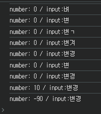
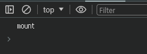
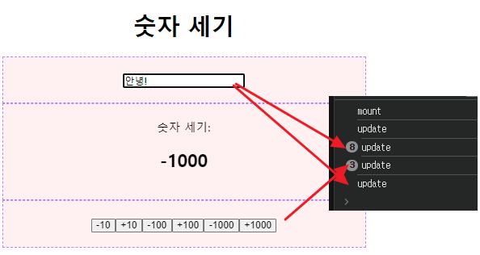
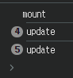
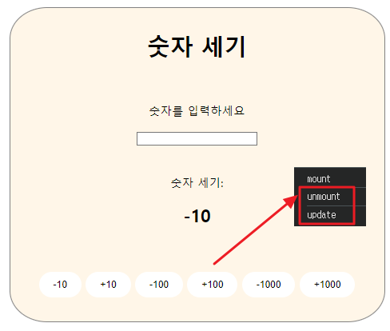

# 컴포넌트의 라이프사이클
!countnumber 프로젝트 참고
## 용어 정의
### Mount
- 컴포넌트가 탄생하는 순간
- 화면에 처음 렌더링 되는 순간
- → 서버에서 데이터를 불러옴

### Update
- 컴포넌트가 다시 렌더링 되는 순간
- 리렌더링 될 때를 의미
- → 어떤 값이 변경되었는지 

### UnMount
- 컴포넌트가 화면에서 사라지는 순간
- 렌더링에서 제외되는 순간을 의미
- → 컴포넌트가 사용하던 메모리 정리

## useEffect
- 컴포넌트가 렌더링 될 때마다 특정 작업을 실행할 수 있도록 하는 Hook

- 컴포넌트의 사이드 이펙트(파생효과)를 제어하는 React Hook
- 컴포넌트 내부 값 변경 → 콘솔에 변경된 값 출력
- Side effect를 만들거나 라이프사이클 제어할 수 있음


### useEffect(function,deps(배열형태))
1. mount : 컴포넌트가 화면에 가장 처음 렌더링 될 때 (function, []);
2. update : 특정 값이 업데이트 될 때 실행(function,[..]);
3. unmount : 컴포넌트가 화면에 사라질 때

## setuseEffect 사용
- countnumber 프로젝트에 useEffect 추가
    ```jsx
    useEffect(()=>{ 
        console.log(`number: ${number} / input:${input}`);
    },[number, input])
    ```
    - 변경된 state 값을 바로바로 사용할 때는 useEffect를 사용해야 함    
    ↔ set함수는 비동기로 동작하기 때문에 변경 이전의 값이 출력됨
    - number값이 변경되었을 때 원하는 동작을 만들 수 있음(콜백함수, 배열형태)
    - console로 출력하여 변경되는 값 확인 가능 

### 1. 마운트 시점 확인
- (function, []);
    ```jsx
    useEffect(()=>{ console.log("mount"); } , []);
    ```
    - 화면 랜더링 시 한번만 출력

### 2. 업데이트
- (function,[..]);
    ```jsx
    useEffect(()=>{console.log("update");})
    ```
    - 화면 내에서 작업이 발생할 때마다 출력
<br>

- useRef로 업데이트 시점 막기
    ```jsx
    const isMount = useRef(false); //아직 마운트되지 않았음

    useEffect(()=>{
        if(!isMount.current){ //App컴포넌트가 최초 mount될 때 실행되긴 하는데
        isMount.current=true; //그때는 조건문이 참이 되기 때문에
        return; //강제로 종료시켜 아래 코드에서 아무것도 실행 안됨
        }
        console.log("update"); //리렌더링 이후 출력될거임
    })
    ```
    - 랜더링 시 업데이트 값은 출력X, 기능 발생 후 출력됨 

### 3. 언마운트
- unmount.jsx 생성
    ```jsx
    import React ,{ useEffect } from "react"

    const Unmount = () =>{
        useEffect(()=>{
            return()=>{
                console.log("unmount");
            }; //정리 함수 → 언마운트 될 때
        },[]);
        return <div>4로 나눠 떨어짐</div>
    }

    export default Unmount;
    ```
- app.jsx에서 unmount 값을 가져오도록 설정
    ```jsx
    <section>
    <Viewers number={number} /> {/*자식 컴포넌트*/}
    <h1>{number % 4 === 0 ? <Unmount /> : null}</h1>
    </section>
    ```
    - 출력결과: 버튼 선택 시 unmount, update 콘솔 출력 


# to-do list
## 프로젝트 생성
1. 폴더 생성: npm create vite@latest > 폴더이름 입력, react 선택, 자바스크립트 선택
2. 기능 설치: npm i 
3. eslintrc.cjs에 추가 ("no-unsed-vars":"off", "react/prop-types":"off",)
4. 파일 내 내용 삭제 후 사용
5. src폴더에 components 폴더 생성