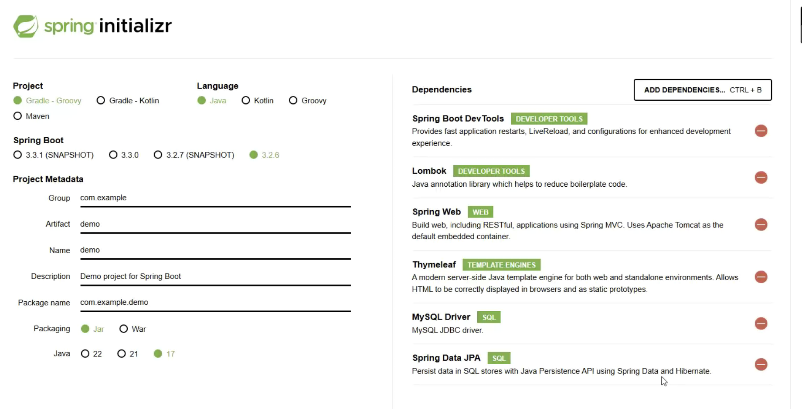
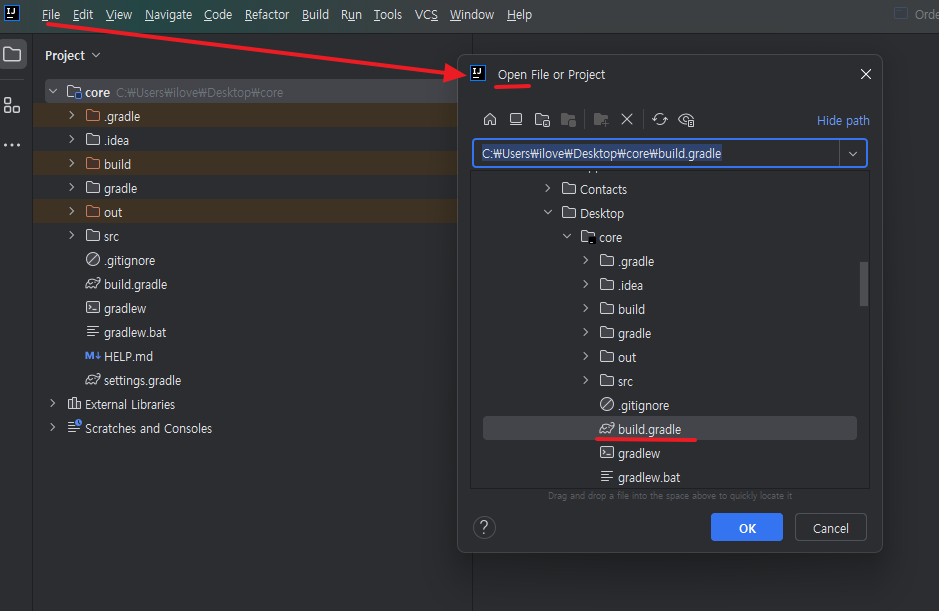
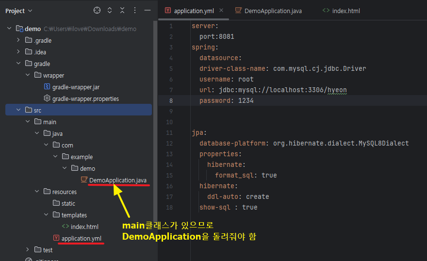

# 인텔리제이(커뮤니티) 환경 설정
## spring initialiuzr 설치
<a href="https://start.spring.io/">spring initialiuzr</a>
- 다운로드 Dependencies 설정: 
- 다운로드 경로에 따라 파일 오픈
(gradle):


- yml로 properties(mysql정보) 등록:

- html에 타임리프 설정:
    ```html
    <!DOCTYPE html>
    <html xml:th="http://www.thymeleaf.org">
    <head>
        <meta charset="UTF-8">
        <title>Title</title>
    </head>
    <body>

    </body>
    </html>
    ```