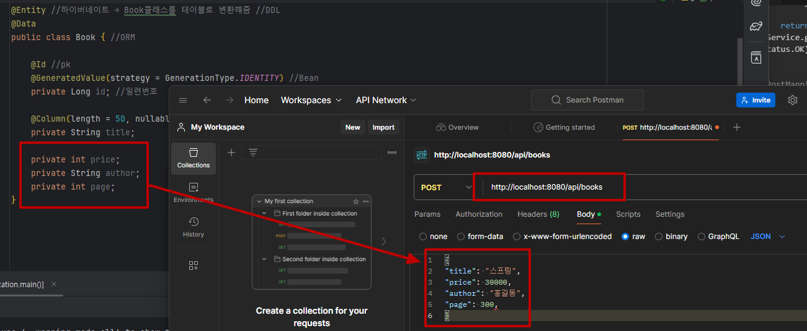

# JpaRepository
## 1. DB에서 데이터 가져오기
- MyBatis(Mapper interface < --- > SQL(xml))
...................- implements SqlSessionFactory

## 2. JpaRepository : CRUD에 관련된 메서드 제공해줌
- extends – Spring Data JPA 
(Repository interface <- 자동생성해줌(Hibernate : ORM) – implements – EntityManagerFactory)

### 개념
- 전체 리스트 가져오기 : findAll() - R
- 데이터 저장 : save() - C
- 특정 레코드 수정 : save() - U
- 특정 레코드 가져오기 : findById() – R
- 특정 레코드 삭제 : deleteById() - D

## HTTP 응답 메시지를 바디에 설정하는 방법
1. ResponseEntity<T> 사용: HttpEntity를 상속받아 구현한 클래스
2. @ResponseBody + 반환 객체 사용


## JPA 사용 방법
- 더티검사: 엔티티 필드를 직접 수정하는 것은 JPA의 자동 더티 검사 메커니즘에 의존한다. 코드를 줄일 수는 있지만 의도하지 않은 업데이트를 발생시킬 수 있다.

<JPA사용하는 방법>
1. JpaRepository에서 제공되는 메서드 사용
2. 쿼리 메서드 사용 : 메서드이름 을 선언하여 인터페이스에서 쿼리 메서드 정의할 수 있다. 메서드 이름은 Spring Data JPA에 의해 분석되어 적절한 SQL쿼리를 생성한다
3. JPQL 쿼리 사용(@Query) – (엔티티 기준)
    > ex) @Query(“select * from book2”)<br>
    List <Book2> findById();
4. 기본 SQL쿼리 사용(테이블 기준)
5. Querydsl을 사용

## JPA 사용
### Repository
- book이라는 entity를 통해 테이블 생성한 클래스 상속
    ```java
    package com.example.test.repository;

    @Repository //JpaRepository → CRUD 정의(tabls, pk type)
    public interface BookRepository extends JpaRepository<Book, Long> {
    }
    ```
### serbvice
- BookRepositoty 객체에 CRUD 사용
    ```java
    package com.example.test.service;

    import java.util.List;

    @Service
    public class BookService {
        @Autowired
        private BookRepository bookRepository;

        public List<Book> getList(){
            return bookRepository.findAll(); //전체 리스트 가져오기 -
        }

        public Book register(Book book){
            return bookRepository.save(book); //값 추가하는 메서드(포스트맨을 통해 Mapping이 되었는지 바로 확인 가능)
        }

        public Book getById(Long id){ //id를 기준으로 특정 데이터 가져오기
            Optional<Book> optional = bookRepository.findById(id); //optional 안에 책 정보가 들어있음 → id가 있으면 true / null이면 false 반환
            if(optional.isPresent()){ //값이 존재하면
                return  optional.get(); //optional에 들어있는 book 정보를 꺼내옴
            }else {
                throw new RuntimeException("id에 맞는 책이 없습니다");
            }
        }
    }
    ```

### controller
- url 매핑
    ```java
    package com.example.test.controller;

    import java.util.List;

    @RestController
    @RequestMapping("/api")
    public class BookRestController {
        @Autowired
        private BookService bookService;

        @GetMapping("/books")
        public ResponseEntity<List<Book>> getList(){
            return new ResponseEntity<>(bookService.getList(), HttpStatus.OK);
        }

        @PostMapping("/books")
        public  ResponseEntity<Book> register(@RequestBody Book book){
            return new ResponseEntity<>(bookService.register(book), HttpStatus.OK);
        }
    }
    ```

## 통신 확인
- <a href="https://www.postman.com/downloads/">포스트맨</a>을 활용하여 서버 연결 확인
- 포스트맨을 통해 Mapping이 되었는지 바로 확인 가능
