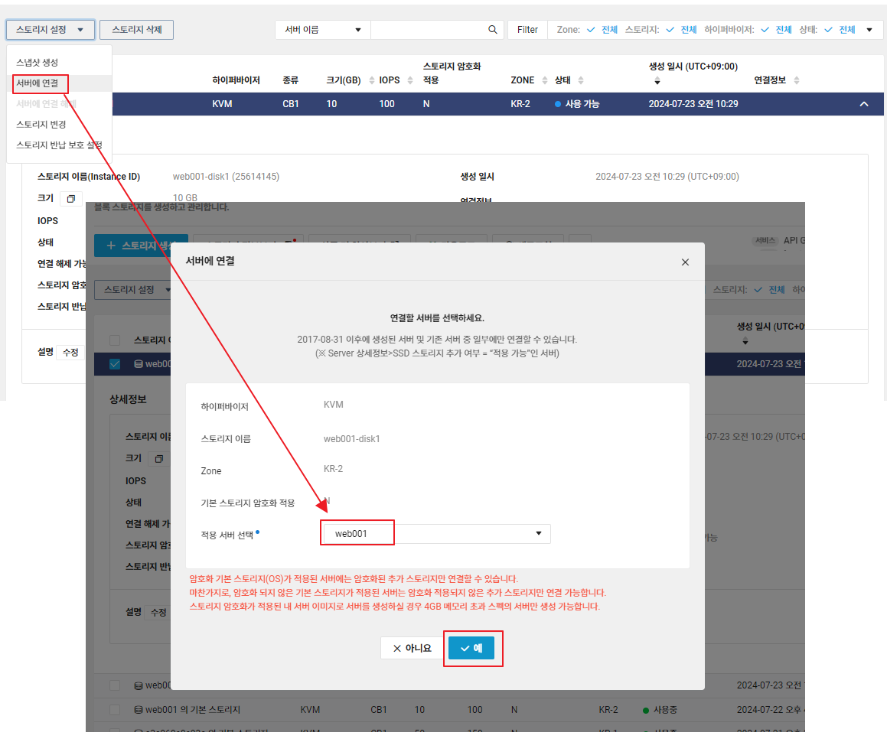
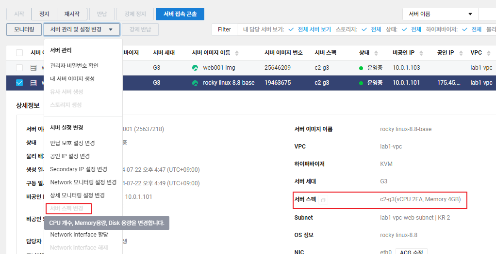

# 서버 생성

# 서버 이미지 생성
## Server 에서 이미지 생성

## 이미지로 Server 만들기

## 디스크 추가 생성
- Storage에서 스토리지 생성

- 서버에 연결

- 디스크 추가 할당 확인

# 클라우드 서버 특징
- 서버 스펙을 쉽게 변경할 수 있음

* but 서버를 정지한 다음 변경해야하는 만큼 클라우드 서버에서 스펙 변경을 잘 하지 않음

## auto scale을 사용하여 트래픽에 맞게 서버를 늘렸다 줄였다 가능
>scale out/in으로 서버를 늘리는 방법을 사용
- 트래픽이 몰리는 기준을 잡아야 함
- 어떤 서버를 몇대씩 늘릴지 경정해야 함

# 로드밸런서 생성
## Target Group 생성

## Load Balencer 생성

### IP주소로 접속하여 확인
- 서버 입장에서 로드 밸런서는 사설 IP와 같음

* 새로고침할 때마다 server name이 변하는 것을 확인할 수 있음

# CDN 신청
- Recently Viewed > CDN+(Domestic) > CDN > CDN 신청

- 캐싱, Viewer 전송 설정은 기본 값으로

# Auto Scaling 생성
## Launch Configuration 설정
- VPC > Auto Scaling > Launch Configuration > Launch Configuration 생성
- 내 서버 이미지에서 선택

- 스토리지 설정은 그대로

- 생성한 인증키로 사용, 생성

## Auto Scaling Group 생성
- VPC > Auto Scaling > Auto Scaling Group > Auto Scaling Group 생성

### 정책 설정

- 정책 2개 추가

# Event Rule 설정
- Management > Cloud Insight > Configuration > Event Rule 추가

